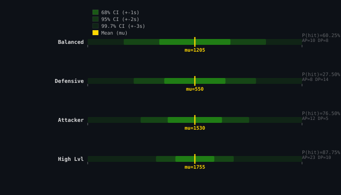
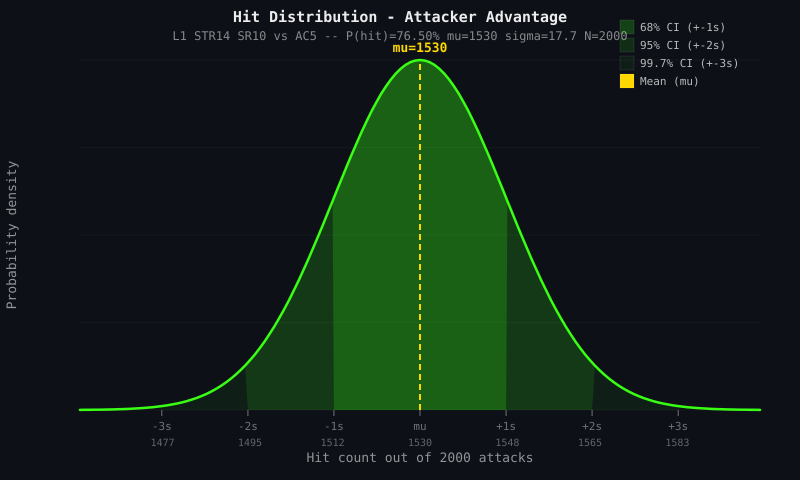

# Combat Mechanics

## Key Classes

| Service | File | Responsibility |
|---------|------|----------------|
| `CombatSimulator` | `BattleArena.Application/Services/CombatSimulator.cs` | Tick-by-tick combat loop driver |
| `CombatService` | `BattleArena.Application/Services/CombatService.cs` | Pure math: attack & damage resolution |
| `CombatStatsService` | `BattleArena.Application/Services/CombatStatsService.cs` | Computes AttackPower / DefensePower |
| `StatusEffectService` | `BattleArena.Application/Services/StatusEffectService.cs` | Effect lifecycle: apply, tick, expire, resist |
| `TurnmeterService` | `BattleArena.Application/Services/TurnmeterService.cs` | TM gain per tick, cost after action |
| `DiceService` | `BattleArena.Application/Services/DiceService.cs` | Seeded RNG for deterministic replay |
| `AutoActionDecisionSource` | `BattleArena.Application/Services/AutoActionDecisionSource.cs` | Default AI — picks fixed weapon, random spell, or unarmed |
| `ConsoleActionDecisionSource` | `BattleArena.Demo/ConsoleActionDecisionSource.cs` | Interactive console menu — user picks melee, spell, or move |

## Interfaces

| Interface | File | Purpose |
|-----------|------|---------|
| `IActionDecisionSource` | `BattleArena.Application/Interfaces/IActionDecisionSource.cs` | Decides which attack source to use at turn start. Injected per-party; auto uses AI, interactive uses console menu. Returns `null` for Move/Skip. |
| `ITargetSelector` | `BattleArena.Application/Interfaces/ITargetSelector.cs` | Decides which enemy to target. Separate from action decision. |

## Combat Loop

```
for tick = 1 to maxTicks:
  1. TurnMeterGain — every living combatant gains TM
  2. Find ready actors (meter >= 100, not CC'd), sort by meter descending
  3. SkippedTurn — ready but CC'd actors skip
  4. For each acting combatant:
     a. IActionDecisionSource.ChooseAttackAsync → weapon / spell / unarmed / null(Move)
     b. SelectTarget → hero or enemy selector (skipped if Move)
     c. TurnStart (SkippedTurn if Move was chosen)
     d. DoTTick — DoT damage on actor
     e. TickAll — decrement effect durations, remove expired
     f. ResolveAttack — d20 + AP vs DP
     g. Damage — if hit, reduce HP
     h. OnHitEffects — spell status effects
     i. SpellDisruption — 20% melee hit on caster
     j. CheckDefeat — Death / KnockedOut
     k. FumblePenalty — natural 1
     l. TurnEnd — deduct TM cost
```

## Attack Resolution

```
hitRoll = d20
if hitRoll == 1  → auto-miss, fumble
if hitRoll == 20 → auto-hit, critical (2× damage)
total = hitRoll + AttackPower
IsHit = (total >= DefensePower)
```

## Damage Formula

```
FinalDamage = max(0, (BaseDamage × TypeMultiplier × CriticalMultiplier) - Mitigation + ElementalDamage)
```

Where `BaseDamage = diceRoll + abilityModifier + flatBonus`, `TypeMultiplier` is 1.5 for vulnerability, `CriticalMultiplier` is 2 on crit.

## Turn Meter

```
GainPerTick = max(1, TurnSpeed + DEXmod + buffs - armorPenalty)
AfterActionCost: meter -= 100 (weapons) or spell cost
```

## Status Effect Two-Phase Roll

```
Phase 1 (ApplicationChance): Roll D100 > chance → quiet miss
Phase 2 (Resistance):        Roll D100 <= resistance → EffectResisted
                             Otherwise → EffectApplied
```

Resistance is capped at 95 (always ≥5% chance to land).

## Event Types

| EventType | Meaning |
|-----------|---------|
| `TurnMeterGain` | TM increased |
| `TurnStart` | Actor begins turn |
| `Attack` | Hit/miss resolved |
| `Damage` | HP reduced |
| `DoTTick` | DoT damage applied |
| `SkippedTurn` | CC'd or voluntarily skipped turn |
| `Move` | Actor used Move action (stub — no range effect yet) |
| `EffectApplied` | Effect landed |
| `EffectResisted` | Resistance blocked |
| `EffectExpired` | Duration reached zero |
| `FumblePenalty` | Natural-1 penalty applied |
| `SpellDisrupted` | Melee hit on caster |
| `SpellQueued` | Began charging a spell |
| `SpellCharging` | Still charging (TM accumulating) |
| `SpellLost` | Concentration broken or CC'd while charging |
| `ConcentrationPass` | Maintained concentration after hit |
| `ManaDeduct` | Mana spent on spell |
| `ManaRegen` | Mana regenerated per tick |
| `InsufficientMana` | Not enough mana to cast |
| `Death` | HP ≤ -10 |
| `KnockedOut` | HP -9 to 0 |
| `TurnEnd` | Action complete |
| `PetSummoned` | Pet entered combat |
| `PetExpired` | Summon duration ended |

## Attack Outcome Distributions

Because attack resolution uses an **opposed d20 roll** (attacker d20 + AP vs defender d20 + DP), with special-rule overrides for natural 1s and 20s, the theoretical hit rate depends on both the AP/DP difference and the priority-ordered special outcomes.

### Special-outcome rates (fixed, independent of AP/DP)

| Outcome | Dice condition | Probability | Notes |
|---------|---------------|-------------|-------|
| TotalReversal | atk=1, def=20 | 1/400 (0.25 %) | Auto-miss, −4 AP penalty, +30 TM to defender |
| DevastatingStrike | atk=20, def=1 | 1/400 (0.25 %) | Auto-hit, triple base damage |
| PerfectParry (both-20) | atk=20, def=20 | 1/400 (0.25 %) | Auto-miss, +20 TM to defender |
| Fumble | atk=1, def≠20 | 19/400 (4.75 %) | Auto-miss, −2 AP penalty |
| Critical hit | atk=20, def∉{1,20} | 18/400 (4.50 %) | Auto-hit, double base damage |
| PerfectParry (def-20) | atk∉{1,20}, def=20 | 18/400 (4.50 %) | Auto-miss, +20 TM to defender |
| Normal opposed roll | atk∈[2,19], def∈[1,19] | 342/400 (85.50 %) | Hit iff d20 + AP ≥ d20 + DP |

### Overall hit probability (all outcomes)

```
P(hit) = (18 cases Critical + 1 case Devastating + NormalHits) / 400
```

Where `NormalHits` = number of (atk∈[2,19], def∈[1,19]) pairs where `atk + AP ≥ def + DP`.

### Measured distributions (verified by `CombatDistribution.feature`)

Each scenario runs **2000 attack resolutions** with live seeded dice and asserts ≥3σ statistical bounds.

The normal-distribution confidence intervals are computed as μ ± z·σ where σ = √(N·p·(1-p)) and z = 1 (68 %), 2 (95 %), 3 (99.7 %). The special-outcome rates (crit 4.5 %, fumble 4.75 %, PP 4.75 %) are constant across all AP/DP configurations and verified in the balanced scenario.







Each SVG embeds the full raw dataset (hit, z-score, PDF value for every x) in XML comments, making it machine-readable for automated re-analysis.

## Self-update instructions

When you modify any of the following files, update this skill to match the new behaviour:

- `BattleArena.Core/Entities/` (Character, StatusEffect, Party, etc.)
- `BattleArena.Application/Services/` (CombatSimulator, CombatService, StatusEffectService, TurnmeterService, DiceService)
- `BattleArena.Application/Models/` (CombatLogEntry, CombatResult)
- `BattleArena.Application/Interfaces/` (new interfaces added)

**What to update**: Attack resolution logic, damage formula, TM formula, status effect lifecycle, new event types, changed property names, new stacking rules.
