# BattleArena

BattleArena is a homebrew fantasy RPG backend and data model for a Dungeons & Dragons-inspired combat and character system. The solution includes a PostgreSQL-backed data layer, a .NET 8 Web API, and a world lore reference that feeds the content used by the application.

## Project goals

- Provide a REST API for combat, character management, equipment, accessories, and NPC data.
- Seed a rich fantasy world with races, classes, deities, pets, weapons, armor, accessories (rings, amulets, girdles), item sets, NPCs, spells, and sample characters.
- Support a Docker-based development workflow with PostgreSQL and the ASP.NET API.
- Provide a shared lore reference in [notes/battle-arena-lore.md](notes/battle-arena-lore.md).

## Solution overview

### Projects

- `BattleArena.Api`
  - ASP.NET Core Web API
  - Configures services, Swagger, and endpoint mappings
- `BattleArena.Application`
  - Application interfaces and services for combat, character creation, dice rolls, orchestrations, and XP/leveling logic (LevelProgression, LevelingService)
- `BattleArena.Core`
  - Domain entities and shared contracts
- `BattleArena.Infrastructure`
  - PostgreSQL data access, repositories, and database context
- `BattleArena.Demo`
  - Console-based demo app for running turn-based and real-time combats with narrated playback
- `BattleArena.Presentation`
  - GUI-agnostic presentation layer — playback engine, display state, ICombatPresenter contract (depends on Core + Application)
- `BattleArena.UnitTests`
  - xUnit unit tests for application behaviour, resistance system, and XP/levelling logic (NSubstitute for mocks)
- `BattleArena.AcceptanceTests`
  - Acceptance tests written with Reqnroll (BDD / Gherkin scenarios)

### Runtime behavior

- The API starts on port `8585` in Docker and exposes Swagger at `/swagger`.
- The database is initialized from `.postgres-init/postgres-init.sql` when the container is first created (includes character XP, NPC flag, and biography fields).
- The API uses PostgreSQL via `BattleArena.Infrastructure` and registers repositories and services through `BattleArena.Api/AddServices.cs`.
- The `BattleArena.Demo` console app provides turn-based and realtime battle playback, with post-battle XP calculations based on enemy difficulty, crits, fumbles, and battle duration.

## Lore and world setting

The world lore is documented in [notes/battle-arena-lore.md](notes/battle-arena-lore.md) across 22 sections covering races, classes, deities, pets, weapons, armor, accessories, item sets, NPCs, spells, subraces, and a leveling & experience system. The current lore emphasizes:

- A homebrew AD&D-inspired fantasy realm with gods, races, and ancient artifacts.
- A combat model driven by `StrikeRating`, armor class, and `d20`-style rolls.
- An economy of gear quality tiers (`Common`, `Uncommon`, `Rare`, `Epic`, `Legendary`).
- A narrative focus on legendary weapons, cursed items, item sets, and NPC-driven quests.
- A 12-level progression system with class archetypes, strike rating bonuses, and accessory slot unlocks.

### Core lore pillars

1. **Races**: Human, Elf, Dwarf, Lizard, Undead, Kobold, Demon, Orc, Ogre, Halfling
2. **Classes**: Barbarian, Knight, Paladin, Priest, Mage, Bard, Druid, Fighter, Rogue
3. **Deities**: Light and Dark alignments, with separate domains such as Heaven, Moon, Fire, Shadow, and Darkness
4. **Pets**: Predators and familiar creatures with class/race restrictions
5. **Weapons and armor**: Common, Epic, Legendary, Cursed, and Rare/Heirloom items
6. **Accessories**: Rings, amulets, and girdles with stat effects and curses
7. **NPCs**: Merchants, quest givers, hostile enemies, and lore-bearing characters
8. **Spells**: Area-of-effect, control, and utility spells across schools
9. **Leveling & Experience**: 12-level progression, class archetypes (Martial / Caster / Hybrid), strike rating bonuses, accessory slot unlocks, and XP formula factoring difficulty, crits, fumbles, and battle duration

## Database model

The PostgreSQL initialization script lives in `.postgres-init/postgres-init.sql` and creates the `arena_data` schema.

### Reference tables

- `die_type`
- `damage_type`
- `attack_type`
- `armor_category`
- `affinity`
- `gear_quality`
- `gear_slot`
- `deity_alignment`
- `spell_school`
- `equipment_slot`

### Core game tables

- `race`
- `subrace`
- `race_special_ability`
- `class`
- `class_race`
- `deity`
- `pet`
- `pet_class_restriction`
- `pet_race_restriction`
- `weapon_type`
- `weapon`
- `armor`
- `item_set`
- `set_bonus`
- `accessory_type`
- `accessory`
- `npc`
- `spell`
- `character`
- `character_equipment`
- `character_inventory`

### Stored functions and procedures

The script also creates reusable database functions for retrieving races, subraces, abilities, classes, weapons, armor, spells, deities, pets, characters (including `npc`, `biography`, `experience_points` fields), item sets, accessories (filterable by type: Ring, Amulet, Girdle), and NPCs. It also includes stored procedures for creating, updating, and deleting characters — with full support for NPC flags, biographies, and experience points.

### Scheduled maintenance

`pg_cron` is enabled, and the following scheduled jobs are configured:

- `vacuum_weapon` — VACUUM ANALYZE on `arena_data.weapon`, weekly at 02:00 Sunday
- `vacuum_armor` — VACUUM ANALYZE on `arena_data.armor`, weekly at 02:00 Sunday
- `vacuum_race` — VACUUM ANALYZE on `arena_data.race`, weekly at 02:00 Sunday
- `vacuum_character` — VACUUM ANALYZE on `arena_data.character`, weekly at 02:00 Sunday
- `clean_cron_logs` — purges `cron.job_run_details` older than 5 days, daily at 01:00

## ER diagram

The following Mermaid ER diagram reflects the core relationships defined in `.postgres-init/postgres-init.sql`.

```mermaid
erDiagram
    DIE_TYPE ||--o{ CHAR_CLASS : "hit die"
    DIE_TYPE ||--o{ PET : "damage die"
    DIE_TYPE ||--o{ WEAPON : "damage die"
    DIE_TYPE ||--o{ SPELL : "damage die"

    DAMAGE_TYPE ||--o{ WEAPON : "damage"
    DAMAGE_TYPE ||--o{ SPELL : "damage"

    ATTACK_TYPE ||--o{ WEAPON : "attack"

    WEAPON_TYPE ||--o{ WEAPON : "type"

    ARMOR_CATEGORY ||--o{ ARMOR : "category"

    GEAR_QUALITY ||--o{ WEAPON : "quality"
    GEAR_QUALITY ||--o{ ARMOR : "quality"
    GEAR_QUALITY ||--o{ ACCESSORY : "quality"

    ACCESSORY_TYPE ||--o{ ACCESSORY : "type"

    ITEM_SET ||--o{ WEAPON : "contains"
    ITEM_SET ||--o{ ARMOR : "contains"
    ITEM_SET ||--o{ SET_BONUS : "has bonuses"

    DEITY_ALIGNMENT ||--o{ DEITY : "alignment"

    SPELL_SCHOOL ||--o{ SPELL : "school"

    RACE ||--o{ SUBRACE : "has"
    RACE ||--o{ RACE_SPECIAL_ABILITY : "has"
    RACE ||--o{ CLASS_RACE : "allows"
    RACE ||--o{ PET_RACE_RESTRICTION : "restricts"
    RACE ||--o{ NPC : "race"
    RACE ||--o{ CHARACTER : "race"

    CHAR_CLASS ||--o{ CLASS_RACE : "allows"
    CHAR_CLASS ||--o{ PET_CLASS_RESTRICTION : "restricts"
    CHAR_CLASS ||--o{ NPC : "class"
    CHAR_CLASS ||--o{ CHARACTER : "class"

    PET ||--o{ PET_CLASS_RESTRICTION : "class restriction"
    PET ||--o{ PET_RACE_RESTRICTION : "race restriction"

    EQUIPMENT_SLOT ||--o{ CHARACTER_EQUIPMENT : "slot"
    CHARACTER ||--o{ CHARACTER_EQUIPMENT : "equipped"
    CHARACTER ||--o{ CHARACTER_INVENTORY : "inventory"

    DIE_TYPE {
        serial id
        varchar name
        int sides
    }

    DAMAGE_TYPE {
        serial id
        varchar name
    }

    ATTACK_TYPE {
        serial id
        varchar name
    }

    ARMOR_CATEGORY {
        serial id
        varchar name
    }

    GEAR_QUALITY {
        serial id
        varchar name
        int sort_order
    }

    WEAPON_TYPE {
        serial id
        varchar name
        text description
    }

    ACCESSORY_TYPE {
        serial id
        varchar name
    }

    ACCESSORY {
        serial id
        int accessory_type_id
        int gear_quality_id
        varchar name
        varchar effect_type
        int effect_value
        boolean cursed
        text description
        text curse_effect
    }

    RACE {
        serial id
        varchar name
        int strength_bonus
        int dexterity_bonus
        int stamina_bonus
        int intelligence_bonus
        int wisdom_bonus
        int charisma_bonus
        text description
        timestamp created_at
    }

    SUBRACE {
        serial id
        int race_id
        varchar name
        text description
    }

    RACE_SPECIAL_ABILITY {
        serial id
        int race_id
        varchar name
        text description
    }

    CHAR_CLASS {
        serial id
        int hit_die_id
        varchar name
        int base_strike_rating
        text description
    }

    CLASS_RACE {
        int class_id
        int race_id
    }

    DEITY_ALIGNMENT {
        serial id
        varchar name
    }

    DEITY {
        serial id
        int alignment_id
        varchar name
        text description
        varchar domain
    }

    PET {
        serial id
        int damage_die_id
        varchar name
        int armor_class
        int hit_points
        text description
    }

    PET_CLASS_RESTRICTION {
        int pet_id
        int class_id
    }

    PET_RACE_RESTRICTION {
        int pet_id
        int race_id
    }

    WEAPON {
        serial id
        int weapon_type_id
        int damage_die_id
        int damage_type_id
        int attack_type_id
        int gear_quality_id
        int set_id
        varchar name
        int damage_count
        int hands
        int attack_bonus
        boolean cursed
        text description
        text curse_effect
        timestamp created_at
    }

    ARMOR {
        serial id
        int armor_category_id
        int gear_quality_id
        int set_id
        varchar name
        int armor_class
        int max_dexterity_bonus
        boolean stealth_disadvantage
        int strength_requirement
        int armor_class_bonus
        boolean cursed
        text description
        text curse_effect
        timestamp created_at
    }

    ITEM_SET {
        serial id
        varchar name
        text description
    }

    SET_BONUS {
        serial id
        int set_id
        int pieces_required
        text effect_description
    }

    NPC {
        serial id
        int race_id
        int class_id
        varchar name
        int level
        int strength
        int dexterity
        int stamina
        int intelligence
        int wisdom
        int charisma
        boolean is_merchant
        boolean is_quest_giver
        boolean is_hostile
        text biography
        timestamp created_at
    }

    SPELL_SCHOOL {
        serial id
        varchar name
    }

    SPELL {
        serial id
        int school_id
        int damage_die_id
        int damage_type_id
        varchar name
        int mana_cost
        text description
    }

    CHARACTER {
        serial id
        int race_id
        int class_id
        varchar name
        int level
        int strength
        int dexterity
        int stamina
        int intelligence
        int wisdom
        int charisma
        int strength_percentile
        int max_hit_points
        int current_hit_points
        int experience_points
        int strike_rating
        int turn_speed
        smallint npc
        text biography
        timestamp created_at
        timestamp updated_at
    }

    CHARACTER_EQUIPMENT {
        serial id
        int character_id
        int slot_id
        varchar item_type
        int item_id
    }

    CHARACTER_INVENTORY {
        serial id
        int character_id
        varchar item_type
        int item_id
        int quantity
    }

    EQUIPMENT_SLOT {
        serial id
        varchar name
    }
```



## Running the solution locally

### Environments

| Mode | DB | API | Demo | Ports exposed |
|------|----|-----|------|---------------|
| `up-local` | Docker | Docker | host (`make demo-local`) | 5432, 8585 |
| `up-dev` | Docker | Docker | Docker (interactive) | 5432, 8585 |
| `up-test` | Docker | Docker | Docker (interactive) | — |
| `up-preprod` | Docker | Docker | — | — |
| `up-prod` | Docker | Docker | — | — |

### Setup

Copy `.env.example` to `.env`:

```bash
cp .env.example .env
```

### Option 1: Docker Compose (recommended)

```bash
# Start DB + API only (demo runs on host, ports exposed)
make up-local

# Start DB + API + demo in Docker (all containers, interactive)
make up-dev

# Same as dev but no host ports
make up-test

# DB + API only, no demo (pre-production / production)
make up-preprod
make up-prod

# Run the demo locally (against up-local)
make demo-local

# Stop containers
make down

# Stop and remove volumes (wipes DB data)
make clean
```

### Option 2: Local .NET run

1. Ensure PostgreSQL is running and `arena_data` schema is initialized.
2. Update the connection string in `BattleArena.Api/appsettings.Development.json` if needed.
3. Restore and run:

```bash
dotnet restore BattleArena.sln
dotnet run --project BattleArena.Api/BattleArena.Api.csproj
```

The API will be available at `http://localhost:8585` (and `http://localhost:8585/swagger`).

## API surface

The API maps these endpoint groups in `BattleArena.Api/Program.cs`:

- `CombatEndpoints`
- `CharacterEndpoints`
- `EquipmentEndpoints`
- `AccessoriesEndpoints`
- `NpcEndpoints`

## Testing

Run unit and acceptance tests from the solution root:

```bash
 dotnet test BattleArena.sln
```

## Current configuration notes

- `BattleArena.Api/AddServices.cs` reads `ConnectionStrings:ArenaDatabase`.
- Docker Compose overlays inject `ConnectionStrings__ArenaDatabase` via environment variable, which overrides `appsettings.json`. The appsettings files serve as fallbacks for local `dotnet run` scenarios.
- Each environment uses a separate Docker Compose project (`battle-arena-<ENV>`) and named volume, ensuring data isolation between environments.
- The base `docker-compose.yml` exposes no host ports and defaults to `ASPNETCORE_ENVIRONMENT: Production`. Environment overlays (`docker-compose.<env>.yml`) set the appropriate environment and expose ports where needed.

## References

- Lore source: [notes/battle-arena-lore.md](notes/battle-arena-lore.md)
- Database initialization: `.postgres-init/postgres-init.sql`
- Docker configuration: `docker-compose.yml`
- API entry point: `BattleArena.Api/Program.cs`
