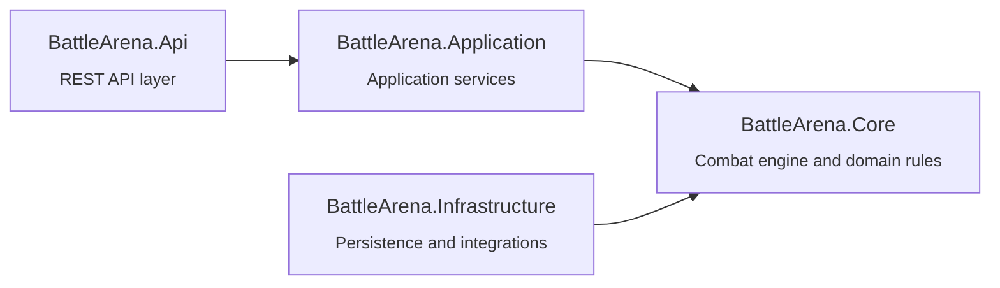

# Feature Task - Solution Architecture Dependency Diagram

Project: Dark Orb

---

## Objective

Create and maintain a visual architecture overview of the Dark Orb solution by automatically generating a Mermaid dependency diagram from the actual `.csproj` project references.

The purpose is to provide developers, architects, and AI agents with a quick understanding of the solution structure and project responsibilities.

---

## Target File

Update:

```text
dark-orb/design/dark-orb-game-design.md
```

Add a new section:

```markdown
# Solution Architecture
```

---

## Required Behavior

### Project Discovery

Scan the solution and discover:

- All `.csproj` files
- All `<ProjectReference>` dependencies
- Project names

---

### Responsibility Discovery

For each project, determine its primary responsibility based on:

- Project name
- Folder structure
- Existing code organization

Generate a short description (1 line maximum).

Examples:

| Project | Description |
|----------|-------------|
| BattleArena.Core | Combat engine and domain rules |
| BattleArena.Application | Application services and use cases |
| BattleArena.Infrastructure | Database and external integrations |
| BattleArena.Api | REST API and persistence endpoints |
| BattleArena.Gui | Desktop user interface |
| BattleArena.Tests | Automated test suite |

Descriptions should remain concise.

---

## Mermaid Diagram Requirements

Generate a Mermaid flowchart.

Each project must be represented as a box.

Each box must contain:

- Project name
- Small responsibility description on second line

Example:



---

## Dependency Rules

Dependencies must be derived from actual project references.

Do NOT:

- Invent dependencies
- Assume dependencies
- Infer dependencies from namespaces

Use only `.csproj` references.

---

## Diagram Placement

Insert diagram under:

```markdown
# Solution Architecture
```

within:

```text
dark-orb/design/dark-orb-game-design.md
```

---

## Validation

Verify:

- Every `.csproj` appears exactly once
- Every project reference appears in diagram
- No duplicate nodes
- Mermaid syntax renders correctly

---

## Deliverables

Update:

```text
dark-orb/design/dark-orb-game-design.md
```

with:

- Solution Architecture section
- Mermaid dependency diagram
- One-line responsibility description per project

---

## Acceptance Criteria

- [x] All `.csproj` projects discovered
- [x] All project references mapped
- [x] Mermaid diagram generated
- [x] Project responsibilities documented
- [x] Diagram renders correctly in Markdown
- [x] Diagram added to dark-orb-game-design.md