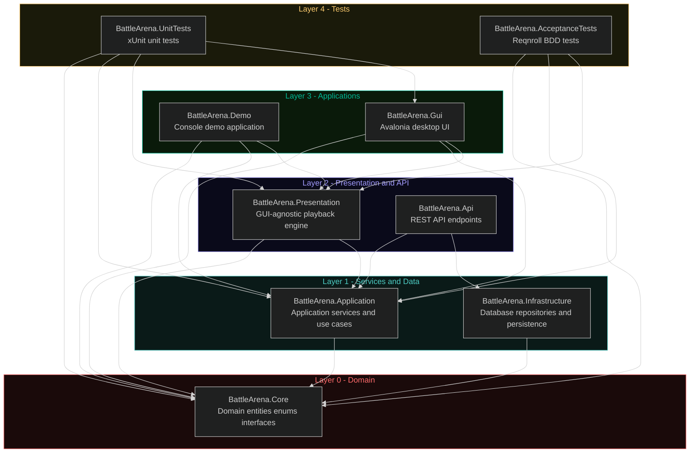
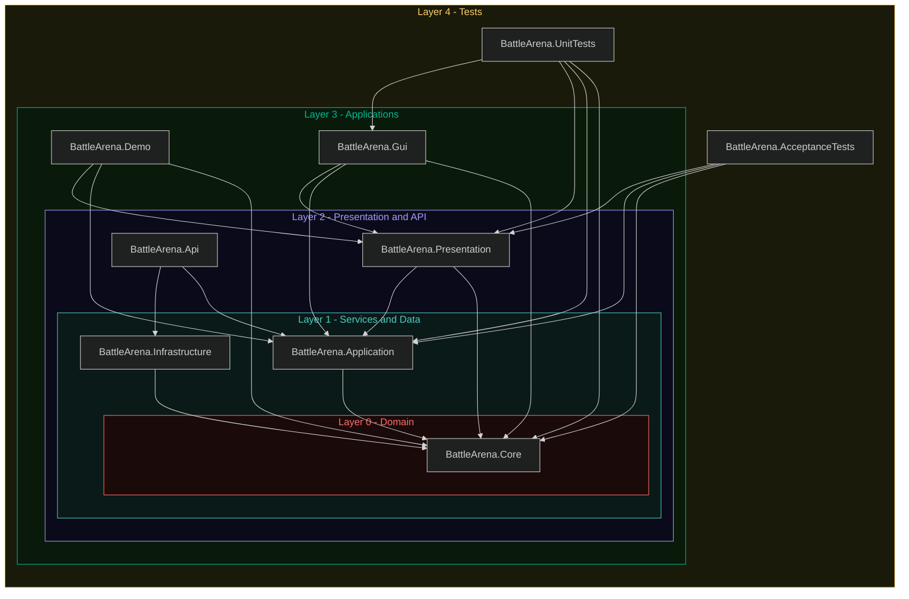

# Solution Architecture

## Dependency Diagram

## Onion Architecture View

## Project Responsibilities

| Project | Responsibility |
|---------|---------------|
| BattleArena.Core | Domain entities, enums, interfaces (zero dependencies) |
| BattleArena.Application | Application services and use cases |
| BattleArena.Infrastructure | Database repositories and persistence |
| BattleArena.Presentation | GUI-agnostic playback engine and display state |
| BattleArena.Api | REST API layer |
| BattleArena.Demo | Console demo (render-only, no game logic) |
| BattleArena.Gui | Avalonia desktop user interface |
| BattleArena.UnitTests | xUnit + NSubstitute unit tests |
| BattleArena.AcceptanceTests | Reqnroll BDD acceptance tests |

## Dependency Rules

- **Core** must not reference any other project.
- **Application** may only reference Core.
- **Infrastructure** may only reference Core.
- All other projects must follow the arrow direction in the diagram. Violations should be flagged as architectural issues.
