# NPC Characters

---

## Old Man Kael — Blind Seer
*Human Priest, Level 8 — Quest Giver*

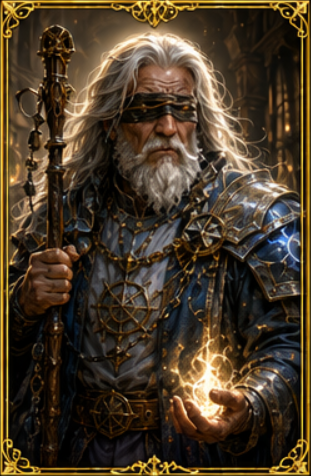

A wise elderly human priest with long, wild white hair and a patch-like blindfold over milky-white eyes. His face is deeply wrinkled, yet serene, as if he looks inward rather than outward. He wears layered, dusty-blue clerical robes embroidered with faint sun-motifs and carries a gnarled staff wrapped in tiny prayer beads. Soft, warm light glows faintly around his hands, hinting at divination magic.

> **Art prompt:** painterly fantasy, warm ambience, heroic-good.

**Attributes**

| STR | DEX | STA | INT | WIS | CHA |
|:---:|:---:|:---:|:---:|:---:|:---:|
|  9  |  8  | 11  | 15  | 19  | 14  |
| *0* | *-1*| *0* | *+2*| *+4*| *+2*|

**HP** 40 · **AC** 11 · **SR** 17 · **HD** 8D8

**Equipment**
- **Quarter Staff** — 1D6 Bludgeoning, 2H
- **Padded Armor** — AC 11, Light
- **Silver Cross of Hope** — Wis +1, Fear Resistance

---

## Greta Ironhand — Dwarf Smith
*Dwarf Fighter, Level 12 — Merchant*

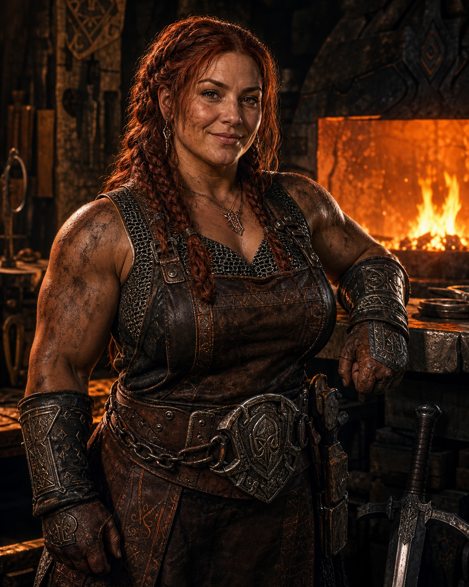

A battle-hardened dwarf woman with a short, muscular build, auburn hair tied in practical braids. Her arms are corded with muscle from years at the forge, and soot and faint burn scars mark her skin. She wears a leather apron over steel-mail armor, an iron-greaved belt, and gauntlets with runes etched into them.

> **Art prompt:** gritty, realistic fantasy, warm forge lighting.

**Attributes**

| STR | DEX | STA | INT | WIS | CHA |
|:---:|:---:|:---:|:---:|:---:|:---:|
| 19  | 10  | 18  | 10  | 13  |  8  |
| *+4*| *0* | *+4*| *0* | *+1*| *-1*|

**HP** 120 · **AC** 14 · **SR** 13 · **HD** 12D10

**Equipment**
- **War Hammer** — 1D8 Bludgeoning, 1H
- **Chain Mail** — AC 16, Heavy
- **Shield** — +2 AC
- **Band of the Bull** — Str +2
- **Hidden: Soul Reaver** (Legendary Great Sword, 1D12 Slashing +3) — kept beneath her forge, awaiting a worthy champion

---

## Shadowmere — Elf Rogue Leader
*Elf Rogue, Level 10 — Quest Giver*

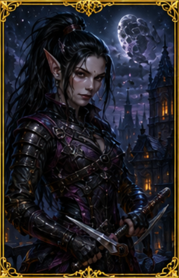

A striking female elf rogue with pale silver skin, long dark hair tied in a high warrior-like ponytail, and narrow, piercing eyes that miss nothing. She wears form-fitting layered black and deep-purple leather armor with hidden pockets and subtle Nightblades-style embroidery. Her gloves are fingerless, and she carries a slender dagger at each hip plus a thin-chain garrote.

> **Art prompt:** cinematic fantasy, high-contrast lighting, rogue-thief vibe.

**Attributes**

| STR | DEX | STA | INT | WIS | CHA |
|:---:|:---:|:---:|:---:|:---:|:---:|
| 10  | 19  | 10  | 16  | 10  | 15  |
| *0* | *+4*| *0* | *+3*| *0* | *+2*|

**HP** 40 · **AC** 12 · **SR** 16 · **HD** 10D6

**Equipment**
- **Dagger ×2** — 1D4 Piercing, 1H, Light
- **Studded Leather Armor** — AC 12, Light
- **Ring of Shadows** — +1 AC, +1 Stealth
- **Sash of Shadows** — Dex +1, Stealth +1

---

## Merchant Vex — Kobold Trader
*Kobold Rogue, Level 6 — Merchant*

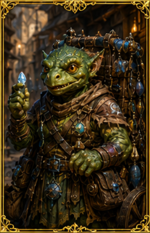

A petite, grinning kobold trader with bright green scales, a short snout, and oversized curious eyes. She wears a patchwork cloak made of mismatched cloth scraps tied together with twine, and under it a practical vest with many pockets. On her back rests a small, wheeled cart loaded with jumbled trinkets, fake gems, cracked scrolls, and one or two real-looking magical rings.

> **Art prompt:** Non cartoon-ish fantasy or stylized D&D, bright colors, charming rogue.

**Attributes**

| STR | DEX | STA | INT | WIS | CHA |
|:---:|:---:|:---:|:---:|:---:|:---:|
|  8  | 17  | 10  | 14  | 10  | 14  |
| *-1*| *+3*| *0* | *+2*| *0* | *+2*|

**HP** 24 · **AC** 11 · **SR** 18 · **HD** 6D6

**Equipment**
- **Dagger** — 1D4 Piercing, 1H
- **Leather Armor** — AC 11, Light
- *(Carries a cart of mixed wares — most are fakes, occasionally a genuine treasure surfaces)*

---

## Kaela Vornskald
*Human Barbarian, Level 10 — Wanderer*

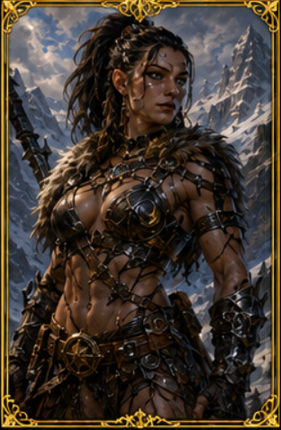

Kaela Vornskald is built like a siege weapon made flesh — dense muscle across shoulders, arms, and core, the kind of physique earned through years of dragging steel through blood, not training halls or ceremony. She does not carry her strength as decoration; it is functional, economical, and always ready to break something that refuses to yield.

Her dark hair is worn in a severe warrior's knot: tightly braided on the sides and pulled back into a thick, high tail bound with leather strips and bone rings. Abs are showing. Her face is hard-lined, not pretty in any conventional sense, but compelling in the way a storm front is compelling: you do not admire it, you respect that it can ruin you.

Her barbarian armor is light and revealing, abdomen muscles are visible, enhancing her beauty as she looks like a war deity.

**Attributes**

| STR | DEX | STA | INT | WIS | CHA |
|:---:|:---:|:---:|:---:|:---:|:---:|
| 19  | 15  | 17  |  9  | 11  | 13  |
| *+4*| *+2*| *+3*| *0* | *0* | *+1*|

**HP** 100 · **AC** 12 · **SR** 15 · **HD** 10D12

**Equipment**
- **Great Sword** — 1D10 Slashing, 2H
- **Hide Armor** — AC 12, Medium
- **Band of the Bull** — Str +2

---

## High Priestess Luna — Moon Temple Leader
*Human Priest, Level 14 — Quest Giver*

A graceful, mature human woman with long, flowing silver-white hair and gentle blue-grey eyes that seem to reflect moonlight. Her face is serene and composed, with fine age-giving lines that speak of wisdom rather than weariness. She wears ornate white-and-silver priestly robes trimmed with lunar-phase patterns, a crescent-moon pendant, and a diadem shaped like a slim silver crown.

> **Art prompt:** elegant, high-fantasy, soft-light portrait.

**Attributes**

| STR | DEX | STA | INT | WIS | CHA |
|:---:|:---:|:---:|:---:|:---:|:---:|
| 13  | 11  | 13  | 15  | 19  | 17  |
| *+1*| *+0*| *+1*| *+2*| *+4*| *+3*|

**HP** 84 · **AC** 18 · **SR** 16 · **HD** 14D8

*Effective STR 16 (13 base + 2 Ring of the Bull + 1 Plate Mail enchantment).*

**Equipment**
- **Great Mace** — 1D10 Bludgeoning, 2H (requires STR 16)
- **Plate Mail** (+1 STR enchantment) — AC 18, Heavy, Mitigation 5
- **Ring of the Bull** — STR +2
- **Silver Cross of Hope** — A blessed symbol of **Lunara**, the moon goddess to whom Luna has devoted her life. Grants Wis +1, Fear Resistance, and a once-per-day **Lunara's Veil** that shrouds the wearer in silver moonlight, granting immunity to the next incoming spell or harmful effect.
- *(Bestows the Amulet of the Archon upon worthy pilgrims — does not wear it herself)*

---

## Lysander the Bard — Gladefolk Lore-Keeper
*Gladefolk Bard, Level 7 — Quest Giver*

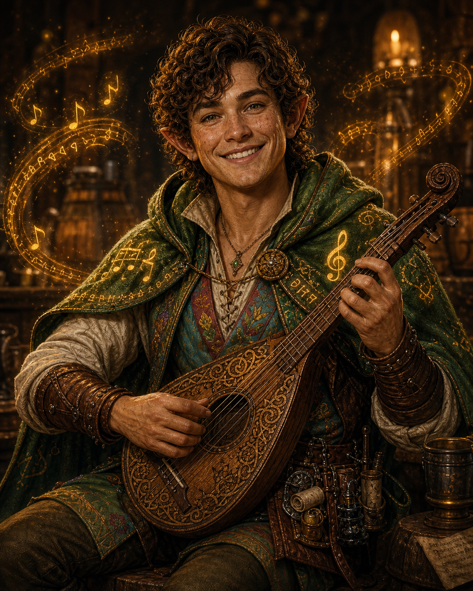

A cheerful Gladefolk bard with curly auburn hair, rosy cheeks, and lively hazel eyes. Like all Gladefolk, he looks no older than a human teenager despite being a seasoned adventurer — a trait that makes nobles underestimate him until he's picked their pockets and their secrets. He wears a quilted colorful vest over a soft-colored shirt, durable trousers, and a wide-brimmed traveler's hat tipped jauntily. A well-worn lute is slung at his side, and his belt is hung with rolled-up maps, songbooks, and small charm pouches.

> **Art prompt:** whimsical fantasy, warm tavern lighting.

**Attributes**

| STR | DEX | STA | INT | WIS | CHA |
|:---:|:---:|:---:|:---:|:---:|:---:|
|  8  | 18  | 13  | 14  | 11  | 18  |
| *-1*| *+4*| *+1*| *+2*| *0* | *+4*|

**HP** 35 · **AC** 12 · **SR** 17 · **HD** 7D6

**Equipment**
- **Short Sword** — 1D6 Piercing, 1H
- **Dagger** — 1D4 Piercing, 1H
- **Studded Leather Armor** — AC 12, Light
- **Ring of the Fox** — Dex +2

---

## Elder Treant — Ancient Forest Guardian
*Elf Druid, Level 20 — Quest Giver*

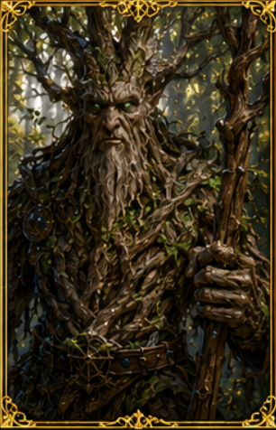

A massive, ancient treant-like elf druid whose body is half-tree and half-human: bark-like skin, branches twisting into hair, and moss-grown robes woven from vines and leaves. His face is weathered, with deep-set eyes that glow faintly green like forest light. His staff is a gnarled branch of a great tree, with tiny glowing leaves and roots that curl around his feet.

> **Art prompt:** epic fantasy, nature-magic, high-detail.

**Attributes**

| STR | DEX | STA | INT | WIS | CHA |
|:---:|:---:|:---:|:---:|:---:|:---:|
| 14  | 12  | 16  | 16  | 20  | 15  |
| *+2*| *+1*| *+3*| *+3*| *+5*| *+2*|

**HP** 160 · **AC** 13 · **SR** 15 · **HD** 20D8

**Equipment**
- **Gnarled Staff** (Quarter Staff) — 1D6 Bludgeoning, 2H
- **Forest Warden's Coat** — AC 13, Light (self-repairing living armor)
- **Heartstone Pendant** — +20 Max HP, Sta +1
- *(Grants the Dragon Scale Mail to those who prove worthy of protecting the forest)*

---

## Ser Garrick Dawnshield
*Human Paladin, Level 12 — Holy Vanguard / Protector*

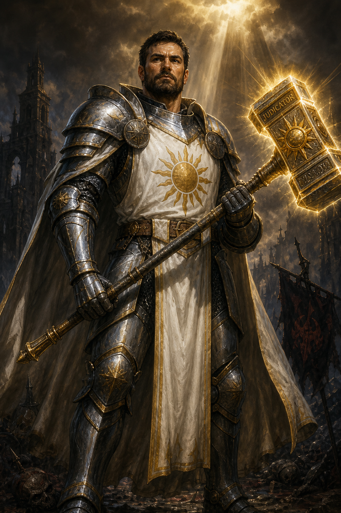

Ser Garrick Dawnshield is a towering paladin clad in polished silver plate marked with the sigil of Aethelion. Once a knight of the Silver Basilica, Garrick survived the Fall of Black Hollow where an entire battalion was consumed by demonic fire. Since then, he wanders the realm seeking signs of infernal corruption. Though feared for his unwavering zeal, those he protects speak of his kindness toward the weak and merciless fury toward evil.

He carries the massive warhammer *Judicator*, a relic said to glow brighter near undead and demons. Garrick believes suffering is the forge through which true virtue is tempered.

> **Art prompt:** A human male paladin standing in shining silver plate armor with a long white tabard bearing a golden sun emblem, holding a massive glowing two-handed warhammer, stern face with short dark hair and trimmed beard, holy fantasy warrior, dark medieval fantasy atmosphere, dramatic lighting, realistic high detail, isometric CRPG character style.

**Attributes**

| STR | DEX | STA | INT | WIS | CHA |
|:---:|:---:|:---:|:---:|:---:|:---:|
| 18  | 11  | 15  | 11  | 13  | 17  |
| *+4*| *0* | *+2*| *0* | *+1*| *+3*|

**HP** 96 · **AC** 16 · **SR** 13 · **HD** 12D10

**Equipment**
- **Judicator** (War Hammer) — 1D8 Bludgeoning +1, glows brighter near undead and demons
- **Plate Armor** — AC 18, Heavy
- **Shield** — +2 AC
- **Silver Cross of Hope** — Wis +1, Fear Resistance

---

## Vaelith Moonveil
*Elf Fighter / Mage, Level 9 — Arcane Duelist*

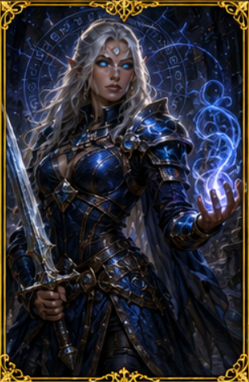

Vaelith Moonveil combines blade mastery with devastating arcane precision. Born among the High Elves of the Crystal Dominion, she was expelled from the Arcane Conclave after experimenting with forbidden battle magic that fused swordsmanship with destructive spellcasting.

She fights with a slender enchanted longsword while weaving magic through rapid gestures and whispered incantations. Her eyes glow faint blue whenever she channels arcane energy. Vaelith seeks forgotten ruins and lost magical artifacts, believing ancient knowledge should never be chained by fearful scholars.

> **Art prompt:** A female high elf fighter mage with long silver hair and glowing blue eyes, wearing elegant enchanted blue and black armor robes, wielding a glowing longsword in one hand and arcane magic in the other, magical energy swirling around her, dark fantasy CRPG style, realistic, highly detailed, isometric RPG character concept art.

**Attributes**

| STR | DEX | STA | INT | WIS | CHA |
|:---:|:---:|:---:|:---:|:---:|:---:|
| 14  | 18  | 10  | 19  | 10  | 13  |
| *+2*| *+4*| *0* | *+4*| *0* | *+1*|

**HP** 45 · **AC** 14 · **SR** 15 · **HD** 9D8

**Equipment**
- **Enchanted Long Sword** — 1D8 Slashing +1
- **Mithril Chain** — AC 14, Medium (flows like silk, protects like steel)
- **Ring of Arcane Focus** — Mana Cost -1

**Spells (10 memorized)**
- Fireball, Ice Bolt, Shock, Static Shock, Magic Missile
- Shield, Mirror Image, Blink, Lightning Bolt, Invisibility

---

## Sister Elira Vane
*Human Priest, Level 7 — Healer / Exorcist*

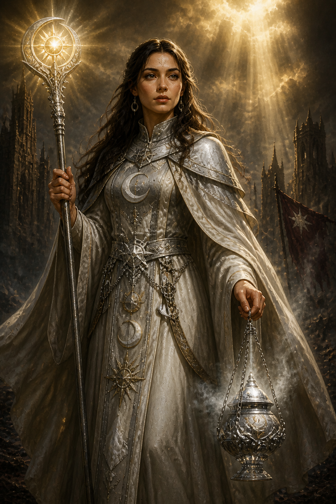

Sister Elira Vane serves the Moon Temple as both healer and spiritual guide. Soft-spoken and calm, she is beloved by the common folk for tending plague victims during the Ash Fever outbreak without fear for her own life.

Behind her serenity lies iron resolve. Elira has performed dozens of exorcisms against shadow spirits and undead horrors that haunt forgotten crypts. She believes compassion is the greatest weapon against darkness.

She carries a silver censer that burns sacred incense during rituals and battle alike.

> **Art prompt:** A human female cleric wearing white and silver priest robes with moon symbols, carrying a glowing holy staff and silver censer, calm expression, long dark brown hair, surrounded by soft divine light, gothic fantasy atmosphere, realistic detailed CRPG character portrait, isometric RPG style.

**Attributes**

| STR | DEX | STA | INT | WIS | CHA |
|:---:|:---:|:---:|:---:|:---:|:---:|
| 11  | 13  | 15  | 13  | 18  | 15  |
| *0* | *+1*| *+2*| *+1*| *+4*| *+2*|

**HP** 49 · **AC** 11 · **SR** 17 · **HD** 7D8

**Equipment**
- **Mace** — 1D6 Bludgeoning, 1H
- **Silver Censer** — burns sacred incense (ritual tool, not a weapon)
- **Padded Armor** (priestly robes) — AC 11, Light
- **Silver Cross of Hope** — Wis +1, Fear Resistance

---

## Lord Aethor Valeborn
*Elf Knight, Level 11 — Noble Duelist / Heavy Cavalry Commander*

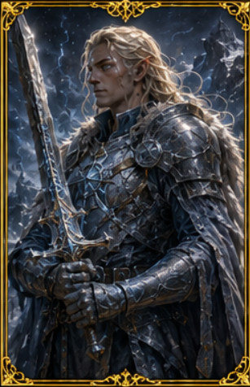

Lord Aethor Valeborn is an elven knight exiled from his ancestral house after refusing to abandon mortal villages during the War of Ashes. Unlike many elves, Aethor believes honor is measured through sacrifice, not bloodline.

He wields the two-handed greatsword *Winter Oath*, a massive blade forged from pale froststeel. Calm and disciplined in battle, he fights with measured precision instead of reckless aggression. His armor is adorned with faded heraldry from a forgotten elven kingdom swallowed by war centuries ago.

> **Art prompt:** A male elf knight in ornate silver and blue heavy armor holding a massive two-handed greatsword, long pale blond hair flowing behind him, noble and stoic expression, dark fantasy battlefield background, realistic medieval fantasy style, highly detailed CRPG character art, isometric RPG perspective.

**Attributes**

| STR | DEX | STA | INT | WIS | CHA |
|:---:|:---:|:---:|:---:|:---:|:---:|
| 16  | 16  | 14  | 14  | 10  | 15  |
| *+3*| *+3*| *+2*| *+2*| *0* | *+2*|

**HP** 88 · **AC** 16 · **SR** 13 · **HD** 11D10

**Equipment**
- **Winter Oath** (Great Sword) — 1D10 Ice +2, 2H (froststeel blade)
- **Plate Armor** — AC 18, Heavy
- **Shield** — +2 AC
- *(Faded heraldry of a forgotten elven kingdom adorns his armor)*

---

## Finnick "Quickfingers" Bramblefoot
*Gladefolk Rogue, Level 8 — Scout / Treasure Hunter*

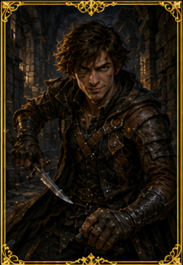

Finnick Bramblefoot is a notorious Gladefolk thief known throughout taverns and criminal circles alike. His youthful Gladefolk appearance — he could pass for a human errand boy of fourteen — lets him slip through places no full-grown burglar could. Charming, sarcastic, and impossible to pin down, Finnick has robbed corrupt nobles, escaped three executions, and once stole a jeweled crown during the coronation ceremony itself.

Though many dismiss him as a petty criminal, Finnick possesses a surprisingly strong moral code. He despises tyrants and often donates stolen gold to struggling villages anonymously.

He favors twin daggers hidden beneath his travel cloak and relies on speed, deception, and dirty tricks over direct confrontation.

> **Art prompt:** A male Gladefolk rogue with messy brown hair and sly green eyes, wearing dark leather armor and hooded travel cloak, holding twin daggers, smirking confidently in a shadowy medieval alley, dark fantasy CRPG style, realistic detailed character concept art, isometric RPG perspective.

**Attributes**

| STR | DEX | STA | INT | WIS | CHA |
|:---:|:---:|:---:|:---:|:---:|:---:|
|  8  | 20  | 13  | 14  | 11  | 16  |
| *-1*| *+5*| *+1*| *+2*| *0* | *+3*|

**HP** 40 · **AC** 12 · **SR** 17 · **HD** 8D6

**Equipment**
- **Dagger ×2** — 1D4 Piercing, 1H, Light
- **Studded Leather Armor** — AC 12, Light
- **Ring of the Fox** — Dex +2

---

## Korg Stonefist
*Orc Barbarian, Level 15 — Hostile (Wandering Berserker)*

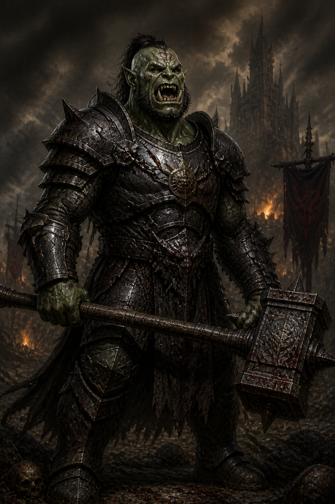

A wandering orc berserker who challenges all who cross his path. Towering and scarred from a thousand battles, Korg lives by the orcish code of *Ushog* — the eternal struggle. He speaks little and fights with savage joy, laughing as he crushes armor and bone beneath his maul.

He wears cursed plate mail that feeds on his pain, the black iron fused to his body by a shaman's ritual gone wrong. Blood seeps from the armor's joints even when he is unharmed, staining the ground wherever he walks.

**Attributes**

| STR | DEX | STA | INT | WIS | CHA |
|:---:|:---:|:---:|:---:|:---:|:---:|
| 21  | 10  | 18  |  8  |  8  |  8  |
| *+5*| *0* | *+4*| *-1*| *-1*| *-1*|

**HP** 165 · **AC** 16 · **SR** 14 · **HD** 15D12

**Special Abilities:** Extra Strength (+2 melee damage)

**Equipment**
- **Maul** — 1D10 Bludgeoning, 2H
- **Cursed Chain Mail** — AC 16, Heavy (feeds on the wearer's pain)
- *(Armor cannot be removed without Remove Curse)*

---

## Graveworm
*Undead Fighter, Level 9 — Hostile (Undead Warlord)*

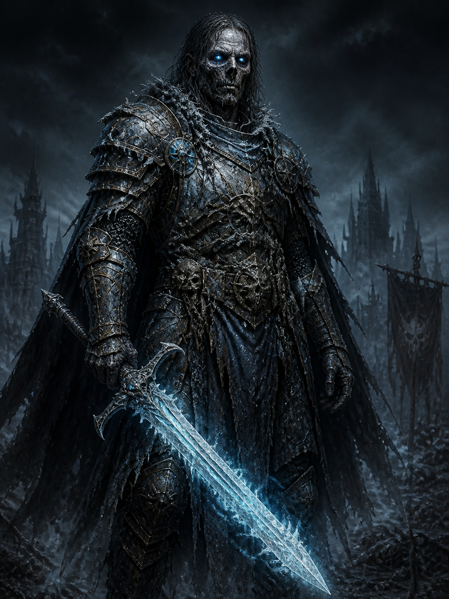

An undead warlord who commands a legion of skeletons in the Bone Fields. In life, he was a knight of the northern kingdoms who was slain by the very blade he now carries — *Frostbite*. The sword that killed him bound his soul to its icy edge, and he has risen as an undead guardian, doomed to protect the weapon that ended him.

Graveworm's hollow eyes glow with cold blue light. Fragments of his old armor still cling to his rotting form, fused with frost and bone.

**Attributes**

| STR | DEX | STA | INT | WIS | CHA |
|:---:|:---:|:---:|:---:|:---:|:---:|
| 17  | 10  | 14  | 11  |  8  |  6  |
| *+3*| *0* | *+2*| *0* | *-1*| *-2*|

**HP** 72 · **AC** 16 · **SR** 14 · **HD** 9D10

**Special Abilities:** Fear Immunity, Cause Fear, Stun

**Equipment**
- **Frostbite** (Short Sword) — 1D8 Ice +2, 1H (slows victims, leaves frozen wounds)
- **Chain Mail** — AC 16, Heavy

---

## Infernal Commander Maleth
*Demon Knight, Level 18 — Hostile (Boss)*

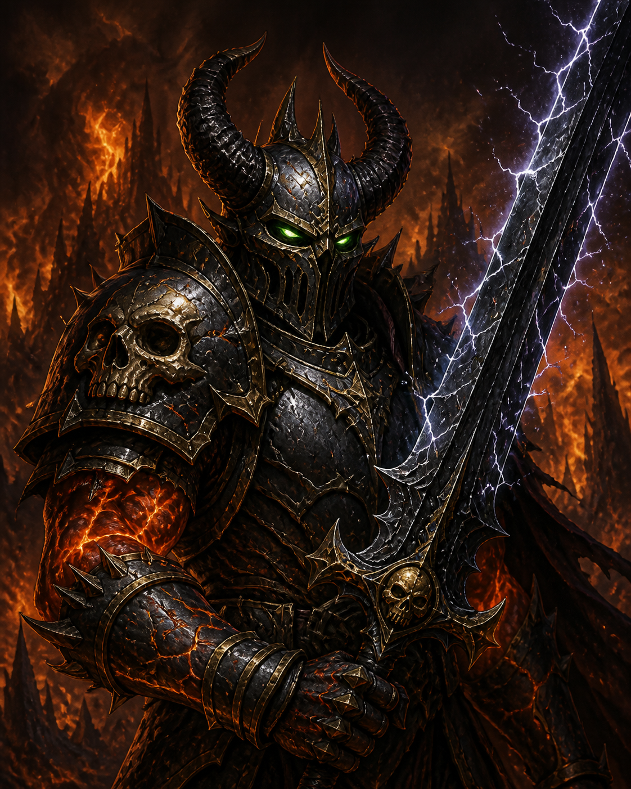

A demon lord commanding the legions of the Fire Pits. Maleth is a towering figure wreathed in hellfire, his body a mass of molten-iron muscle and jagged black horns. He wields the legendary lance *Stormbringer* and rides a nightmare steed whose hooves leave burning imprints in the stone.

Maleth was once an angel of the Silver Basilica who fell during the First Sundering. He now commands the infernal armies that besiege the mortal realm, and his defeat is the key to breaking the siege of the Burning Plains.

> **Art prompt:** Massive demon knight in obsidian and brass plate armor wreathed in flame, holding a crackling lightning lance, riding a fiery nightmare steed, dark hellscape background, epic boss encounter, CRPG isometric character art.

**Attributes**

| STR | DEX | STA | INT | WIS | CHA |
|:---:|:---:|:---:|:---:|:---:|:---:|
| 22  | 12  | 19  | 15  | 10  | 17  |
| *+6*| *+1*| *+4*| *+2*| *0* | *+3*|

**HP** 180 · **AC** 16 · **SR** 12 · **HD** 18D10

**Special Abilities:** Cause Fear, Stun

**Equipment**
- **Stormbringer** (Lance) — 1D12 Lightning +2, 2H (thunder shakes the earth, lightning arcs from the tip)
- **Plate Armor** — AC 18, Heavy
- **Shield** — +2 AC
- **Nightmare Steed** — fiendish mount

---

## Stat Index

| # | Name | Race | Class | Lvl | Role | STR | DEX | STA | INT | WIS | CHA | HP | AC | SR |
|:-:|------|------|-------|:---:|------|:---:|:---:|:---:|:---:|:---:|:---:|:--:|:--:|:--:|
| 1 | Old Man Kael | Human | Priest | 8 | Quest Giver | 9 | 8 | 11 | 15 | 19 | 14 | 40 | 11 | 17 |
| 2 | Greta Ironhand | Dwarf | Fighter | 12 | Merchant | 19 | 10 | 18 | 10 | 13 | 8 | 120 | 14 | 13 |
| 3 | Shadowmere | Elf | Rogue | 10 | Quest Giver | 10 | 19 | 10 | 16 | 10 | 15 | 40 | 12 | 16 |
| 4 | Merchant Vex | Kobold | Rogue | 6 | Merchant | 8 | 17 | 10 | 14 | 10 | 14 | 24 | 11 | 18 |
| 5 | Kaela Vornskald | Human | Barbarian | 10 | Wanderer | 19 | 15 | 17 | 9 | 11 | 13 | 100 | 12 | 15 |
| 6 | High Priestess Luna | Human | Priest | 14 | Quest Giver | 9 | 11 | 13 | 15 | 19 | 17 | 84 | 18 | 16 |
| 7 | Lysander the Bard | Gladefolk | Bard | 7 | Quest Giver | 8 | 18 | 13 | 14 | 11 | 18 | 35 | 12 | 17 |
| 8 | Elder Treant | Elf | Druid | 20 | Quest Giver | 14 | 12 | 16 | 16 | 20 | 15 | 160 | 13 | 15 |
| 9 | Ser Garrick Dawnshield | Human | Paladin | 12 | Vanguard | 18 | 11 | 15 | 11 | 13 | 17 | 96 | 16 | 13 |
| 10 | Vaelith Moonveil | Elf | Ftr/Mage | 9 | Arcane Duelist | 14 | 18 | 10 | 19 | 10 | 13 | 45 | 14 | 15 |
| 11 | Sister Elira Vane | Human | Priest | 7 | Healer | 11 | 13 | 15 | 13 | 18 | 15 | 49 | 11 | 17 |
| 12 | Lord Aethor Valeborn | Elf | Knight | 11 | Duelist | 16 | 16 | 14 | 14 | 10 | 15 | 88 | 16 | 13 |
| 13 | Finnick Bramblefoot | Gladefolk | Rogue | 8 | Scout/Thief | 8 | 20 | 13 | 14 | 11 | 16 | 40 | 12 | 17 |
| 14 | Korg Stonefist | Orc | Barbarian | 15 | Hostile | 21 | 10 | 18 | 8 | 8 | 8 | 165 | 16 | 14 |
| 15 | Graveworm | Undead | Fighter | 9 | Hostile | 17 | 10 | 14 | 11 | 8 | 6 | 72 | 16 | 14 |
| 16 | Infernal Cmdr Maleth | Demon | Knight | 18 | Boss | 22 | 12 | 19 | 15 | 10 | 17 | 180 | 16 | 12 |
