# Dark Orb Master Spellbook

This master document merges the earlier Dark Orb spell roster with the rebuilt progression system so the setting has one complete spell reference instead of separate versions. It keeps AD&D 2e-inspired spell foundations while applying the custom Dark Orb access rules for mages, priests, druids, paladins, and knights.

## Structure

The system now uses one shared framework for every spell entry: **School**, **Spell Level**, **Access Layer**, **Access Tier**, **Minimum Level**, **Effect**, **Impact**, **Class**, **Damage Type**, and **Afterburn**. This lets the spellbook show both fantasy identity and progression logic in one place.

## Progression model

The spellbook is organized into three access layers: **Common Core**, **Class Core**, and **School Specialization**. Common Core stabilizes low-tier play, Class Core gives each class a clear role before rare magic appears, and School Specialization defines the stronger signature effects in the mid and late game.

| Layer | Purpose | Design use |
|---|---|---|
| Common Core | Shared baseline spells used by most members of a casting class. | Gives early characters a stable toolkit and prevents weak low-level identity. |
| Class Core | Spells tied to class fantasy before deep specialization. | Keeps priests, druids, paladins, and knights feeling different early. |
| School Specialization | Signature spells and variants tied to magical doctrine. | Defines rare effects, elite spell picks, and late-game mastery. |

## Class progression

This is the applied progression plan for Dark Orb, including your custom paladin and knight rules. The access model below is intentionally tuned for game feel rather than strict AD&D 2e canon in every case.

| Class | Early progression | Mid progression | Late progression |
|---|---|---|---|
| Mage | Levels 1-2 use a broad Common Core of widely taught arcane staples. | Levels 3-4 keep some shared spells but begin school-gated picks. | Level 5+ is driven mostly by school specialization, rare variants, and elite identity. |
| Priest | Early access to blessings, healing, command, protection, and curse tools. | Mid progression expands into restoration, stronger control, and battlefield support. | Late progression adds miracles, barriers, summons, and supreme healing. |
| Druid | Early access to roots, beasts, natural healing, and terrain magic. | Mid progression expands into storms, swarms, and primal battlefield control. | Late progression adds catastrophes, guardian summons, and great nature magic. |
| Paladin | Starts using magic around level 6 in Dark Orb, focused on self and companion buffs, wards, cleansing, and healing-lite support. | Mid progression adds auras, resistance, anti-fear, and stronger defensive support. | Late progression gains elite holy defense and small-area protection, but stays narrower than a priest. |
| Knight | Starts command-style magic around level 9 in Dark Orb, focused on warcries, morale boosts, TM uplift, formation discipline, and resistance support. | Mid progression adds stronger command auras and anti-panic tools. | Late progression gains elite banner magic, group Magic Resistance support, and morale supremacy rather than broad spellcasting. |

## Access rules

### Mage access rules

Mages begin with a broad **Common Core** so that early arcane play feels flexible and useful rather than prematurely specialized. School choice begins to matter at levels 3-4 and becomes dominant at level 5+, with elite school variants and rare off-school picks treated as mastery rewards.

### Priest access rules

Priests are **deity-aligned casters** — their magic originates from a patron deity, not a spell school. Schools remain secondary metadata for legacy grouping but do not drive progression or identity.

Priests gain early class identity through blessings, command effects, healing, warding, and curse interaction. Their progression should stay broad within divine identity, with late-game access opening stronger battlefield miracles and barriers rather than turning them into elemental specialists.

### Druid access rules

Druids are **deity-aligned casters** — their primal magic is tied to nature deities. Schools remain secondary metadata; identity and progression are deity-driven.

Druids gain early access to roots, nature utility, beast interaction, and natural healing before expanding into storms, swarms, terrain control, and primal summoning. Their list should remain distinct from priests by controlling the battlefield through natural force and environment.

### Paladin access rules

Paladins are **deity-aligned casters** — their magic is channelled through a patron deity. Schools are secondary.

In Dark Orb, paladins start spell use around level 6 as a custom rule, even though AD&D 2e canon places paladin priest spellcasting later. Their list is restricted to protection, self and companion buffs, cleansing, courage, healing-lite support, and defensive wards, with very little offensive magic.

### Knight access rules

Knights are **deity-aligned casters** — their command magic flows from divine authority. Schools are secondary.

Knights begin magical support around level 9 and focus on warcries, morale, formation integrity, TM uplift, fear control, and Magic Resistance support. They should feel like martial leaders using command magic, not priests with a renamed spell list.

## Six schools

Dark Orb uses six broad schools to organize common spells, specialized spells, and custom variants. These are broader and more game-facing than strict AD&D school labels, which makes them better for a large modular spellbook.

### Aegis

Aegis focuses on wards, protection, armor reinforcement, resistance, sanctuaries, anti-magic, and survival tools. It is the main school for Armor Class increases, Magic Resistance buffs, barriers, and anti-control defense.

### Stormcraft

Stormcraft governs raw elemental force such as fire, lightning, frost, detonations, and destructive battlefield hazards. It is the primary school for HP-damage nukes, electrocute variants, and high-pressure area spells.

### Verdancy

Verdancy is the school of nature, beasts, roots, wind, stone, insects, herbs, and primal elemental power. It excels at Movement control, terrain shaping, nature healing, storms, swarms, and guardian summons.

### Umbramancy

Umbramancy is the dark magic school, covering death, undead, shadow, curses, fear, life-drain, anti-caster pressure, and sinister battlefield control. It is the best school for necrotic damage, HP leech, MP drain variants, curse trees, and undead conjuration.

### Mirage

Mirage handles illusion, invisibility, mirror images, deception, confusion, stealth, and perception warping. It supports defense and control through miss chance, misdirection, concealment, and sensory denial.

### Dominion

Dominion governs command, blessing, morale, discipline, fear resistance, divine authority, and battle momentum. It is the natural school for warcries, prayer effects, teamwide TM uplift, panic control, and leadership magic.

## Deity system (divine casters)

A subset of classes derive their power from deities rather than spell schools. This system runs alongside the school system — it does not replace it.

### Divine caster classes

The following classes are **deity-aligned**:

| Class | Role | Magic access |
|-------|------|--------------|
| Priest | Full divine caster | Level 1 |
| Druid | Full divine caster | Level 1 |
| Paladin | Limited divine caster | Level 6 |
| Knight | Command magic caster | Level 9 |

These classes **do not** use spell schools as their primary identity system. Schools remain valid for legacy classification and mechanical grouping but do not drive progression or identity logic.

### Canonical deities

Deities are defined in [`../reference/deities.md`](#../reference/deities.md). The authoritative list:

#### Light deities (Sky / Heaven aligned)

| Deity | Title | Domain |
|-------|-------|--------|
| **Aethelion** | The radiant father of light | Heaven, Light |
| **Astrara** | The guiding star mother | Stars, Fate |
| **Celestara** | The weaver of destiny | Destiny, Time |
| **Lunara** | The silver moon goddess | Moon, Magic, Tides |

#### Twilight deity (Boundary / Time aligned)

| Deity | Title | Domain |
|-------|-------|--------|
| **Chronara** | The keeper of time | Time, Stars, Balance |

Chronara watches stars ignite and shadows burn out without ever taking a side. She is the twilight fulcrum between the celestial and the void. Her associations with stars and the night sky underpin future night-sky buff mechanics tied to constellations, moon phases, and star visibility.

#### Dark deities (Elemental / Shadow aligned)

| Deity | Title | Domain |
|-------|-------|--------|
| **Ignaroth** | The burning destroyer | Fire, Destruction |
| **Umbraex** | The void lord | Darkness, Secrets |
| **Veparix** | The deceptive mist | Deception, Illusion |
| **Noctivane** | The shadow assassin god | Shadow, Stealth |

### Deity spell metadata

Every divine spell includes the following conceptual fields:

| Field | Required | Description |
|-------|----------|-------------|
| `PrimaryDeity` | Yes | The deity granting the spell |
| `DeityAlignment` | Yes | Good, Evil, or Neutral |
| `DeitySource` | Yes | Power origin identifier |
| `FallbackDeity` | Yes | `DEITY_UNBOUND` (see below) |

### Placeholder: DEITY_UNBOUND

Used when no specific deity is assigned:

- Meaning: Generic divine power source, temporary fallback
- Used until explicit deity binding is defined
- Prevents system gaps during incomplete mappings

### Night-sky buffs (future implementation)

Extra buffs become available when constellations, the moon, or stars are visible in the night sky. These effects are:

- **Reserved for future implementation** — not yet active
- Associated with Chronara (time/stars), Astrara (guiding star), and Lunara (moon)
- May grant temporary bonuses to divine caster classes when fighting under visible celestial bodies
- Design intent: create dynamic power variance tied to in-game time-of-day and location visibility

### School / deity boundary

| System | Used by | Drives |
|--------|---------|--------|
| Spell schools | Arcane casters, fire/frost/shadow/nature users | Progression, identity, spell access |
| Deity system | Priest, Druid, Paladin, Knight | Progression, identity, spell access |

Both systems coexist. Schools remain fully intact and functional for non-divine casters.

### Smite

- **Deity-channelled divine attack spell**
- Restricted to: Paladin (Level 6+), Knight (Level 6+)
- Must be associated with a valid deity
- Cannot be used outside the listed divine caster archetypes

### Chasten

- Divine counterpart to Smite for non-martial casters
- Available to: Priest (Level 1+), Druid (Level 1+)
- Default bound to Light deities
- Supports `DEITY_UNBOUND` fallback
- Mirrors Smite progression structure

## Impact system

The spellbook uses a unified impact language so offensive and defensive spells can be compared cleanly. **HP** covers damage and healing, **TM** covers turn-meter acceleration, loss, or lock, **MP** covers mana drain or leech variants, **Magic Resistance** covers anti-magic protection or magical vulnerability, **Armor Class** covers physical survivability, and **Movement** covers roots, slows, displacement, teleporting, and terrain denial.

## Mage common core

These are the low-tier spells most mages should have access to before school specialization strongly limits choice. This solves the progression issue you identified by making early mages broad and competent before their schools fully define them.

| Spell | School | Spell Level | Access Layer | Access Tier | Minimum Level | Class | Damage Type | Afterburn | Tags |
|------|--------|-------------|-------------|-----------|---------------|-------|------------|-----------|------|
| [Magic Missile](#magic-missile) | Stormcraft | 1 | Common Core | Early | - | Mage | Force | No. | Single-Target Damage, Nuke |
| [Armor](#armor) | Aegis | 1 | Common Core | Early | - | Mage | None | No. | Defensive, Buff |
| [Shield](#shield) | Aegis | 1 | Common Core | Early | - | Mage | None | No. | Defensive |
| [Burning Hands](#burning-hands) | Stormcraft | 1 | Common Core | Early | - | Mage | Fire | No clear persistent burn in baseline list. | Offensive, AoE |
| [Grease](#grease) | Mirage | 1 | Common Core | Early | - | Mage | None/Control | Yes, persistent slippery zone. | CC, Slip, AoE |
| [Sleep](#sleep) | Mirage | 1 | Common Core | Early | - | Mage | None/Control | Yes, duration disable. | CC, AoE |
| [Color Spray](#color-spray) | Mirage | 1 | Common Core | Early | - | Mage | Light/Control | No. | CC, AoE |
| [Detect Magic](#detect-magic) | Aegis / Mirage | 1 | Common Core | Early | - | Mage | None | No. | Utility |
| [Invisibility](#invisibility) | Mirage | 2 | Common Core | Early | - | Mage | None | Yes, duration stealth state. | Invisibility |
| [Mirror Image](#mirror-image) | Mirage | 2 | Common Core | Early | - | Mage | None | Yes, images persist until removed. | Defensive, Image |
| [Web](#web) | Mirage / Dominion | 2 | Common Core | Early | - | Mage | None/Control | Yes, persistent sticky field while active. | CC, Root, AoE |
| [Stinking Cloud](#stinking-cloud) | Umbramancy / Mirage | 2 | Common Core | Early | - | Mage | Poison/Control | Yes, persistent cloud zone. | CC, AoE |

### Magic Missile

<table border="0" cellspacing="0" cellpadding="0" style="border: none; border-collapse: collapse;">
<tr>
<td style="border: none; padding-right: 12px;">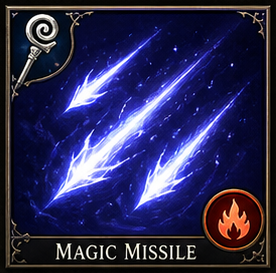</td>
<td style="border: none;">
<table border="0" cellspacing="0" cellpadding="0" style="border: none; border-collapse: collapse;">
<tr><th style="border: none;">School</th><th style="border: none;">Level</th><th style="border: none;">Mana</th><th style="border: none;">Damage</th><th style="border: none;">Class</th><th style="border: none;">Tags</th></tr>
<tr><td style="border: none;">Stormcraft</td><td style="border: none;">1</td><td style="border: none;">5</td><td style="border: none;">1d4+1 per dart</td><td style="border: none;">Mage</td><td style="border: none;">Single-Target Damage, Nuke</td></tr>
</table>
</td>
</tr>
</table>

*The first incantation taught in every arcane academy — three flawless darts of pure force that never deviate from their mark. Three glowing darts of pure force that never miss — each deals 1d4+1 damage and strikes simultaneously with no attack roll required. Force damage bypasses most resistances and immunities. Base 3d4+3 at level 1, gaining +1 dart at levels 3, 5, and 7 (max 6d4+6). Guaranteed HP damage that cannot be dodged, parried, or blocked.*

### Armor

<table border="0" cellspacing="0" cellpadding="0" style="border: none; border-collapse: collapse;">
<tr>
<td style="border: none; padding-right: 12px;">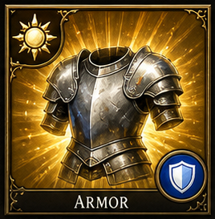</td>
<td style="border: none;">
<table border="0" cellspacing="0" cellpadding="0" style="border: none; border-collapse: collapse;">
<tr><th style="border: none;">School</th><th style="border: none;">Level</th><th style="border: none;">Mana</th><th style="border: none;">Damage</th><th style="border: none;">Class</th><th style="border: none;">Tags</th></tr>
<tr><td style="border: none;">Aegis</td><td style="border: none;">1</td><td style="border: none;">10</td><td style="border: none;">None</td><td style="border: none;">Mage</td><td style="border: none;">Defensive, Buff</td></tr>
</table>
</td>
</tr>
</table>

*A shimmering field of magical force wraps the caster in invisible plate. Creates a protective field granting a significant Armor Class bonus that stacks with worn armor. AC +6 at level 1, scaling +1 per 3 caster levels (max +10). The field lasts until dispelled or the caster rests.*

### Shield

<table border="0" cellspacing="0" cellpadding="0" style="border: none; border-collapse: collapse;">
<tr>
<td style="border: none; padding-right: 12px;"></td>
<td style="border: none;">
<table border="0" cellspacing="0" cellpadding="0" style="border: none; border-collapse: collapse;">
<tr><th style="border: none;">School</th><th style="border: none;">Level</th><th style="border: none;">Mana</th><th style="border: none;">Damage</th><th style="border: none;">Class</th><th style="border: none;">Tags</th></tr>
<tr><td style="border: none;">Aegis</td><td style="border: none;">1</td><td style="border: none;">-</td><td style="border: none;"></td><td style="border: none;">Mage</td><td style="border: none;">Defensive</td></tr>
</table>
</td>
</tr>
</table>

*- Mage.*

### Burning Hands

<table border="0" cellspacing="0" cellpadding="0" style="border: none; border-collapse: collapse;">
<tr>
<td style="border: none; padding-right: 12px;">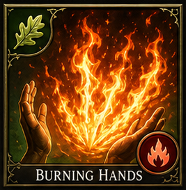</td>
<td style="border: none;">
<table border="0" cellspacing="0" cellpadding="0" style="border: none; border-collapse: collapse;">
<tr><th style="border: none;">School</th><th style="border: none;">Level</th><th style="border: none;">Mana</th><th style="border: none;">Damage</th><th style="border: none;">Class</th><th style="border: none;">Tags</th></tr>
<tr><td style="border: none;">Stormcraft</td><td style="border: none;">1</td><td style="border: none;">5</td><td style="border: none;">1d4 per level Fire</td><td style="border: none;">Mage</td><td style="border: none;">Offensive, AoE</td></tr>
</table>
</td>
</tr>
</table>

*A fan of roaring flame erupts from the caster's fingertips. A cone-shaped burst hits all targets in short range for 1d4 fire damage per caster level (max 5d4). No save for half. Base 1d4 at level 1, scaling +1d4 per level up to 5d4.*

### Grease

<table border="0" cellspacing="0" cellpadding="0" style="border: none; border-collapse: collapse;">
<tr>
<td style="border: none; padding-right: 12px;"></td>
<td style="border: none;">
<table border="0" cellspacing="0" cellpadding="0" style="border: none; border-collapse: collapse;">
<tr><th style="border: none;">School</th><th style="border: none;">Level</th><th style="border: none;">Mana</th><th style="border: none;">Damage</th><th style="border: none;">Class</th><th style="border: none;">Tags</th></tr>
<tr><td style="border: none;">Mirage</td><td style="border: none;">1</td><td style="border: none;">-</td><td style="border: none;"></td><td style="border: none;">Mage</td><td style="border: none;">CC, Slip, AoE</td></tr>
</table>
</td>
</tr>
</table>

*- Mage Damage type: None/Control. Yes, persistent slippery zone.*

### Sleep

<table border="0" cellspacing="0" cellpadding="0" style="border: none; border-collapse: collapse;">
<tr>
<td style="border: none; padding-right: 12px;">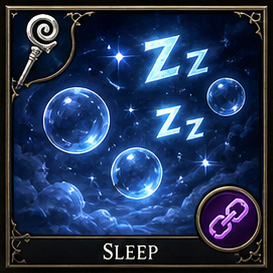</td>
<td style="border: none;">
<table border="0" cellspacing="0" cellpadding="0" style="border: none; border-collapse: collapse;">
<tr><th style="border: none;">School</th><th style="border: none;">Level</th><th style="border: none;">Mana</th><th style="border: none;">Damage</th><th style="border: none;">Class</th><th style="border: none;">Tags</th></tr>
<tr><td style="border: none;">Mirage</td><td style="border: none;">1</td><td style="border: none;">5</td><td style="border: none;">None</td><td style="border: none;">Mage</td><td style="border: none;">CC, AoE</td></tr>
</table>
</td>
</tr>
</table>

*A cloud of shimmering blue motes drifts across the battlefield. Puts low-HP targets into magical slumber, affecting up to 4 HD of creatures total. Slumber breaks on damage or when the duration expires. Non-lethal crowd control that freezes TM.*

### Color Spray

<table border="0" cellspacing="0" cellpadding="0" style="border: none; border-collapse: collapse;">
<tr>
<td style="border: none; padding-right: 12px;"></td>
<td style="border: none;">
<table border="0" cellspacing="0" cellpadding="0" style="border: none; border-collapse: collapse;">
<tr><th style="border: none;">School</th><th style="border: none;">Level</th><th style="border: none;">Mana</th><th style="border: none;">Damage</th><th style="border: none;">Class</th><th style="border: none;">Tags</th></tr>
<tr><td style="border: none;">Mirage</td><td style="border: none;">1</td><td style="border: none;">-</td><td style="border: none;"></td><td style="border: none;">Mage</td><td style="border: none;">CC, AoE</td></tr>
</table>
</td>
</tr>
</table>

*- Mage Damage type: Light/Control.*

### Detect Magic

<table border="0" cellspacing="0" cellpadding="0" style="border: none; border-collapse: collapse;">
<tr>
<td style="border: none; padding-right: 12px;"></td>
<td style="border: none;">
<table border="0" cellspacing="0" cellpadding="0" style="border: none; border-collapse: collapse;">
<tr><th style="border: none;">School</th><th style="border: none;">Level</th><th style="border: none;">Mana</th><th style="border: none;">Damage</th><th style="border: none;">Class</th><th style="border: none;">Tags</th></tr>
<tr><td style="border: none;">Aegis / Mirage</td><td style="border: none;">1</td><td style="border: none;">-</td><td style="border: none;"></td><td style="border: none;">Mage</td><td style="border: none;">Utility</td></tr>
</table>
</td>
</tr>
</table>

*- Mage.*

### Invisibility

<table border="0" cellspacing="0" cellpadding="0" style="border: none; border-collapse: collapse;">
<tr>
<td style="border: none; padding-right: 12px;">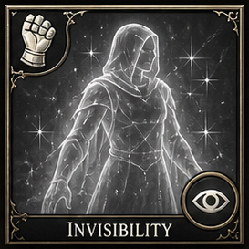</td>
<td style="border: none;">
<table border="0" cellspacing="0" cellpadding="0" style="border: none; border-collapse: collapse;">
<tr><th style="border: none;">School</th><th style="border: none;">Level</th><th style="border: none;">Mana</th><th style="border: none;">Damage</th><th style="border: none;">Class</th><th style="border: none;">Tags</th></tr>
<tr><td style="border: none;">Mirage</td><td style="border: none;">2</td><td style="border: none;">10</td><td style="border: none;">None</td><td style="border: none;">Mage</td><td style="border: none;">Invisibility</td></tr>
</table>
</td>
</tr>
</table>

*The caster or a touched ally fades from sight, becoming a whisper of refracted light. Renders the target completely invisible — attacks against them suffer a severe miss chance. The spell ends when the target attacks or casts an offensive spell.*

### Mirror Image

<table border="0" cellspacing="0" cellpadding="0" style="border: none; border-collapse: collapse;">
<tr>
<td style="border: none; padding-right: 12px;"></td>
<td style="border: none;">
<table border="0" cellspacing="0" cellpadding="0" style="border: none; border-collapse: collapse;">
<tr><th style="border: none;">School</th><th style="border: none;">Level</th><th style="border: none;">Mana</th><th style="border: none;">Damage</th><th style="border: none;">Class</th><th style="border: none;">Tags</th></tr>
<tr><td style="border: none;">Mirage</td><td style="border: none;">2</td><td style="border: none;">-</td><td style="border: none;"></td><td style="border: none;">Mage</td><td style="border: none;">Defensive, Image</td></tr>
</table>
</td>
</tr>
</table>

*- Mage Yes, images persist until removed.*

### Web

<table border="0" cellspacing="0" cellpadding="0" style="border: none; border-collapse: collapse;">
<tr>
<td style="border: none; padding-right: 12px;"></td>
<td style="border: none;">
<table border="0" cellspacing="0" cellpadding="0" style="border: none; border-collapse: collapse;">
<tr><th style="border: none;">School</th><th style="border: none;">Level</th><th style="border: none;">Mana</th><th style="border: none;">Damage</th><th style="border: none;">Class</th><th style="border: none;">Tags</th></tr>
<tr><td style="border: none;">Mirage / Dominion</td><td style="border: none;">2</td><td style="border: none;">-</td><td style="border: none;"></td><td style="border: none;">Mage</td><td style="border: none;">CC, Root, AoE</td></tr>
</table>
</td>
</tr>
</table>

*- Mage Damage type: None/Control. Yes, persistent sticky field while active.*

### Stinking Cloud

<table border="0" cellspacing="0" cellpadding="0" style="border: none; border-collapse: collapse;">
<tr>
<td style="border: none; padding-right: 12px;"></td>
<td style="border: none;">
<table border="0" cellspacing="0" cellpadding="0" style="border: none; border-collapse: collapse;">
<tr><th style="border: none;">School</th><th style="border: none;">Level</th><th style="border: none;">Mana</th><th style="border: none;">Damage</th><th style="border: none;">Class</th><th style="border: none;">Tags</th></tr>
<tr><td style="border: none;">Umbramancy / Mirage</td><td style="border: none;">2</td><td style="border: none;">-</td><td style="border: none;"></td><td style="border: none;">Mage</td><td style="border: none;">CC, AoE</td></tr>
</table>
</td>
</tr>
</table>

*- Mage Damage type: Poison/Control. Yes, persistent cloud zone.*

## Mage specialization

From the mid game onward, mage identity shifts toward school-defined picks, stronger battlefield roles, and rarer variants. These are still organized with the same access-rule framework.

| Spell | School | Spell Level | Access Layer | Access Tier | Minimum Level | Class | Damage Type | Afterburn | Tags |
|------|--------|-------------|-------------|-----------|---------------|-------|------------|-----------|------|
| [Lightning Bolt](#lightning-bolt) | Stormcraft | 3 | School Specialization | Mid | - | Mage | Lightning | Optional electric aftershock in variants. | Offensive, AoE, Nuke |
| [Fireball](#fireball) | Stormcraft | 3 | School Specialization | Mid | - | Mage | Fire | No in baseline effect text. | Offensive, AoE, Nuke |
| [Blink](#blink) | Mirage | 3 | School Specialization | Mid | - | Mage | None | Yes, duration displacement effect. | Blink, Defensive |
| [Slow](#slow) | Dominion / Mirage | 3 | School Specialization | Mid | - | Mage | None/Control | Yes, duration-based tempo suppression. | CC, Debuff, Turn-Meter Control |
| [Haste](#haste) | Dominion | 3 | School Specialization | Mid | - | Mage, Paladin, Knight, Bard | None/Buff | Yes, duration-based speed buff. | Buff, TM Uplift |
| [Mass Haste](#mass-haste) | Dominion | 5 | School Specialization | Late | - | Mage, Priest, Druid | None/Buff | Yes, duration-based speed buff. Caster suffers DefensePower debuff. | Buff, TM Uplift, Group |
| [Vampiric Touch](#vampiric-touch) | Umbramancy | 3 | School Specialization | Mid | - | Mage | Necrotic/Drain-theme | Leech effect instead of burn. | Single-Target Damage, Leech |
| [Fear](#fear) | Umbramancy / Dominion | 4 | School Specialization | Mid | - | Mage | None/Control | No. | CC, Debuff |
| [Ice Storm](#ice-storm) | Stormcraft | 4 | School Specialization | Mid | - | Mage | Cold/Physical | No. | Offensive, AoE |
| [Confusion](#confusion) | Mirage / Dominion | 4/7 | School Specialization | Late | - | Mage | None/Control | Yes, duration-based control effect. | CC, AoE |
| [Cloudkill](#cloudkill) | Umbramancy | 5 | School Specialization | Late | - | Mage | Poison | Yes, persistent cloud hazard. | Offensive, AoE |
| [Cone of Cold](#cone-of-cold) | Stormcraft | 5 | School Specialization | Late | - | Mage | Cold | No. | Offensive, AoE, Nuke |
| [Feeblemind](#feeblemind) | Umbramancy | 5 | School Specialization | Late | - | Mage | None/Anti-Mage | Yes, lasting debilitation. | CC, Anti-Mage |
| [Delayed Blast Fireball](#delayed-blast-fireball) | Stormcraft | 7 | School Specialization | Late | - | Mage | Fire | No baseline burn rider. | Offensive, AoE, Nuke |
| [Maze](#maze) | Mirage | 8 | School Specialization | Late | - | Mage | None/Control | Yes, exile duration. | CC |
| [Mind Siphon Variant](#mind-siphon-variant) | Umbramancy | 4 | School Specialization | Mid | - | Mage, Dark Priest | Shadow/Drain | Yes, lingering mana suppression in variant design. | MP Leech, Variant |
| [Arc Lash Variant](#arc-lash-variant) | Stormcraft | 3 | School Specialization | Mid | - | Mage | Lightning | Yes, electric aftershock in variant design. | Single-Target Damage, TM Control, Variant |
| [Mirror Guard Variant](#mirror-guard-variant) | Mirage / Aegis | 3 | School Specialization | Mid | - | Mage | Illusory/None | Yes, images persist until broken. | Defensive, Variant |
| [Greasefire Variant](#greasefire-variant) | Stormcraft / Mirage | 2 | School Specialization | Mid | - | Mage | Fire | Yes, brief burning ground effect in variant design. | Offensive, AoE, Variant |
| [Mind Game](#mind-game) | Umbramancy | 2 | School Specialization | Mid | - | Mage | Shadow | Yes, Confused (gray) | CC, Debuff |
| [Charm Person](#charm-person) | Mirage | 2 | School Specialization | Mid | - | Mage | None | Yes, Charmed (pink) | CC, Charm |

### Lightning Bolt

<table border="0" cellspacing="0" cellpadding="0" style="border: none; border-collapse: collapse;">
<tr>
<td style="border: none; padding-right: 12px;"></td>
<td style="border: none;">
<table border="0" cellspacing="0" cellpadding="0" style="border: none; border-collapse: collapse;">
<tr><th style="border: none;">School</th><th style="border: none;">Level</th><th style="border: none;">Mana</th><th style="border: none;">Damage</th><th style="border: none;">Class</th><th style="border: none;">Tags</th></tr>
<tr><td style="border: none;">Stormcraft</td><td style="border: none;">3</td><td style="border: none;">-</td><td style="border: none;"></td><td style="border: none;">Mage</td><td style="border: none;">Offensive, AoE, Nuke</td></tr>
</table>
</td>
</tr>
</table>

*- Mage Damage type: Lightning. Optional electric aftershock in variants.*

### Fireball

<table border="0" cellspacing="0" cellpadding="0" style="border: none; border-collapse: collapse;">
<tr>
<td style="border: none; padding-right: 12px;">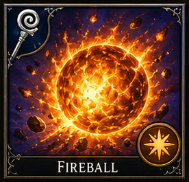</td>
<td style="border: none;">
<table border="0" cellspacing="0" cellpadding="0" style="border: none; border-collapse: collapse;">
<tr><th style="border: none;">School</th><th style="border: none;">Level</th><th style="border: none;">Mana</th><th style="border: none;">Damage</th><th style="border: none;">Class</th><th style="border: none;">Tags</th></tr>
<tr><td style="border: none;">Stormcraft</td><td style="border: none;">3</td><td style="border: none;">15</td><td style="border: none;">1d6 per level Fire</td><td style="border: none;">Mage</td><td style="border: none;">Offensive, AoE, Nuke</td></tr>
</table>
</td>
</tr>
</table>

*A pea-sized bead of orange light streaks to the target point and erupts into a roaring sphere of flame. A wide-area explosion dealing 1d6 fire damage per caster level (cap 10d6) to all targets in a 20-foot radius. Cannot be shaped. Base 5d6 at level 5, scaling +1d6 per level to 10d6.*

### Blink

<table border="0" cellspacing="0" cellpadding="0" style="border: none; border-collapse: collapse;">
<tr>
<td style="border: none; padding-right: 12px;"></td>
<td style="border: none;">
<table border="0" cellspacing="0" cellpadding="0" style="border: none; border-collapse: collapse;">
<tr><th style="border: none;">School</th><th style="border: none;">Level</th><th style="border: none;">Mana</th><th style="border: none;">Damage</th><th style="border: none;">Class</th><th style="border: none;">Tags</th></tr>
<tr><td style="border: none;">Mirage</td><td style="border: none;">3</td><td style="border: none;">-</td><td style="border: none;"></td><td style="border: none;">Mage</td><td style="border: none;">Blink, Defensive</td></tr>
</table>
</td>
</tr>
</table>

*- Mage Yes, duration displacement effect.*

### Slow

<table border="0" cellspacing="0" cellpadding="0" style="border: none; border-collapse: collapse;">
<tr>
<td style="border: none; padding-right: 12px;">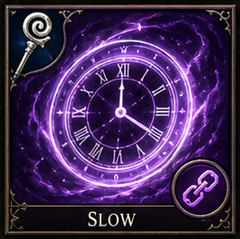</td>
<td style="border: none;">
<table border="0" cellspacing="0" cellpadding="0" style="border: none; border-collapse: collapse;">
<tr><th style="border: none;">School</th><th style="border: none;">Level</th><th style="border: none;">Mana</th><th style="border: none;">Damage</th><th style="border: none;">Class</th><th style="border: none;">Tags</th></tr>
<tr><td style="border: none;">Dominion / Mirage</td><td style="border: none;">3</td><td style="border: none;">15</td><td style="border: none;">None</td><td style="border: none;">Mage</td><td style="border: none;">CC, Debuff, Turn-Meter Control</td></tr>
</table>
</td>
</tr>
</table>

*A cloying purple haze settles over the target, weighing down their limbs. Reduces turn meter gain by 50%, halves movement speed, and applies -2 DefensePower. Duration 1 round per caster level. Deity Bonus: (Chronara, Celestara) +1 round duration.*

### Haste

<table border="0" cellspacing="0" cellpadding="0" style="border: none; border-collapse: collapse;">
<tr>
<td style="border: none; padding-right: 12px;">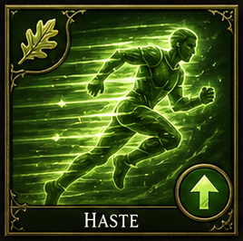</td>
<td style="border: none;">
<table border="0" cellspacing="0" cellpadding="0" style="border: none; border-collapse: collapse;">
<tr><th style="border: none;">School</th><th style="border: none;">Level</th><th style="border: none;">Mana</th><th style="border: none;">Damage</th><th style="border: none;">Class</th><th style="border: none;">Tags</th></tr>
<tr><td style="border: none;">Dominion</td><td style="border: none;">3</td><td style="border: none;">20</td><td style="border: none;">None</td><td style="border: none;">Mage, Paladin, Knight, Bard</td><td style="border: none;">Buff, TM Uplift</td></tr>
</table>
</td>
</tr>
</table>

*Time warps around the target as golden energy suffuses their limbs. Massively accelerates turn meter gain by 50% and grants +2 AttackPower and +2 DefensePower. Lasts 1 round per caster level (max 10 rounds). Deity Bonus: (Celestara, Chronara) +1 round duration.*

### Mass Haste

<table border="0" cellspacing="0" cellpadding="0" style="border: none; border-collapse: collapse;">
<tr>
<td style="border: none; padding-right: 12px;"></td>
<td style="border: none;">
<table border="0" cellspacing="0" cellpadding="0" style="border: none; border-collapse: collapse;">
<tr><th style="border: none;">School</th><th style="border: none;">Level</th><th style="border: none;">Mana</th><th style="border: none;">Damage</th><th style="border: none;">Class</th><th style="border: none;">Tags</th></tr>
<tr><td style="border: none;">Dominion</td><td style="border: none;">5</td><td style="border: none;">-</td><td style="border: none;"></td><td style="border: none;">Mage, Priest, Druid</td><td style="border: none;">Buff, TM Uplift, Group</td></tr>
</table>
</td>
</tr>
</table>

*- Mage, Priest, Druid Damage type: None/Buff. Yes, duration-based speed buff. Caster suffers DefensePower debuff.*

### Vampiric Touch

<table border="0" cellspacing="0" cellpadding="0" style="border: none; border-collapse: collapse;">
<tr>
<td style="border: none; padding-right: 12px;"></td>
<td style="border: none;">
<table border="0" cellspacing="0" cellpadding="0" style="border: none; border-collapse: collapse;">
<tr><th style="border: none;">School</th><th style="border: none;">Level</th><th style="border: none;">Mana</th><th style="border: none;">Damage</th><th style="border: none;">Class</th><th style="border: none;">Tags</th></tr>
<tr><td style="border: none;">Umbramancy</td><td style="border: none;">3</td><td style="border: none;">-</td><td style="border: none;"></td><td style="border: none;">Mage</td><td style="border: none;">Single-Target Damage, Leech</td></tr>
</table>
</td>
</tr>
</table>

*- Mage Damage type: Necrotic/Drain-theme. Leech effect instead of burn.*

### Fear

<table border="0" cellspacing="0" cellpadding="0" style="border: none; border-collapse: collapse;">
<tr>
<td style="border: none; padding-right: 12px;"></td>
<td style="border: none;">
<table border="0" cellspacing="0" cellpadding="0" style="border: none; border-collapse: collapse;">
<tr><th style="border: none;">School</th><th style="border: none;">Level</th><th style="border: none;">Mana</th><th style="border: none;">Damage</th><th style="border: none;">Class</th><th style="border: none;">Tags</th></tr>
<tr><td style="border: none;">Umbramancy / Dominion</td><td style="border: none;">4</td><td style="border: none;">-</td><td style="border: none;"></td><td style="border: none;">Mage</td><td style="border: none;">CC, Debuff</td></tr>
</table>
</td>
</tr>
</table>

*- Mage Damage type: None/Control.*

### Ice Storm

<table border="0" cellspacing="0" cellpadding="0" style="border: none; border-collapse: collapse;">
<tr>
<td style="border: none; padding-right: 12px;"></td>
<td style="border: none;">
<table border="0" cellspacing="0" cellpadding="0" style="border: none; border-collapse: collapse;">
<tr><th style="border: none;">School</th><th style="border: none;">Level</th><th style="border: none;">Mana</th><th style="border: none;">Damage</th><th style="border: none;">Class</th><th style="border: none;">Tags</th></tr>
<tr><td style="border: none;">Stormcraft</td><td style="border: none;">4</td><td style="border: none;">-</td><td style="border: none;"></td><td style="border: none;">Mage</td><td style="border: none;">Offensive, AoE</td></tr>
</table>
</td>
</tr>
</table>

*- Mage Damage type: Cold/Physical.*

### Confusion

<table border="0" cellspacing="0" cellpadding="0" style="border: none; border-collapse: collapse;">
<tr>
<td style="border: none; padding-right: 12px;">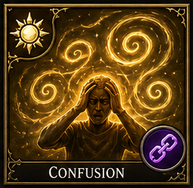</td>
<td style="border: none;">
<table border="0" cellspacing="0" cellpadding="0" style="border: none; border-collapse: collapse;">
<tr><th style="border: none;">School</th><th style="border: none;">Level</th><th style="border: none;">Mana</th><th style="border: none;">Damage</th><th style="border: none;">Class</th><th style="border: none;">Tags</th></tr>
<tr><td style="border: none;">Mirage / Dominion</td><td style="border: none;">4</td><td style="border: none;">15</td><td style="border: none;">None</td><td style="border: none;">Mage</td><td style="border: none;">CC, AoE</td></tr>
</table>
</td>
</tr>
</table>

*Swirling ribbons of clashing colour erupt around the target. The target acts erratically — may attack allies, skip turns, or wander randomly each round. Lasts 1 round per caster level (max 6).*

### Cloudkill

<table border="0" cellspacing="0" cellpadding="0" style="border: none; border-collapse: collapse;">
<tr>
<td style="border: none; padding-right: 12px;"></td>
<td style="border: none;">
<table border="0" cellspacing="0" cellpadding="0" style="border: none; border-collapse: collapse;">
<tr><th style="border: none;">School</th><th style="border: none;">Level</th><th style="border: none;">Mana</th><th style="border: none;">Damage</th><th style="border: none;">Class</th><th style="border: none;">Tags</th></tr>
<tr><td style="border: none;">Umbramancy</td><td style="border: none;">5</td><td style="border: none;">-</td><td style="border: none;"></td><td style="border: none;">Mage</td><td style="border: none;">Offensive, AoE</td></tr>
</table>
</td>
</tr>
</table>

*- Mage Damage type: Poison. Yes, persistent cloud hazard.*

### Cone of Cold

<table border="0" cellspacing="0" cellpadding="0" style="border: none; border-collapse: collapse;">
<tr>
<td style="border: none; padding-right: 12px;"></td>
<td style="border: none;">
<table border="0" cellspacing="0" cellpadding="0" style="border: none; border-collapse: collapse;">
<tr><th style="border: none;">School</th><th style="border: none;">Level</th><th style="border: none;">Mana</th><th style="border: none;">Damage</th><th style="border: none;">Class</th><th style="border: none;">Tags</th></tr>
<tr><td style="border: none;">Stormcraft</td><td style="border: none;">5</td><td style="border: none;">-</td><td style="border: none;"></td><td style="border: none;">Mage</td><td style="border: none;">Offensive, AoE, Nuke</td></tr>
</table>
</td>
</tr>
</table>

*- Mage Damage type: Cold.*

### Feeblemind

<table border="0" cellspacing="0" cellpadding="0" style="border: none; border-collapse: collapse;">
<tr>
<td style="border: none; padding-right: 12px;">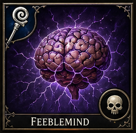</td>
<td style="border: none;">
<table border="0" cellspacing="0" cellpadding="0" style="border: none; border-collapse: collapse;">
<tr><th style="border: none;">School</th><th style="border: none;">Level</th><th style="border: none;">Mana</th><th style="border: none;">Damage</th><th style="border: none;">Class</th><th style="border: none;">Tags</th></tr>
<tr><td style="border: none;">Umbramancy</td><td style="border: none;">5</td><td style="border: none;">25</td><td style="border: none;">None</td><td style="border: none;">Mage</td><td style="border: none;">CC, Anti-Mage</td></tr>
</table>
</td>
</tr>
</table>

*A lance of pure psychic corruption pierces the target's consciousness. Devastating Intelligence and Wisdom drain drops mental stats to 1, making spellcasting impossible. Deals severe MP damage (2d6 x caster level).*

### Delayed Blast Fireball

<table border="0" cellspacing="0" cellpadding="0" style="border: none; border-collapse: collapse;">
<tr>
<td style="border: none; padding-right: 12px;"></td>
<td style="border: none;">
<table border="0" cellspacing="0" cellpadding="0" style="border: none; border-collapse: collapse;">
<tr><th style="border: none;">School</th><th style="border: none;">Level</th><th style="border: none;">Mana</th><th style="border: none;">Damage</th><th style="border: none;">Class</th><th style="border: none;">Tags</th></tr>
<tr><td style="border: none;">Stormcraft</td><td style="border: none;">7</td><td style="border: none;">-</td><td style="border: none;"></td><td style="border: none;">Mage</td><td style="border: none;">Offensive, AoE, Nuke</td></tr>
</table>
</td>
</tr>
</table>

*- Mage Damage type: Fire. No baseline burn rider.*

### Maze

<table border="0" cellspacing="0" cellpadding="0" style="border: none; border-collapse: collapse;">
<tr>
<td style="border: none; padding-right: 12px;"></td>
<td style="border: none;">
<table border="0" cellspacing="0" cellpadding="0" style="border: none; border-collapse: collapse;">
<tr><th style="border: none;">School</th><th style="border: none;">Level</th><th style="border: none;">Mana</th><th style="border: none;">Damage</th><th style="border: none;">Class</th><th style="border: none;">Tags</th></tr>
<tr><td style="border: none;">Mirage</td><td style="border: none;">8</td><td style="border: none;">-</td><td style="border: none;"></td><td style="border: none;">Mage</td><td style="border: none;">CC</td></tr>
</table>
</td>
</tr>
</table>

*- Mage Damage type: None/Control. Yes, exile duration.*

### Mind Siphon Variant

<table border="0" cellspacing="0" cellpadding="0" style="border: none; border-collapse: collapse;">
<tr>
<td style="border: none; padding-right: 12px;"></td>
<td style="border: none;">
<table border="0" cellspacing="0" cellpadding="0" style="border: none; border-collapse: collapse;">
<tr><th style="border: none;">School</th><th style="border: none;">Level</th><th style="border: none;">Mana</th><th style="border: none;">Damage</th><th style="border: none;">Class</th><th style="border: none;">Tags</th></tr>
<tr><td style="border: none;">Umbramancy</td><td style="border: none;">4</td><td style="border: none;">-</td><td style="border: none;"></td><td style="border: none;">Mage, Dark Priest</td><td style="border: none;">MP Leech, Variant</td></tr>
</table>
</td>
</tr>
</table>

*- Mage, Dark Priest Damage type: Shadow/Drain. Yes, lingering mana suppression in variant design.*

### Arc Lash Variant

<table border="0" cellspacing="0" cellpadding="0" style="border: none; border-collapse: collapse;">
<tr>
<td style="border: none; padding-right: 12px;"></td>
<td style="border: none;">
<table border="0" cellspacing="0" cellpadding="0" style="border: none; border-collapse: collapse;">
<tr><th style="border: none;">School</th><th style="border: none;">Level</th><th style="border: none;">Mana</th><th style="border: none;">Damage</th><th style="border: none;">Class</th><th style="border: none;">Tags</th></tr>
<tr><td style="border: none;">Stormcraft</td><td style="border: none;">3</td><td style="border: none;">-</td><td style="border: none;"></td><td style="border: none;">Mage</td><td style="border: none;">Single-Target Damage, TM Control, Variant</td></tr>
</table>
</td>
</tr>
</table>

*- Mage Damage type: Lightning. Yes, electric aftershock in variant design.*

### Mirror Guard Variant

<table border="0" cellspacing="0" cellpadding="0" style="border: none; border-collapse: collapse;">
<tr>
<td style="border: none; padding-right: 12px;"></td>
<td style="border: none;">
<table border="0" cellspacing="0" cellpadding="0" style="border: none; border-collapse: collapse;">
<tr><th style="border: none;">School</th><th style="border: none;">Level</th><th style="border: none;">Mana</th><th style="border: none;">Damage</th><th style="border: none;">Class</th><th style="border: none;">Tags</th></tr>
<tr><td style="border: none;">Mirage / Aegis</td><td style="border: none;">3</td><td style="border: none;">-</td><td style="border: none;"></td><td style="border: none;">Mage</td><td style="border: none;">Defensive, Variant</td></tr>
</table>
</td>
</tr>
</table>

*- Mage Damage type: Illusory/None. Yes, images persist until broken.*

### Greasefire Variant

<table border="0" cellspacing="0" cellpadding="0" style="border: none; border-collapse: collapse;">
<tr>
<td style="border: none; padding-right: 12px;"></td>
<td style="border: none;">
<table border="0" cellspacing="0" cellpadding="0" style="border: none; border-collapse: collapse;">
<tr><th style="border: none;">School</th><th style="border: none;">Level</th><th style="border: none;">Mana</th><th style="border: none;">Damage</th><th style="border: none;">Class</th><th style="border: none;">Tags</th></tr>
<tr><td style="border: none;">Stormcraft / Mirage</td><td style="border: none;">2</td><td style="border: none;">-</td><td style="border: none;"></td><td style="border: none;">Mage</td><td style="border: none;">Offensive, AoE, Variant</td></tr>
</table>
</td>
</tr>
</table>

*- Mage Damage type: Fire. Yes, brief burning ground effect in variant design.*

### Mind Game

<table border="0" cellspacing="0" cellpadding="0" style="border: none; border-collapse: collapse;">
<tr>
<td style="border: none; padding-right: 12px;"></td>
<td style="border: none;">
<table border="0" cellspacing="0" cellpadding="0" style="border: none; border-collapse: collapse;">
<tr><th style="border: none;">School</th><th style="border: none;">Level</th><th style="border: none;">Mana</th><th style="border: none;">Damage</th><th style="border: none;">Class</th><th style="border: none;">Tags</th></tr>
<tr><td style="border: none;">Umbramancy</td><td style="border: none;">2</td><td style="border: none;">-</td><td style="border: none;"></td><td style="border: none;">Mage</td><td style="border: none;">CC, Debuff</td></tr>
</table>
</td>
</tr>
</table>

*- Mage Damage type: Shadow. Yes, Confused (gray).*

### Charm Person

<table border="0" cellspacing="0" cellpadding="0" style="border: none; border-collapse: collapse;">
<tr>
<td style="border: none; padding-right: 12px;"></td>
<td style="border: none;">
<table border="0" cellspacing="0" cellpadding="0" style="border: none; border-collapse: collapse;">
<tr><th style="border: none;">School</th><th style="border: none;">Level</th><th style="border: none;">Mana</th><th style="border: none;">Damage</th><th style="border: none;">Class</th><th style="border: none;">Tags</th></tr>
<tr><td style="border: none;">Mirage</td><td style="border: none;">2</td><td style="border: none;">-</td><td style="border: none;"></td><td style="border: none;">Mage</td><td style="border: none;">CC, Charm</td></tr>
</table>
</td>
</tr>
</table>

*- Mage Yes, Charmed (pink).*

## Priest spellbook

Priests gain broad early identity through blessings, healing, commands, wards, and spiritual battlefield control. Their later spells expand into miracles, barriers, supreme restoration, and holy devastation rather than generic arcane offense.

| Spell | School | Spell Level | Access Layer | Access Tier | Minimum Level | Class | Damage Type | Afterburn | Tags |
|------|--------|-------------|-------------|-----------|---------------|-------|------------|-----------|------|
| [Bless](#bless) | Deity | 1 | Class Core | Early | - | Priest, Paladin | None | Yes, duration buff. | Buff, AoE |
| [Command](#command) | Deity | 1 | Class Core | Early | - | Priest, Paladin | None/Control | No. | CC |
| [Cure Light Wounds](#cure-light-wounds) | Deity | 1 | Class Core | Early | - | Priest, Druid, Paladin | Healing | No direct after-effect beyond restored HP. | Healing |
| [Protection from Evil](#protection-from-evil) | Deity | 1 | Class Core | Early | - | Priest, Paladin | None | No. | Defensive, Buff |
| [Chasten](#chasten) | Deity | 1 | Core | Early | - | Priest | Radiant | No | Debuff |
| [Sanctuary](#sanctuary) | Deity | 1 | Class Core | Early | - | Priest, Paladin | None | Yes, duration shield-state. | Defensive |
| [Aid](#aid) | Deity | 2 | Class Core | Early | - | Priest, Paladin | None | Yes, duration support buff. | Buff |
| [Chant](#chant) | Deity | 2 | Class Core | Early | - | Priest | None | Yes, duration aura. | Buff, Debuff |
| [Hold Person](#hold-person) | Deity | 2/3 | Class Core | Mid | - | Priest | None/Control | No. | CC |
| [Prayer](#prayer) | Deity | 3 | Class Core | Mid | - | Priest | None | Yes, duration field effect. | Buff, Debuff |
| [Remove Paralysis](#remove-paralysis) | Deity | 3 | Class Core | Mid | - | Priest, Paladin | Cleanse | No. | Healing, Cleanse |
| [Cure Serious Wounds](#cure-serious-wounds) | Deity | 4 | Class Core | Mid | - | Priest, Druid, Paladin | Healing | No. | Healing |
| [Free Action](#free-action) | Deity | 4 | Class Core | Mid | - | Priest, Paladin | None | Yes, duration buff. | Defensive |
| [Cure Critical Wounds](#cure-critical-wounds) | Deity | 5 | School Specialization | Late | - | Priest, Druid, Paladin | Healing | No. | Healing |
| [Flame Strike](#flame-strike) | Deity | 5 | School Specialization | Late | - | Priest | Fire/Radiant | No explicit lingering burn. | Offensive, Nuke |
| [Heal](#heal) | Deity | 6 | School Specialization | Late | - | Priest | Healing | No. | Healing |
| [Blade Barrier](#blade-barrier) | Deity | 6 | School Specialization | Late | - | Priest | Physical/Magical | Yes, persistent hazard while active. | Offensive, Defensive, Barrier |
| [Heroes' Feast](#heroes-feast) | Deity | 6 | School Specialization | Late | - | Priest | Buff | Yes, prebuff duration benefits. | Buff, AoE |
| [Restoration](#restoration) | Deity | 7 | School Specialization | Late | - | Priest | Healing | No. | Healing, Cleanse |

### Bless

<table border="0" cellspacing="0" cellpadding="0" style="border: none; border-collapse: collapse;">
<tr>
<td style="border: none; padding-right: 12px;">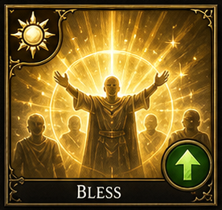</td>
<td style="border: none;">
<table border="0" cellspacing="0" cellpadding="0" style="border: none; border-collapse: collapse;">
<tr><th style="border: none;">Deity</th><th style="border: none;">Level</th><th style="border: none;">Mana</th><th style="border: none;">Damage</th><th style="border: none;">Class</th><th style="border: none;">Tags</th></tr>
<tr><td style="border: none;">Aethelion</td><td style="border: none;">1</td><td style="border: none;">8</td><td style="border: none;">None</td><td style="border: none;">Priest, Paladin</td><td style="border: none;">Buff, AoE</td></tr>
</table>
</td>
</tr>
</table>

*The priest raises a holy symbol as golden light descends upon their allies. Allies in range gain +1 AttackPower, +10% turn meter rate, and +1 to all saving throws. Affects up to 6 allies. Deity Bonus: (Aethelion) +25% healing and +1 round duration.*

### Command

<table border="0" cellspacing="0" cellpadding="0" style="border: none; border-collapse: collapse;">
<tr>
<td style="border: none; padding-right: 12px;"></td>
<td style="border: none;">
<table border="0" cellspacing="0" cellpadding="0" style="border: none; border-collapse: collapse;">
<tr><th style="border: none;">Deity</th><th style="border: none;">Level</th><th style="border: none;">Mana</th><th style="border: none;">Damage</th><th style="border: none;">Class</th><th style="border: none;">Tags</th></tr>
<tr><td style="border: none;">Aethelion</td><td style="border: none;">1</td><td style="border: none;">-</td><td style="border: none;"></td><td style="border: none;">Priest, Paladin</td><td style="border: none;">CC</td></tr>
</table>
</td>
</tr>
</table>

*- Priest, Paladin Damage type: None/Control. Deity Bonus: (Aethelion, Umbraex) Aethelion: +1 round; Umbraex: -1 DefensePower.*

### Cure Light Wounds

<table border="0" cellspacing="0" cellpadding="0" style="border: none; border-collapse: collapse;">
<tr>
<td style="border: none; padding-right: 12px;">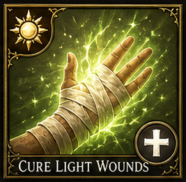</td>
<td style="border: none;">
<table border="0" cellspacing="0" cellpadding="0" style="border: none; border-collapse: collapse;">
<tr><th style="border: none;">Deity</th><th style="border: none;">Level</th><th style="border: none;">Mana</th><th style="border: none;">Damage</th><th style="border: none;">Class</th><th style="border: none;">Tags</th></tr>
<tr><td style="border: none;">Aethelion</td><td style="border: none;">1</td><td style="border: none;">6</td><td style="border: none;">1d8+1 Healing</td><td style="border: none;">Priest, Druid, Paladin</td><td style="border: none;">Healing</td></tr>
</table>
</td>
</tr>
</table>

*A soft green glow radiates from the healer's palms as wounds knit and bruises fade. Restores 1d8+1 hit points to a single target, scaling +1d8+1 per caster level (cap 5d8+5 at level 5). Deity Bonus: (Aethelion, Lunara) +25% healing on full moon cycles.*

### Protection from Evil

<table border="0" cellspacing="0" cellpadding="0" style="border: none; border-collapse: collapse;">
<tr>
<td style="border: none; padding-right: 12px;">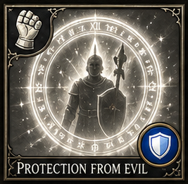</td>
<td style="border: none;">
<table border="0" cellspacing="0" cellpadding="0" style="border: none; border-collapse: collapse;">
<tr><th style="border: none;">Deity</th><th style="border: none;">Level</th><th style="border: none;">Mana</th><th style="border: none;">Damage</th><th style="border: none;">Class</th><th style="border: none;">Tags</th></tr>
<tr><td style="border: none;">Aethelion</td><td style="border: none;">1</td><td style="border: none;">10</td><td style="border: none;">None</td><td style="border: none;">Priest, Paladin</td><td style="border: none;">Defensive, Buff</td></tr>
</table>
</td>
</tr>
</table>

*A shimmering golden ward encircles the target, deflecting the attentions of malevolent forces. Provides +2 AC and +2 saving throws against evil creatures. Grants immunity to mental control and possession. Deity Bonus: (Aethelion) +1 round duration and +2 additional AC.*

### Chasten

<table border="0" cellspacing="0" cellpadding="0" style="border: none; border-collapse: collapse;">
<tr>
<td style="border: none; padding-right: 12px;"></td>
<td style="border: none;">
<table border="0" cellspacing="0" cellpadding="0" style="border: none; border-collapse: collapse;">
<tr><th style="border: none;">Deity</th><th style="border: none;">Level</th><th style="border: none;">Mana</th><th style="border: none;">Damage</th><th style="border: none;">Class</th><th style="border: none;">Tags</th></tr>
<tr><td style="border: none;">Aethelion</td><td style="border: none;">1</td><td style="border: none;">-</td><td style="border: none;"></td><td style="border: none;">Priest</td><td style="border: none;">Debuff</td></tr>
</table>
</td>
</tr>
</table>

*- Priest Damage type: Radiant. Deity Bonus: (Aethelion, Umbraex) Aethelion: +1d4 radiant; Umbraex: +1d4 shadow.*

### Sanctuary

<table border="0" cellspacing="0" cellpadding="0" style="border: none; border-collapse: collapse;">
<tr>
<td style="border: none; padding-right: 12px;"></td>
<td style="border: none;">
<table border="0" cellspacing="0" cellpadding="0" style="border: none; border-collapse: collapse;">
<tr><th style="border: none;">Deity</th><th style="border: none;">Level</th><th style="border: none;">Mana</th><th style="border: none;">Damage</th><th style="border: none;">Class</th><th style="border: none;">Tags</th></tr>
<tr><td style="border: none;">Aethelion</td><td style="border: none;">1</td><td style="border: none;">-</td><td style="border: none;"></td><td style="border: none;">Priest, Paladin</td><td style="border: none;">Defensive</td></tr>
</table>
</td>
</tr>
</table>

*- Priest, Paladin Yes, duration shield-state. Deity Bonus: (Aethelion, Celestara) +1 round duration.*

### Aid

<table border="0" cellspacing="0" cellpadding="0" style="border: none; border-collapse: collapse;">
<tr>
<td style="border: none; padding-right: 12px;"></td>
<td style="border: none;">
<table border="0" cellspacing="0" cellpadding="0" style="border: none; border-collapse: collapse;">
<tr><th style="border: none;">Deity</th><th style="border: none;">Level</th><th style="border: none;">Mana</th><th style="border: none;">Damage</th><th style="border: none;">Class</th><th style="border: none;">Tags</th></tr>
<tr><td style="border: none;">Aethelion</td><td style="border: none;">2</td><td style="border: none;">-</td><td style="border: none;"></td><td style="border: none;">Priest, Paladin</td><td style="border: none;">Buff</td></tr>
</table>
</td>
</tr>
</table>

*- Priest, Paladin Yes, duration support buff. Deity Bonus: (Aethelion) +5 temporary HP.*

### Chant

<table border="0" cellspacing="0" cellpadding="0" style="border: none; border-collapse: collapse;">
<tr>
<td style="border: none; padding-right: 12px;"></td>
<td style="border: none;">
<table border="0" cellspacing="0" cellpadding="0" style="border: none; border-collapse: collapse;">
<tr><th style="border: none;">Deity</th><th style="border: none;">Level</th><th style="border: none;">Mana</th><th style="border: none;">Damage</th><th style="border: none;">Class</th><th style="border: none;">Tags</th></tr>
<tr><td style="border: none;">Chronara</td><td style="border: none;">2</td><td style="border: none;">-</td><td style="border: none;"></td><td style="border: none;">Priest</td><td style="border: none;">Buff, Debuff</td></tr>
</table>
</td>
</tr>
</table>

*- Priest Yes, duration aura. Deity Bonus: (Chronara, Astrara) +1 round duration.*

### Hold Person

<table border="0" cellspacing="0" cellpadding="0" style="border: none; border-collapse: collapse;">
<tr>
<td style="border: none; padding-right: 12px;">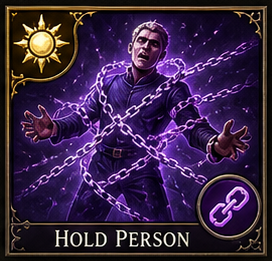</td>
<td style="border: none;">
<table border="0" cellspacing="0" cellpadding="0" style="border: none; border-collapse: collapse;">
<tr><th style="border: none;">Deity</th><th style="border: none;">Level</th><th style="border: none;">Mana</th><th style="border: none;">Damage</th><th style="border: none;">Class</th><th style="border: none;">Tags</th></tr>
<tr><td style="border: none;">Umbraex</td><td style="border: none;">2</td><td style="border: none;">10</td><td style="border: none;">None</td><td style="border: none;">Priest</td><td style="border: none;">CC</td></tr>
</table>
</td>
</tr>
</table>

*Golden bands of divine light wrap around the target, locking their limbs in place. Paralyzes a humanoid target completely — no movement, no actions, no defense. Save each round to break free. Deity Bonus: (Umbraex, Veparix) Veparix: +5% hold chance; Umbraex: -1 DefensePower.*

### Prayer

<table border="0" cellspacing="0" cellpadding="0" style="border: none; border-collapse: collapse;">
<tr>
<td style="border: none; padding-right: 12px;"></td>
<td style="border: none;">
<table border="0" cellspacing="0" cellpadding="0" style="border: none; border-collapse: collapse;">
<tr><th style="border: none;">Deity</th><th style="border: none;">Level</th><th style="border: none;">Mana</th><th style="border: none;">Damage</th><th style="border: none;">Class</th><th style="border: none;">Tags</th></tr>
<tr><td style="border: none;">Astrara</td><td style="border: none;">3</td><td style="border: none;">-</td><td style="border: none;"></td><td style="border: none;">Priest</td><td style="border: none;">Buff, Debuff</td></tr>
</table>
</td>
</tr>
</table>

*- Priest Yes, duration field effect. Deity Bonus: (Astrara, Chronara) Astrara: +1 AttackPower; Chronara: +1 round.*

### Remove Paralysis

<table border="0" cellspacing="0" cellpadding="0" style="border: none; border-collapse: collapse;">
<tr>
<td style="border: none; padding-right: 12px;"></td>
<td style="border: none;">
<table border="0" cellspacing="0" cellpadding="0" style="border: none; border-collapse: collapse;">
<tr><th style="border: none;">Deity</th><th style="border: none;">Level</th><th style="border: none;">Mana</th><th style="border: none;">Damage</th><th style="border: none;">Class</th><th style="border: none;">Tags</th></tr>
<tr><td style="border: none;">Aethelion</td><td style="border: none;">3</td><td style="border: none;">-</td><td style="border: none;"></td><td style="border: none;">Priest, Paladin</td><td style="border: none;">Healing, Cleanse</td></tr>
</table>
</td>
</tr>
</table>

*- Priest, Paladin Damage type: Cleanse. Deity Bonus: (Aethelion) Heals 1d4 HP on removal.*

### Cure Serious Wounds

<table border="0" cellspacing="0" cellpadding="0" style="border: none; border-collapse: collapse;">
<tr>
<td style="border: none; padding-right: 12px;"></td>
<td style="border: none;">
<table border="0" cellspacing="0" cellpadding="0" style="border: none; border-collapse: collapse;">
<tr><th style="border: none;">Deity</th><th style="border: none;">Level</th><th style="border: none;">Mana</th><th style="border: none;">Damage</th><th style="border: none;">Class</th><th style="border: none;">Tags</th></tr>
<tr><td style="border: none;">Aethelion</td><td style="border: none;">4</td><td style="border: none;">-</td><td style="border: none;"></td><td style="border: none;">Priest, Druid, Paladin</td><td style="border: none;">Healing</td></tr>
</table>
</td>
</tr>
</table>

*- Priest, Druid, Paladin Damage type: Healing. Deity Bonus: (Aethelion) +25% healing.*

### Free Action

<table border="0" cellspacing="0" cellpadding="0" style="border: none; border-collapse: collapse;">
<tr>
<td style="border: none; padding-right: 12px;"></td>
<td style="border: none;">
<table border="0" cellspacing="0" cellpadding="0" style="border: none; border-collapse: collapse;">
<tr><th style="border: none;">Deity</th><th style="border: none;">Level</th><th style="border: none;">Mana</th><th style="border: none;">Damage</th><th style="border: none;">Class</th><th style="border: none;">Tags</th></tr>
<tr><td style="border: none;">Aethelion</td><td style="border: none;">4</td><td style="border: none;">-</td><td style="border: none;"></td><td style="border: none;">Priest, Paladin</td><td style="border: none;">Defensive</td></tr>
</table>
</td>
</tr>
</table>

*- Priest, Paladin Yes, duration buff. Deity Bonus: (Aethelion, Celestara) +1 round duration.*

### Cure Critical Wounds

<table border="0" cellspacing="0" cellpadding="0" style="border: none; border-collapse: collapse;">
<tr>
<td style="border: none; padding-right: 12px;"></td>
<td style="border: none;">
<table border="0" cellspacing="0" cellpadding="0" style="border: none; border-collapse: collapse;">
<tr><th style="border: none;">Deity</th><th style="border: none;">Level</th><th style="border: none;">Mana</th><th style="border: none;">Damage</th><th style="border: none;">Class</th><th style="border: none;">Tags</th></tr>
<tr><td style="border: none;">Aethelion</td><td style="border: none;">5</td><td style="border: none;">-</td><td style="border: none;"></td><td style="border: none;">Priest, Druid, Paladin</td><td style="border: none;">Healing</td></tr>
</table>
</td>
</tr>
</table>

*- Priest, Druid, Paladin Damage type: Healing. Deity Bonus: (Aethelion) +25% healing.*

### Flame Strike

<table border="0" cellspacing="0" cellpadding="0" style="border: none; border-collapse: collapse;">
<tr>
<td style="border: none; padding-right: 12px;">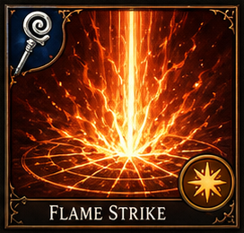</td>
<td style="border: none;">
<table border="0" cellspacing="0" cellpadding="0" style="border: none; border-collapse: collapse;">
<tr><th style="border: none;">Deity</th><th style="border: none;">Level</th><th style="border: none;">Mana</th><th style="border: none;">Damage</th><th style="border: none;">Class</th><th style="border: none;">Tags</th></tr>
<tr><td style="border: none;">Ignaroth</td><td style="border: none;">5</td><td style="border: none;">20</td><td style="border: none;">1d6 per level Fire/Radiant</td><td style="border: none;">Priest</td><td style="border: none;">Offensive, Nuke</td></tr>
</table>
</td>
</tr>
</table>

*A pillar of divine fire descends from the heavens. A vertical column dealing 1d6 fire + 1d6 radiant damage per caster level (cap 15d6+15d6). Undead take double damage. Base 6d6+6d6 at level 6, scaling +1d6/+1d6 per level. Deity Bonus: (Ignaroth) +1d6 fire damage; 10% chance to ignite for 1d4.*

### Heal

<table border="0" cellspacing="0" cellpadding="0" style="border: none; border-collapse: collapse;">
<tr>
<td style="border: none; padding-right: 12px;">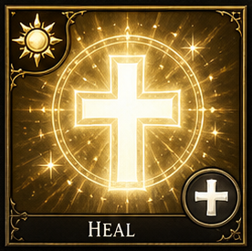</td>
<td style="border: none;">
<table border="0" cellspacing="0" cellpadding="0" style="border: none; border-collapse: collapse;">
<tr><th style="border: none;">Deity</th><th style="border: none;">Level</th><th style="border: none;">Mana</th><th style="border: none;">Damage</th><th style="border: none;">Class</th><th style="border: none;">Tags</th></tr>
<tr><td style="border: none;">Aethelion</td><td style="border: none;">6</td><td style="border: none;">30</td><td style="border: none;">Cures all HP</td><td style="border: none;">Priest</td><td style="border: none;">Healing</td></tr>
</table>
</td>
</tr>
</table>

*The most powerful restorative miracle in the divine arsenal. Instantly restores the target to full health and cures blindness, deafness, paralysis, disease, and poison. Deity Bonus: (Aethelion, Lunara) Fully heals all conditions; Lunara adds mana restoration.*

### Blade Barrier

<table border="0" cellspacing="0" cellpadding="0" style="border: none; border-collapse: collapse;">
<tr>
<td style="border: none; padding-right: 12px;">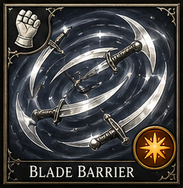</td>
<td style="border: none;">
<table border="0" cellspacing="0" cellpadding="0" style="border: none; border-collapse: collapse;">
<tr><th style="border: none;">Deity</th><th style="border: none;">Level</th><th style="border: none;">Mana</th><th style="border: none;">Damage</th><th style="border: none;">Class</th><th style="border: none;">Tags</th></tr>
<tr><td style="border: none;">Celestara</td><td style="border: none;">6</td><td style="border: none;">25</td><td style="border: none;">1d6 per level Slashing</td><td style="border: none;">Priest</td><td style="border: none;">Offensive, Defensive, Barrier</td></tr>
</table>
</td>
</tr>
</table>

*A ring of spinning silver blades materializes, orbiting in a deadly dance. An immobile 20-foot ring dealing 1d6 slashing per caster level (cap 15d6) to any creature passing through. Lasts 1 round per level. Deity Bonus: (Celestara, Umbraex) +1 round duration.*

### Heroes' Feast

<table border="0" cellspacing="0" cellpadding="0" style="border: none; border-collapse: collapse;">
<tr>
<td style="border: none; padding-right: 12px;"></td>
<td style="border: none;">
<table border="0" cellspacing="0" cellpadding="0" style="border: none; border-collapse: collapse;">
<tr><th style="border: none;">Deity</th><th style="border: none;">Level</th><th style="border: none;">Mana</th><th style="border: none;">Damage</th><th style="border: none;">Class</th><th style="border: none;">Tags</th></tr>
<tr><td style="border: none;">Aethelion</td><td style="border: none;">6</td><td style="border: none;">-</td><td style="border: none;"></td><td style="border: none;">Priest</td><td style="border: none;">Buff, AoE</td></tr>
</table>
</td>
</tr>
</table>

*- Priest Damage type: Buff. Yes, prebuff duration benefits. Deity Bonus: (Aethelion, Lunara) +10 temporary HP on full moon.*

### Restoration

<table border="0" cellspacing="0" cellpadding="0" style="border: none; border-collapse: collapse;">
<tr>
<td style="border: none; padding-right: 12px;"></td>
<td style="border: none;">
<table border="0" cellspacing="0" cellpadding="0" style="border: none; border-collapse: collapse;">
<tr><th style="border: none;">Deity</th><th style="border: none;">Level</th><th style="border: none;">Mana</th><th style="border: none;">Damage</th><th style="border: none;">Class</th><th style="border: none;">Tags</th></tr>
<tr><td style="border: none;">Aethelion</td><td style="border: none;">7</td><td style="border: none;">-</td><td style="border: none;"></td><td style="border: none;">Priest</td><td style="border: none;">Healing, Cleanse</td></tr>
</table>
</td>
</tr>
</table>

*- Priest Damage type: Healing. Deity Bonus: (Aethelion) Also cures one additional random condition.*

## Druid spellbook

Druids begin with natural control and utility, then scale into storms, swarms, primal damage, and guardian summoning. Their battlefield identity should feel environmental and living rather than doctrinal or purely holy.

| Spell | School | Spell Level | Access Layer | Access Tier | Minimum Level | Class | Damage Type | Afterburn | Tags |
|------|--------|-------------|-------------|-----------|---------------|-------|------------|-----------|------|
| [Entangle](#entangle) | Deity | 1 | Class Core | Early | - | Druid, Priest | None/Control | Yes, persistent rooting zone while active. | CC, Root |
| [Faerie Fire](#faerie-fire) | Deity | 1 | Class Core | Early | - | Druid, Priest | None/Reveal | Yes, duration reveal. | Debuff |
| [Shillelagh](#shillelagh) | Deity | 1 | Class Core | Early | - | Druid | Physical/Magical | No. | Buff |
| [Barkskin](#barkskin) | Deity | 2 | Class Core | Early | - | Druid, Priest | None | Yes, duration-based defensive skin. | Defensive |
| [Goodberry](#goodberry) | Deity | 2 | Class Core | Early | - | Druid, Priest | Healing | No. | Healing |
| [Heat Metal](#heat-metal) | Deity | 2 | Class Core | Early | - | Druid, Priest | Fire | Yes, continuing heat damage or pressure. | Debuff |
| [Call Lightning](#call-lightning) | Deity | 3 | Class Core | Mid | - | Druid, Priest | Lightning | Yes in repeated-round use, though not burn. | Offensive |
| [Hold Animal](#hold-animal) | Deity | 3 | Class Core | Mid | - | Druid, Priest | None/Control | Yes, duration root/paralysis. | CC |
| [Call Woodland Beings](#call-woodland-beings) | Deity | 4 | School Specialization | Mid | - | Druid | Variable | Yes, summoned allies persist for duration. | Summoning |
| [Giant Insect](#giant-insect) | Deity | 4 | School Specialization | Mid | - | Druid, Priest | Physical | Yes, transformed creatures persist for duration. | Summoning-lite |
| [Insect Plague](#insect-plague) | Deity | 5 | School Specialization | Late | - | Druid, Priest | Physical/Poison-theme | Yes, persistent swarm presence. | Offensive, CC |
| [Anti-Plant Shell](#anti-plant-shell) | Deity | 5 | School Specialization | Late | - | Druid, Priest | None | Yes, persistent shell. | Defensive |
| [Fire Seeds](#fire-seeds) | Deity | 6 | School Specialization | Late | - | Druid | Fire | Sometimes, depending on trap-style implementation. | Offensive |
| [Liveoak](#liveoak) | Deity | 6 | School Specialization | Late | - | Druid | Physical | Yes, awakened guardian persists. | Summoning |
| [Creeping Doom](#creeping-doom) | Deity | 7 | School Specialization | Late | - | Druid | Physical | Yes, persistent swarm pressure. | Offensive, CC |
| [Earthquake](#earthquake) | Deity | 7 | School Specialization | Late | - | Druid, Priest | Physical | Yes, persistent terrain disruption during effect. | Offensive, AoE |
| [Turn Undead](#turn-undead) | Deity | 2 | Class Core | Early | - | Priest, Paladin, Knight | Holy | Yes, Fear (2 turns) | Offensive, CC |

### Entangle

<table border="0" cellspacing="0" cellpadding="0" style="border: none; border-collapse: collapse;">
<tr>
<td style="border: none; padding-right: 12px;">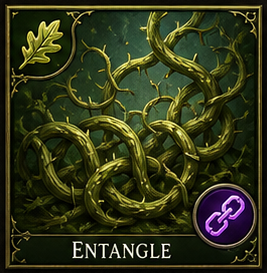</td>
<td style="border: none;">
<table border="0" cellspacing="0" cellpadding="0" style="border: none; border-collapse: collapse;">
<tr><th style="border: none;">Deity</th><th style="border: none;">Level</th><th style="border: none;">Mana</th><th style="border: none;">Damage</th><th style="border: none;">Class</th><th style="border: none;">Tags</th></tr>
<tr><td style="border: none;">Chronara</td><td style="border: none;">1</td><td style="border: none;">5</td><td style="border: none;">None</td><td style="border: none;">Druid, Priest</td><td style="border: none;">CC, Root</td></tr>
</table>
</td>
</tr>
</table>

*The ground erupts with grasping vines and thick roots that snake around the legs of the unwary. Plants and roots grapple all creatures in a 40-foot radius — movement reduced to 0. Deity Bonus: (Chronara, Veparix) +5% root chance; +1 round duration.*

### Faerie Fire

<table border="0" cellspacing="0" cellpadding="0" style="border: none; border-collapse: collapse;">
<tr>
<td style="border: none; padding-right: 12px;"></td>
<td style="border: none;">
<table border="0" cellspacing="0" cellpadding="0" style="border: none; border-collapse: collapse;">
<tr><th style="border: none;">Deity</th><th style="border: none;">Level</th><th style="border: none;">Mana</th><th style="border: none;">Damage</th><th style="border: none;">Class</th><th style="border: none;">Tags</th></tr>
<tr><td style="border: none;">Veparix</td><td style="border: none;">1</td><td style="border: none;">-</td><td style="border: none;"></td><td style="border: none;">Druid, Priest</td><td style="border: none;">Debuff</td></tr>
</table>
</td>
</tr>
</table>

*- Druid, Priest Damage type: None/Reveal. Yes, duration reveal. Deity Bonus: (Veparix, Lunara) +1 round reveal duration.*

### Shillelagh

<table border="0" cellspacing="0" cellpadding="0" style="border: none; border-collapse: collapse;">
<tr>
<td style="border: none; padding-right: 12px;"></td>
<td style="border: none;">
<table border="0" cellspacing="0" cellpadding="0" style="border: none; border-collapse: collapse;">
<tr><th style="border: none;">Deity</th><th style="border: none;">Level</th><th style="border: none;">Mana</th><th style="border: none;">Damage</th><th style="border: none;">Class</th><th style="border: none;">Tags</th></tr>
<tr><td style="border: none;">Chronara</td><td style="border: none;">1</td><td style="border: none;">-</td><td style="border: none;"></td><td style="border: none;">Druid</td><td style="border: none;">Buff</td></tr>
</table>
</td>
</tr>
</table>

*- Druid Damage type: Physical/Magical. Deity Bonus: (Chronara) +1d4 nature damage.*

### Barkskin

<table border="0" cellspacing="0" cellpadding="0" style="border: none; border-collapse: collapse;">
<tr>
<td style="border: none; padding-right: 12px;"></td>
<td style="border: none;">
<table border="0" cellspacing="0" cellpadding="0" style="border: none; border-collapse: collapse;">
<tr><th style="border: none;">Deity</th><th style="border: none;">Level</th><th style="border: none;">Mana</th><th style="border: none;">Damage</th><th style="border: none;">Class</th><th style="border: none;">Tags</th></tr>
<tr><td style="border: none;">Celestara</td><td style="border: none;">2</td><td style="border: none;">-</td><td style="border: none;"></td><td style="border: none;">Druid, Priest</td><td style="border: none;">Defensive</td></tr>
</table>
</td>
</tr>
</table>

*- Druid, Priest Yes, duration-based defensive skin. Deity Bonus: (Celestara, Aethelion) +1 additional AC.*

### Goodberry

<table border="0" cellspacing="0" cellpadding="0" style="border: none; border-collapse: collapse;">
<tr>
<td style="border: none; padding-right: 12px;"></td>
<td style="border: none;">
<table border="0" cellspacing="0" cellpadding="0" style="border: none; border-collapse: collapse;">
<tr><th style="border: none;">Deity</th><th style="border: none;">Level</th><th style="border: none;">Mana</th><th style="border: none;">Damage</th><th style="border: none;">Class</th><th style="border: none;">Tags</th></tr>
<tr><td style="border: none;">Lunara</td><td style="border: none;">2</td><td style="border: none;">-</td><td style="border: none;"></td><td style="border: none;">Druid, Priest</td><td style="border: none;">Healing</td></tr>
</table>
</td>
</tr>
</table>

*- Druid, Priest Damage type: Healing. Deity Bonus: (Lunara, Aethelion) +1 berry created.*

### Heat Metal

<table border="0" cellspacing="0" cellpadding="0" style="border: none; border-collapse: collapse;">
<tr>
<td style="border: none; padding-right: 12px;"></td>
<td style="border: none;">
<table border="0" cellspacing="0" cellpadding="0" style="border: none; border-collapse: collapse;">
<tr><th style="border: none;">Deity</th><th style="border: none;">Level</th><th style="border: none;">Mana</th><th style="border: none;">Damage</th><th style="border: none;">Class</th><th style="border: none;">Tags</th></tr>
<tr><td style="border: none;">Ignaroth</td><td style="border: none;">2</td><td style="border: none;">-</td><td style="border: none;"></td><td style="border: none;">Druid, Priest</td><td style="border: none;">Debuff</td></tr>
</table>
</td>
</tr>
</table>

*- Druid, Priest Damage type: Fire. Yes, continuing heat damage or pressure. Deity Bonus: (Ignaroth) +1d6 fire damage; ignites target on critical.*

### Call Lightning

<table border="0" cellspacing="0" cellpadding="0" style="border: none; border-collapse: collapse;">
<tr>
<td style="border: none; padding-right: 12px;">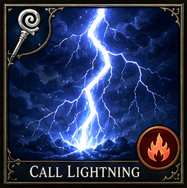</td>
<td style="border: none;">
<table border="0" cellspacing="0" cellpadding="0" style="border: none; border-collapse: collapse;">
<tr><th style="border: none;">Deity</th><th style="border: none;">Level</th><th style="border: none;">Mana</th><th style="border: none;">Damage</th><th style="border: none;">Class</th><th style="border: none;">Tags</th></tr>
<tr><td style="border: none;">Chronara</td><td style="border: none;">3</td><td style="border: none;">12</td><td style="border: none;">1d6 per level Lightning</td><td style="border: none;">Druid, Priest</td><td style="border: none;">Offensive</td></tr>
</table>
</td>
</tr>
</table>

*The druid raises a hand to the sky, summoning a storm bolt from the heavens. A 5-foot wide lightning bolt strikes from above for 1d6 per caster level (cap 10d6). Can be called each round while the storm lasts. Deity Bonus: (Chronara, Lunara) Chronara: +1d6 lightning; Lunara: -2 mana cost.*

### Hold Animal

<table border="0" cellspacing="0" cellpadding="0" style="border: none; border-collapse: collapse;">
<tr>
<td style="border: none; padding-right: 12px;"></td>
<td style="border: none;">
<table border="0" cellspacing="0" cellpadding="0" style="border: none; border-collapse: collapse;">
<tr><th style="border: none;">Deity</th><th style="border: none;">Level</th><th style="border: none;">Mana</th><th style="border: none;">Damage</th><th style="border: none;">Class</th><th style="border: none;">Tags</th></tr>
<tr><td style="border: none;">Chronara</td><td style="border: none;">3</td><td style="border: none;">-</td><td style="border: none;"></td><td style="border: none;">Druid, Priest</td><td style="border: none;">CC</td></tr>
</table>
</td>
</tr>
</table>

*- Druid, Priest Damage type: None/Control. Yes, duration root/paralysis. Deity Bonus: (Chronara, Veparix) +5% hold chance.*

### Call Woodland Beings

<table border="0" cellspacing="0" cellpadding="0" style="border: none; border-collapse: collapse;">
<tr>
<td style="border: none; padding-right: 12px;"></td>
<td style="border: none;">
<table border="0" cellspacing="0" cellpadding="0" style="border: none; border-collapse: collapse;">
<tr><th style="border: none;">Deity</th><th style="border: none;">Level</th><th style="border: none;">Mana</th><th style="border: none;">Damage</th><th style="border: none;">Class</th><th style="border: none;">Tags</th></tr>
<tr><td style="border: none;">Chronara</td><td style="border: none;">4</td><td style="border: none;">-</td><td style="border: none;"></td><td style="border: none;">Druid</td><td style="border: none;">Summoning</td></tr>
</table>
</td>
</tr>
</table>

*- Druid Damage type: Variable. Yes, summoned allies persist for duration. Deity Bonus: (Chronara, Lunara) Summoned ally has +10% HP.*

### Giant Insect

<table border="0" cellspacing="0" cellpadding="0" style="border: none; border-collapse: collapse;">
<tr>
<td style="border: none; padding-right: 12px;"></td>
<td style="border: none;">
<table border="0" cellspacing="0" cellpadding="0" style="border: none; border-collapse: collapse;">
<tr><th style="border: none;">Deity</th><th style="border: none;">Level</th><th style="border: none;">Mana</th><th style="border: none;">Damage</th><th style="border: none;">Class</th><th style="border: none;">Tags</th></tr>
<tr><td style="border: none;">Chronara</td><td style="border: none;">4</td><td style="border: none;">-</td><td style="border: none;"></td><td style="border: none;">Druid, Priest</td><td style="border: none;">Summoning-lite</td></tr>
</table>
</td>
</tr>
</table>

*- Druid, Priest Damage type: Physical. Yes, transformed creatures persist for duration. Deity Bonus: (Chronara, Veparix) Summoned insect deals +1d4 poison.*

### Insect Plague

<table border="0" cellspacing="0" cellpadding="0" style="border: none; border-collapse: collapse;">
<tr>
<td style="border: none; padding-right: 12px;"></td>
<td style="border: none;">
<table border="0" cellspacing="0" cellpadding="0" style="border: none; border-collapse: collapse;">
<tr><th style="border: none;">Deity</th><th style="border: none;">Level</th><th style="border: none;">Mana</th><th style="border: none;">Damage</th><th style="border: none;">Class</th><th style="border: none;">Tags</th></tr>
<tr><td style="border: none;">Umbraex</td><td style="border: none;">5</td><td style="border: none;">-</td><td style="border: none;"></td><td style="border: none;">Druid, Priest</td><td style="border: none;">Offensive, CC</td></tr>
</table>
</td>
</tr>
</table>

*- Druid, Priest Damage type: Physical/Poison-theme. Yes, persistent swarm presence. Deity Bonus: (Umbraex, Chronara) +1 round duration.*

### Anti-Plant Shell

<table border="0" cellspacing="0" cellpadding="0" style="border: none; border-collapse: collapse;">
<tr>
<td style="border: none; padding-right: 12px;"></td>
<td style="border: none;">
<table border="0" cellspacing="0" cellpadding="0" style="border: none; border-collapse: collapse;">
<tr><th style="border: none;">Deity</th><th style="border: none;">Level</th><th style="border: none;">Mana</th><th style="border: none;">Damage</th><th style="border: none;">Class</th><th style="border: none;">Tags</th></tr>
<tr><td style="border: none;">Celestara</td><td style="border: none;">5</td><td style="border: none;">-</td><td style="border: none;"></td><td style="border: none;">Druid, Priest</td><td style="border: none;">Defensive</td></tr>
</table>
</td>
</tr>
</table>

*- Druid, Priest Yes, persistent shell. Deity Bonus: (Celestara, Aethelion) +1 round duration.*

### Fire Seeds

<table border="0" cellspacing="0" cellpadding="0" style="border: none; border-collapse: collapse;">
<tr>
<td style="border: none; padding-right: 12px;"></td>
<td style="border: none;">
<table border="0" cellspacing="0" cellpadding="0" style="border: none; border-collapse: collapse;">
<tr><th style="border: none;">Deity</th><th style="border: none;">Level</th><th style="border: none;">Mana</th><th style="border: none;">Damage</th><th style="border: none;">Class</th><th style="border: none;">Tags</th></tr>
<tr><td style="border: none;">Ignaroth</td><td style="border: none;">6</td><td style="border: none;">-</td><td style="border: none;"></td><td style="border: none;">Druid</td><td style="border: none;">Offensive</td></tr>
</table>
</td>
</tr>
</table>

*- Druid Damage type: Fire. Sometimes, depending on trap-style implementation. Deity Bonus: (Ignaroth) +1d6 fire damage per seed.*

### Liveoak

<table border="0" cellspacing="0" cellpadding="0" style="border: none; border-collapse: collapse;">
<tr>
<td style="border: none; padding-right: 12px;"></td>
<td style="border: none;">
<table border="0" cellspacing="0" cellpadding="0" style="border: none; border-collapse: collapse;">
<tr><th style="border: none;">Deity</th><th style="border: none;">Level</th><th style="border: none;">Mana</th><th style="border: none;">Damage</th><th style="border: none;">Class</th><th style="border: none;">Tags</th></tr>
<tr><td style="border: none;">Chronara</td><td style="border: none;">6</td><td style="border: none;">-</td><td style="border: none;"></td><td style="border: none;">Druid</td><td style="border: none;">Summoning</td></tr>
</table>
</td>
</tr>
</table>

*- Druid Damage type: Physical. Yes, awakened guardian persists. Deity Bonus: (Chronara, Lunara) Guardian has +10% HP and +1 AC.*

### Creeping Doom

<table border="0" cellspacing="0" cellpadding="0" style="border: none; border-collapse: collapse;">
<tr>
<td style="border: none; padding-right: 12px;"></td>
<td style="border: none;">
<table border="0" cellspacing="0" cellpadding="0" style="border: none; border-collapse: collapse;">
<tr><th style="border: none;">Deity</th><th style="border: none;">Level</th><th style="border: none;">Mana</th><th style="border: none;">Damage</th><th style="border: none;">Class</th><th style="border: none;">Tags</th></tr>
<tr><td style="border: none;">Umbraex</td><td style="border: none;">7</td><td style="border: none;">-</td><td style="border: none;"></td><td style="border: none;">Druid</td><td style="border: none;">Offensive, CC</td></tr>
</table>
</td>
</tr>
</table>

*- Druid Damage type: Physical. Yes, persistent swarm pressure. Deity Bonus: (Umbraex, Chronara) +1 round duration.*

### Earthquake

<table border="0" cellspacing="0" cellpadding="0" style="border: none; border-collapse: collapse;">
<tr>
<td style="border: none; padding-right: 12px;"></td>
<td style="border: none;">
<table border="0" cellspacing="0" cellpadding="0" style="border: none; border-collapse: collapse;">
<tr><th style="border: none;">Deity</th><th style="border: none;">Level</th><th style="border: none;">Mana</th><th style="border: none;">Damage</th><th style="border: none;">Class</th><th style="border: none;">Tags</th></tr>
<tr><td style="border: none;">Chronara</td><td style="border: none;">7</td><td style="border: none;">-</td><td style="border: none;"></td><td style="border: none;">Druid, Priest</td><td style="border: none;">Offensive, AoE</td></tr>
</table>
</td>
</tr>
</table>

*- Druid, Priest Damage type: Physical. Yes, persistent terrain disruption during effect. Deity Bonus: (Ignaroth, Chronara) +1d6 physical damage; +1 round terrain disruption.*

### Turn Undead

<table border="0" cellspacing="0" cellpadding="0" style="border: none; border-collapse: collapse;">
<tr>
<td style="border: none; padding-right: 12px;"></td>
<td style="border: none;">
<table border="0" cellspacing="0" cellpadding="0" style="border: none; border-collapse: collapse;">
<tr><th style="border: none;">Deity</th><th style="border: none;">Level</th><th style="border: none;">Mana</th><th style="border: none;">Damage</th><th style="border: none;">Class</th><th style="border: none;">Tags</th></tr>
<tr><td style="border: none;">Aethelion</td><td style="border: none;">2</td><td style="border: none;">-</td><td style="border: none;"></td><td style="border: none;">Priest, Paladin, Knight</td><td style="border: none;">Offensive, CC</td></tr>
</table>
</td>
</tr>
</table>

*- Priest, Paladin, Knight Damage type: Holy. Yes, Fear (2 turns). Deity Bonus: (Aethelion, Noctivane) Aethelion: +2d6 holy; Noctivane: fear lasts +1 round.*

## Paladin spellbook

Paladins begin magical access around level 6 in Dark Orb and remain a narrow support caster with holy defenses, buffs, and companion protection. Their spell list intentionally avoids broad offensive identity and instead reinforces survivability, courage, and team stability.

| Spell | School | Spell Level | Access Layer | Access Tier | Minimum Level | Class | Damage Type | Afterburn | Tags |
|------|--------|-------------|-------------|-----------|---------------|-------|------------|-----------|------|
| [Bless](#bless) | Deity | 1 | Class Core | Early | - | Improves ally morale and combat readiness. |  |  |  |

### Bless

<table border="0" cellspacing="0" cellpadding="0" style="border: none; border-collapse: collapse;">
<tr>
<td style="border: none; padding-right: 12px;"></td>
<td style="border: none;">
<table border="0" cellspacing="0" cellpadding="0" style="border: none; border-collapse: collapse;">
<tr><th style="border: none;">Deity</th><th style="border: none;">Level</th><th style="border: none;">Mana</th><th style="border: none;">Damage</th><th style="border: none;">Class</th><th style="border: none;">Tags</th></tr>
<tr><td style="border: none;">Aethelion</td><td style="border: none;">1</td><td style="border: none;">8</td><td style="border: none;">None</td><td style="border: none;">Priest, Paladin</td><td style="border: none;">Buff, AoE</td></tr>
</table>
</td>
</tr>
</table>

*The priest raises a holy symbol as golden light descends upon their allies. Allies in range gain +1 AttackPower, +10% turn meter rate, and +1 to all saving throws. Affects up to 6 allies. Deity Bonus: (Aethelion) +25% healing and +1 round duration.*

## Knight spellbook

Knights begin spell-like command magic around level 9 and should feel like tactical leaders using morale, discipline, banner magic, and resistance support. Their list is deliberately distinct from paladins even when both support allies.

| Spell | School | Spell Level | Access Layer | Access Tier | Minimum Level | Class | Damage Type | Afterburn | Tags |
|------|--------|-------------|-------------|-----------|---------------|-------|------------|-----------|------|
| [War Cry](#war-cry) | Deity | 1 | Class Core | Early | - | Knight, Paladin | Sonic/Morale | Short-duration momentum effect. | CC or Buff, Variant |
| [Smite](#smite) | Deity | 1 | Class Core | Early | - | Knight | Radiant | No | Offensive |
| [Rallying Cry](#rallying-cry) | Deity | 1 | Class Core | Early | - | Knight | Sonic/Morale | Short aura duration. | Buff, Variant |
| [Steadfast Line](#steadfast-line) | Deity | 2 | Class Core | Early | - | Knight | None | Yes, short formation aura. | Buff, Variant |
| [Banner of Resolve](#banner-of-resolve) | Deity | 2 | Class Core | Early | - | Knight | None | Yes, aura duration. | Buff, Variant |
| [Iron Will Litany](#iron-will-litany) | Deity | 3 | Class Core | Mid | - | Knight | None | Yes, chant duration. | Defensive, Variant |
| [Advance Signal](#advance-signal) | Deity | 3 | Class Core | Mid | - | Knight | None | Short-duration surge. | Buff, Variant |
| [Haste](#haste) | Dominion | 3 | School Specialization | Mid | - | Knight | None/Buff | Yes, duration-based speed buff. | Buff, TM Uplift |
| [Shielding Cadence](#shielding-cadence) | Deity | 3 | Class Core | Mid | - | Knight | None | Yes, cadence duration. | Defensive, Variant |
| [Battle Hymn of Defiance](#battle-hymn-of-defiance) | Deity | 4 | School Specialization | Late | - | Knight | Sonic/Morale | Yes, anthem duration. | Buff, AoE, Variant |
| [Arcane Defiance Banner](#arcane-defiance-banner) | Deity | 4 | School Specialization | Late | - | Knight | None | Yes, banner aura. | Defensive, Variant |
| [Lionheart Command](#lionheart-command) | Deity | 4 | School Specialization | Late | - | Knight | Sonic/Morale | Yes, command duration. | Buff, Variant |

### War Cry

<table border="0" cellspacing="0" cellpadding="0" style="border: none; border-collapse: collapse;">
<tr>
<td style="border: none; padding-right: 12px;"></td>
<td style="border: none;">
<table border="0" cellspacing="0" cellpadding="0" style="border: none; border-collapse: collapse;">
<tr><th style="border: none;">Deity</th><th style="border: none;">Level</th><th style="border: none;">Mana</th><th style="border: none;">Damage</th><th style="border: none;">Class</th><th style="border: none;">Tags</th></tr>
<tr><td style="border: none;">Ignaroth</td><td style="border: none;">1</td><td style="border: none;">-</td><td style="border: none;"></td><td style="border: none;">Knight, Paladin</td><td style="border: none;">CC or Buff, Variant</td></tr>
</table>
</td>
</tr>
</table>

*- Knight, Paladin Damage type: Sonic/Morale. Short-duration momentum effect. Deity Bonus: (Ignaroth, Chronara) Ignaroth: +1d6 sonic; Chronara: +1 round TM disruption.*

### Smite

<table border="0" cellspacing="0" cellpadding="0" style="border: none; border-collapse: collapse;">
<tr>
<td style="border: none; padding-right: 12px;">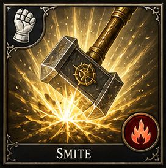</td>
<td style="border: none;">
<table border="0" cellspacing="0" cellpadding="0" style="border: none; border-collapse: collapse;">
<tr><th style="border: none;">Deity</th><th style="border: none;">Level</th><th style="border: none;">Mana</th><th style="border: none;">Damage</th><th style="border: none;">Class</th><th style="border: none;">Tags</th></tr>
<tr><td style="border: none;">Aethelion</td><td style="border: none;">1</td><td style="border: none;">8</td><td style="border: none;">1d8+1 Radiant</td><td style="border: none;">Paladin, Knight</td><td style="border: none;">Offensive</td></tr>
</table>
</td>
</tr>
</table>

*The paladin's weapon blazes with holy radiance as they strike — a single, decisive blow empowered by divine will. Empowers the next melee attack with +1d8 radiant damage (+1 per level). Double damage to undead and demons. Deity Bonus: (Aethelion, Ignaroth) Aethelion: +1d4 radiant; Ignaroth: +1d6 fire.*

### Rallying Cry

<table border="0" cellspacing="0" cellpadding="0" style="border: none; border-collapse: collapse;">
<tr>
<td style="border: none; padding-right: 12px;"></td>
<td style="border: none;">
<table border="0" cellspacing="0" cellpadding="0" style="border: none; border-collapse: collapse;">
<tr><th style="border: none;">Deity</th><th style="border: none;">Level</th><th style="border: none;">Mana</th><th style="border: none;">Damage</th><th style="border: none;">Class</th><th style="border: none;">Tags</th></tr>
<tr><td style="border: none;">Aethelion</td><td style="border: none;">1</td><td style="border: none;">-</td><td style="border: none;"></td><td style="border: none;">Knight</td><td style="border: none;">Buff, Variant</td></tr>
</table>
</td>
</tr>
</table>

*- Knight Damage type: Sonic/Morale. Short aura duration. Deity Bonus: (Aethelion, Celestara) +10% TM gain.*

### Steadfast Line

<table border="0" cellspacing="0" cellpadding="0" style="border: none; border-collapse: collapse;">
<tr>
<td style="border: none; padding-right: 12px;"></td>
<td style="border: none;">
<table border="0" cellspacing="0" cellpadding="0" style="border: none; border-collapse: collapse;">
<tr><th style="border: none;">Deity</th><th style="border: none;">Level</th><th style="border: none;">Mana</th><th style="border: none;">Damage</th><th style="border: none;">Class</th><th style="border: none;">Tags</th></tr>
<tr><td style="border: none;">Celestara</td><td style="border: none;">2</td><td style="border: none;">-</td><td style="border: none;"></td><td style="border: none;">Knight</td><td style="border: none;">Buff, Variant</td></tr>
</table>
</td>
</tr>
</table>

*- Knight Yes, short formation aura. Deity Bonus: (Celestara, Aethelion) +1 round formation aura.*

### Banner of Resolve

<table border="0" cellspacing="0" cellpadding="0" style="border: none; border-collapse: collapse;">
<tr>
<td style="border: none; padding-right: 12px;"></td>
<td style="border: none;">
<table border="0" cellspacing="0" cellpadding="0" style="border: none; border-collapse: collapse;">
<tr><th style="border: none;">Deity</th><th style="border: none;">Level</th><th style="border: none;">Mana</th><th style="border: none;">Damage</th><th style="border: none;">Class</th><th style="border: none;">Tags</th></tr>
<tr><td style="border: none;">Celestara</td><td style="border: none;">2</td><td style="border: none;">-</td><td style="border: none;"></td><td style="border: none;">Knight</td><td style="border: none;">Buff, Variant</td></tr>
</table>
</td>
</tr>
</table>

*- Knight Yes, aura duration. Deity Bonus: (Aethelion, Celestara) +1 round duration.*

### Iron Will Litany

<table border="0" cellspacing="0" cellpadding="0" style="border: none; border-collapse: collapse;">
<tr>
<td style="border: none; padding-right: 12px;"></td>
<td style="border: none;">
<table border="0" cellspacing="0" cellpadding="0" style="border: none; border-collapse: collapse;">
<tr><th style="border: none;">Deity</th><th style="border: none;">Level</th><th style="border: none;">Mana</th><th style="border: none;">Damage</th><th style="border: none;">Class</th><th style="border: none;">Tags</th></tr>
<tr><td style="border: none;">Celestara</td><td style="border: none;">3</td><td style="border: none;">-</td><td style="border: none;"></td><td style="border: none;">Knight</td><td style="border: none;">Defensive, Variant</td></tr>
</table>
</td>
</tr>
</table>

*- Knight Yes, chant duration. Deity Bonus: (Celestara, Aethelion) +5 Magic Resistance.*

### Advance Signal

<table border="0" cellspacing="0" cellpadding="0" style="border: none; border-collapse: collapse;">
<tr>
<td style="border: none; padding-right: 12px;"></td>
<td style="border: none;">
<table border="0" cellspacing="0" cellpadding="0" style="border: none; border-collapse: collapse;">
<tr><th style="border: none;">Deity</th><th style="border: none;">Level</th><th style="border: none;">Mana</th><th style="border: none;">Damage</th><th style="border: none;">Class</th><th style="border: none;">Tags</th></tr>
<tr><td style="border: none;">Chronara</td><td style="border: none;">3</td><td style="border: none;">-</td><td style="border: none;"></td><td style="border: none;">Knight</td><td style="border: none;">Buff, Variant</td></tr>
</table>
</td>
</tr>
</table>

*- Knight Short-duration surge. Deity Bonus: (Chronara, Astrara) +1 round TM surge.*

### Haste

<table border="0" cellspacing="0" cellpadding="0" style="border: none; border-collapse: collapse;">
<tr>
<td style="border: none; padding-right: 12px;"></td>
<td style="border: none;">
<table border="0" cellspacing="0" cellpadding="0" style="border: none; border-collapse: collapse;">
<tr><th style="border: none;">School</th><th style="border: none;">Level</th><th style="border: none;">Mana</th><th style="border: none;">Damage</th><th style="border: none;">Class</th><th style="border: none;">Tags</th></tr>
<tr><td style="border: none;">Dominion</td><td style="border: none;">3</td><td style="border: none;">20</td><td style="border: none;">None</td><td style="border: none;">Mage, Paladin, Knight, Bard</td><td style="border: none;">Buff, TM Uplift</td></tr>
</table>
</td>
</tr>
</table>

*Time warps around the target as golden energy suffuses their limbs. Massively accelerates turn meter gain by 50% and grants +2 AttackPower and +2 DefensePower. Lasts 1 round per caster level (max 10 rounds). Deity Bonus: (Celestara, Chronara) +1 round duration.*

### Shielding Cadence

<table border="0" cellspacing="0" cellpadding="0" style="border: none; border-collapse: collapse;">
<tr>
<td style="border: none; padding-right: 12px;"></td>
<td style="border: none;">
<table border="0" cellspacing="0" cellpadding="0" style="border: none; border-collapse: collapse;">
<tr><th style="border: none;">Deity</th><th style="border: none;">Level</th><th style="border: none;">Mana</th><th style="border: none;">Damage</th><th style="border: none;">Class</th><th style="border: none;">Tags</th></tr>
<tr><td style="border: none;">Celestara</td><td style="border: none;">3</td><td style="border: none;">-</td><td style="border: none;"></td><td style="border: none;">Knight</td><td style="border: none;">Defensive, Variant</td></tr>
</table>
</td>
</tr>
</table>

*- Knight Yes, cadence duration. Deity Bonus: (Celestara, Aethelion) +1 additional AC.*

### Battle Hymn of Defiance

<table border="0" cellspacing="0" cellpadding="0" style="border: none; border-collapse: collapse;">
<tr>
<td style="border: none; padding-right: 12px;"></td>
<td style="border: none;">
<table border="0" cellspacing="0" cellpadding="0" style="border: none; border-collapse: collapse;">
<tr><th style="border: none;">Deity</th><th style="border: none;">Level</th><th style="border: none;">Mana</th><th style="border: none;">Damage</th><th style="border: none;">Class</th><th style="border: none;">Tags</th></tr>
<tr><td style="border: none;">Chronara</td><td style="border: none;">4</td><td style="border: none;">-</td><td style="border: none;"></td><td style="border: none;">Knight</td><td style="border: none;">Buff, AoE, Variant</td></tr>
</table>
</td>
</tr>
</table>

*- Knight Damage type: Sonic/Morale. Yes, anthem duration. Deity Bonus: (Chronara, Astrara) +1 round anthem duration.*

### Arcane Defiance Banner

<table border="0" cellspacing="0" cellpadding="0" style="border: none; border-collapse: collapse;">
<tr>
<td style="border: none; padding-right: 12px;"></td>
<td style="border: none;">
<table border="0" cellspacing="0" cellpadding="0" style="border: none; border-collapse: collapse;">
<tr><th style="border: none;">Deity</th><th style="border: none;">Level</th><th style="border: none;">Mana</th><th style="border: none;">Damage</th><th style="border: none;">Class</th><th style="border: none;">Tags</th></tr>
<tr><td style="border: none;">Lunara</td><td style="border: none;">4</td><td style="border: none;">-</td><td style="border: none;"></td><td style="border: none;">Knight</td><td style="border: none;">Defensive, Variant</td></tr>
</table>
</td>
</tr>
</table>

*- Knight Yes, banner aura. Deity Bonus: (Celestara, Lunara) +5 Magic Resistance; -2 mana cost.*

### Lionheart Command

<table border="0" cellspacing="0" cellpadding="0" style="border: none; border-collapse: collapse;">
<tr>
<td style="border: none; padding-right: 12px;"></td>
<td style="border: none;">
<table border="0" cellspacing="0" cellpadding="0" style="border: none; border-collapse: collapse;">
<tr><th style="border: none;">Deity</th><th style="border: none;">Level</th><th style="border: none;">Mana</th><th style="border: none;">Damage</th><th style="border: none;">Class</th><th style="border: none;">Tags</th></tr>
<tr><td style="border: none;">Aethelion</td><td style="border: none;">4</td><td style="border: none;">-</td><td style="border: none;"></td><td style="border: none;">Knight</td><td style="border: none;">Buff, Variant</td></tr>
</table>
</td>
</tr>
</table>

*- Knight Damage type: Sonic/Morale. Yes, command duration. Deity Bonus: (Aethelion, Chronara) +1 round command duration; +1 AttackPower.*

## Additional Common Spells

These spells are migrated from the quick-reference index. School, class, and progression metadata are preliminary — review during the next progression pass.

| Spell | School | Damage | Mana | Class | Tags |
|------|--------|--------|------|-------|------|
| [Fire Storm](#fire-storm) | Stormcraft | 1D10 Fire | 12 | Mage | Offensive, AoE, Nuke |

### Fire Storm

<table border="0" cellspacing="0" cellpadding="0" style="border: none; border-collapse: collapse;">
<tr>
<td style="border: none; padding-right: 12px;"></td>
<td style="border: none;">
<table border="0" cellspacing="0" cellpadding="0" style="border: none; border-collapse: collapse;">
<tr><th style="border: none;">School</th><th style="border: none;">Level</th><th style="border: none;">Mana</th><th style="border: none;">Damage</th><th style="border: none;">Class</th><th style="border: none;">Tags</th></tr>
<tr><td style="border: none;">Stormcraft</td><td style="border: none;">-</td><td style="border: none;">12</td><td style="border: none;">1D10 Fire</td><td style="border: none;">Mage</td><td style="border: none;">Offensive, AoE, Nuke</td></tr>
</table>
</td>
</tr>
</table>

*A conflagration engulfs the area. HP damage*

| [Acid Rain](#acid-rain) | Stormcraft | 1D6 Acid | 9 | Mage | Offensive, AoE |

### Acid Rain

<table border="0" cellspacing="0" cellpadding="0" style="border: none; border-collapse: collapse;">
<tr>
<td style="border: none; padding-right: 12px;"></td>
<td style="border: none;">
<table border="0" cellspacing="0" cellpadding="0" style="border: none; border-collapse: collapse;">
<tr><th style="border: none;">School</th><th style="border: none;">Level</th><th style="border: none;">Mana</th><th style="border: none;">Damage</th><th style="border: none;">Class</th><th style="border: none;">Tags</th></tr>
<tr><td style="border: none;">Stormcraft</td><td style="border: none;">-</td><td style="border: none;">9</td><td style="border: none;">1D6 Acid</td><td style="border: none;">Mage</td><td style="border: none;">Offensive, AoE</td></tr>
</table>
</td>
</tr>
</table>

*Corrosive rain burns all in the area. HP damage*

| [Lava Hail](#lava-hail) | Stormcraft | 1D12 Fire | 15 | Mage | Offensive, AoE, Nuke |

### Lava Hail

<table border="0" cellspacing="0" cellpadding="0" style="border: none; border-collapse: collapse;">
<tr>
<td style="border: none; padding-right: 12px;"></td>
<td style="border: none;">
<table border="0" cellspacing="0" cellpadding="0" style="border: none; border-collapse: collapse;">
<tr><th style="border: none;">School</th><th style="border: none;">Level</th><th style="border: none;">Mana</th><th style="border: none;">Damage</th><th style="border: none;">Class</th><th style="border: none;">Tags</th></tr>
<tr><td style="border: none;">Stormcraft</td><td style="border: none;">-</td><td style="border: none;">15</td><td style="border: none;">1D12 Fire</td><td style="border: none;">Mage</td><td style="border: none;">Offensive, AoE, Nuke</td></tr>
</table>
</td>
</tr>
</table>

*Molten rock rains from the sky. HP damage*

| [Lightning Strike](#lightning-strike) | Stormcraft | 1D10 Lightning | 10 | Mage | Offensive, AoE |

### Lightning Strike

<table border="0" cellspacing="0" cellpadding="0" style="border: none; border-collapse: collapse;">
<tr>
<td style="border: none; padding-right: 12px;"></td>
<td style="border: none;">
<table border="0" cellspacing="0" cellpadding="0" style="border: none; border-collapse: collapse;">
<tr><th style="border: none;">School</th><th style="border: none;">Level</th><th style="border: none;">Mana</th><th style="border: none;">Damage</th><th style="border: none;">Class</th><th style="border: none;">Tags</th></tr>
<tr><td style="border: none;">Stormcraft</td><td style="border: none;">-</td><td style="border: none;">10</td><td style="border: none;">1D10 Lightning</td><td style="border: none;">Mage</td><td style="border: none;">Offensive, AoE</td></tr>
</table>
</td>
</tr>
</table>

*A bolt of lightning strikes from above. HP damage*

| [Sand Storm](#sand-storm) | Verdancy | 1D6 Bludgeoning | 7 | Druid | Offensive, AoE |

### Sand Storm

<table border="0" cellspacing="0" cellpadding="0" style="border: none; border-collapse: collapse;">
<tr>
<td style="border: none; padding-right: 12px;"></td>
<td style="border: none;">
<table border="0" cellspacing="0" cellpadding="0" style="border: none; border-collapse: collapse;">
<tr><th style="border: none;">School</th><th style="border: none;">Level</th><th style="border: none;">Mana</th><th style="border: none;">Damage</th><th style="border: none;">Class</th><th style="border: none;">Tags</th></tr>
<tr><td style="border: none;">Verdancy</td><td style="border: none;">-</td><td style="border: none;">7</td><td style="border: none;">1D6 Bludgeoning</td><td style="border: none;">Druid</td><td style="border: none;">Offensive, AoE</td></tr>
</table>
</td>
</tr>
</table>

*Blinding sand scours the battlefield. HP damage*

| [Blinding Flash](#blinding-flash) | Mirage | — | 6 | Mage, Priest | CC, AoE |

### Blinding Flash

<table border="0" cellspacing="0" cellpadding="0" style="border: none; border-collapse: collapse;">
<tr>
<td style="border: none; padding-right: 12px;"></td>
<td style="border: none;">
<table border="0" cellspacing="0" cellpadding="0" style="border: none; border-collapse: collapse;">
<tr><th style="border: none;">School</th><th style="border: none;">Level</th><th style="border: none;">Mana</th><th style="border: none;">Damage</th><th style="border: none;">Class</th><th style="border: none;">Tags</th></tr>
<tr><td style="border: none;">Mirage</td><td style="border: none;">-</td><td style="border: none;">6</td><td style="border: none;">—</td><td style="border: none;">Mage, Priest</td><td style="border: none;">CC, AoE</td></tr>
</table>
</td>
</tr>
</table>

*A brilliant flash blinds all who see it. TM disruption*

| [Insect Swarm](#insect-swarm) | Verdancy | 1D4 Piercing | 7 | Druid | Offensive, DoT |

### Insect Swarm

<table border="0" cellspacing="0" cellpadding="0" style="border: none; border-collapse: collapse;">
<tr>
<td style="border: none; padding-right: 12px;"></td>
<td style="border: none;">
<table border="0" cellspacing="0" cellpadding="0" style="border: none; border-collapse: collapse;">
<tr><th style="border: none;">School</th><th style="border: none;">Level</th><th style="border: none;">Mana</th><th style="border: none;">Damage</th><th style="border: none;">Class</th><th style="border: none;">Tags</th></tr>
<tr><td style="border: none;">Verdancy</td><td style="border: none;">-</td><td style="border: none;">7</td><td style="border: none;">1D4 Piercing</td><td style="border: none;">Druid</td><td style="border: none;">Offensive, DoT</td></tr>
</table>
</td>
</tr>
</table>

*A cloud of biting insects descends. HP damage, DoT*

| [Fog of Despair](#fog-of-despair) | Umbramancy | — | 8 | Priest | CC, AoE |

### Fog of Despair

<table border="0" cellspacing="0" cellpadding="0" style="border: none; border-collapse: collapse;">
<tr>
<td style="border: none; padding-right: 12px;"></td>
<td style="border: none;">
<table border="0" cellspacing="0" cellpadding="0" style="border: none; border-collapse: collapse;">
<tr><th style="border: none;">School</th><th style="border: none;">Level</th><th style="border: none;">Mana</th><th style="border: none;">Damage</th><th style="border: none;">Class</th><th style="border: none;">Tags</th></tr>
<tr><td style="border: none;">Umbramancy</td><td style="border: none;">-</td><td style="border: none;">8</td><td style="border: none;">—</td><td style="border: none;">Priest</td><td style="border: none;">CC, AoE</td></tr>
</table>
</td>
</tr>
</table>

*A choking fog that saps morale. TM disruption*

| [Stun](#stun) | Stormcraft | — | 5 | Mage | CC |

### Stun

<table border="0" cellspacing="0" cellpadding="0" style="border: none; border-collapse: collapse;">
<tr>
<td style="border: none; padding-right: 12px;"></td>
<td style="border: none;">
<table border="0" cellspacing="0" cellpadding="0" style="border: none; border-collapse: collapse;">
<tr><th style="border: none;">School</th><th style="border: none;">Level</th><th style="border: none;">Mana</th><th style="border: none;">Damage</th><th style="border: none;">Class</th><th style="border: none;">Tags</th></tr>
<tr><td style="border: none;">Stormcraft</td><td style="border: none;">-</td><td style="border: none;">5</td><td style="border: none;">—</td><td style="border: none;">Mage</td><td style="border: none;">CC</td></tr>
</table>
</td>
</tr>
</table>

*A concussive force that stuns the target. TM freeze*

| [Charm Enemy](#charm-enemy) | Mirage | — | 8 | Mage | CC |

### Charm Enemy

<table border="0" cellspacing="0" cellpadding="0" style="border: none; border-collapse: collapse;">
<tr>
<td style="border: none; padding-right: 12px;"></td>
<td style="border: none;">
<table border="0" cellspacing="0" cellpadding="0" style="border: none; border-collapse: collapse;">
<tr><th style="border: none;">School</th><th style="border: none;">Level</th><th style="border: none;">Mana</th><th style="border: none;">Damage</th><th style="border: none;">Class</th><th style="border: none;">Tags</th></tr>
<tr><td style="border: none;">Mirage</td><td style="border: none;">-</td><td style="border: none;">8</td><td style="border: none;">—</td><td style="border: none;">Mage</td><td style="border: none;">CC</td></tr>
</table>
</td>
</tr>
</table>

*Bends an enemy to your will. TM control*

| [Taunt](#taunt) | Dominion | — | 4 | Knight | CC |

### Taunt

<table border="0" cellspacing="0" cellpadding="0" style="border: none; border-collapse: collapse;">
<tr>
<td style="border: none; padding-right: 12px;"></td>
<td style="border: none;">
<table border="0" cellspacing="0" cellpadding="0" style="border: none; border-collapse: collapse;">
<tr><th style="border: none;">School</th><th style="border: none;">Level</th><th style="border: none;">Mana</th><th style="border: none;">Damage</th><th style="border: none;">Class</th><th style="border: none;">Tags</th></tr>
<tr><td style="border: none;">Dominion</td><td style="border: none;">-</td><td style="border: none;">4</td><td style="border: none;">—</td><td style="border: none;">Knight</td><td style="border: none;">CC</td></tr>
</table>
</td>
</tr>
</table>

*Forces an enemy to attack you. TM disruption*

| [Freeze](#freeze) | Stormcraft | — | 7 | Mage | CC |

### Freeze

<table border="0" cellspacing="0" cellpadding="0" style="border: none; border-collapse: collapse;">
<tr>
<td style="border: none; padding-right: 12px;"></td>
<td style="border: none;">
<table border="0" cellspacing="0" cellpadding="0" style="border: none; border-collapse: collapse;">
<tr><th style="border: none;">School</th><th style="border: none;">Level</th><th style="border: none;">Mana</th><th style="border: none;">Damage</th><th style="border: none;">Class</th><th style="border: none;">Tags</th></tr>
<tr><td style="border: none;">Stormcraft</td><td style="border: none;">-</td><td style="border: none;">7</td><td style="border: none;">—</td><td style="border: none;">Mage</td><td style="border: none;">CC</td></tr>
</table>
</td>
</tr>
</table>

*Encases the target in ice. TM freeze*

| [Confuse](#confuse) | Mirage | — | 6 | Mage | CC |

### Confuse

<table border="0" cellspacing="0" cellpadding="0" style="border: none; border-collapse: collapse;">
<tr>
<td style="border: none; padding-right: 12px;"></td>
<td style="border: none;">
<table border="0" cellspacing="0" cellpadding="0" style="border: none; border-collapse: collapse;">
<tr><th style="border: none;">School</th><th style="border: none;">Level</th><th style="border: none;">Mana</th><th style="border: none;">Damage</th><th style="border: none;">Class</th><th style="border: none;">Tags</th></tr>
<tr><td style="border: none;">Mirage</td><td style="border: none;">-</td><td style="border: none;">6</td><td style="border: none;">—</td><td style="border: none;">Mage</td><td style="border: none;">CC</td></tr>
</table>
</td>
</tr>
</table>

*Makes the target act erratically. TM disruption*

| [Provoke](#provoke) | Dominion | — | 5 | Knight | CC, Debuff |

### Provoke

<table border="0" cellspacing="0" cellpadding="0" style="border: none; border-collapse: collapse;">
<tr>
<td style="border: none; padding-right: 12px;"></td>
<td style="border: none;">
<table border="0" cellspacing="0" cellpadding="0" style="border: none; border-collapse: collapse;">
<tr><th style="border: none;">School</th><th style="border: none;">Level</th><th style="border: none;">Mana</th><th style="border: none;">Damage</th><th style="border: none;">Class</th><th style="border: none;">Tags</th></tr>
<tr><td style="border: none;">Dominion</td><td style="border: none;">-</td><td style="border: none;">5</td><td style="border: none;">—</td><td style="border: none;">Knight</td><td style="border: none;">CC, Debuff</td></tr>
</table>
</td>
</tr>
</table>

*Enrages the target, reducing its defenses. Debuff*

| [Sacrifice](#sacrifice) | Deity | — | 0 | Priest | Support |

### Sacrifice

<table border="0" cellspacing="0" cellpadding="0" style="border: none; border-collapse: collapse;">
<tr>
<td style="border: none; padding-right: 12px;"></td>
<td style="border: none;">
<table border="0" cellspacing="0" cellpadding="0" style="border: none; border-collapse: collapse;">
<tr><th style="border: none;">School</th><th style="border: none;">Level</th><th style="border: none;">Mana</th><th style="border: none;">Damage</th><th style="border: none;">Class</th><th style="border: none;">Tags</th></tr>
<tr><td style="border: none;">Aethelion</td><td style="border: none;">-</td><td style="border: none;">0</td><td style="border: none;">—</td><td style="border: none;">Priest</td><td style="border: none;">Support</td></tr>
</table>
</td>
</tr>
</table>

*Sacrifice own HP to empower an ally. HP transfer*

| [Blind](#blind) | Mirage | — | 5 | Mage | CC |

### Blind

<table border="0" cellspacing="0" cellpadding="0" style="border: none; border-collapse: collapse;">
<tr>
<td style="border: none; padding-right: 12px;"></td>
<td style="border: none;">
<table border="0" cellspacing="0" cellpadding="0" style="border: none; border-collapse: collapse;">
<tr><th style="border: none;">School</th><th style="border: none;">Level</th><th style="border: none;">Mana</th><th style="border: none;">Damage</th><th style="border: none;">Class</th><th style="border: none;">Tags</th></tr>
<tr><td style="border: none;">Mirage</td><td style="border: none;">-</td><td style="border: none;">5</td><td style="border: none;">—</td><td style="border: none;">Mage</td><td style="border: none;">CC</td></tr>
</table>
</td>
</tr>
</table>

*Robs the target of sight. Debuff*

| [Root](#root) | Verdancy | — | 5 | Druid | CC |

### Root

<table border="0" cellspacing="0" cellpadding="0" style="border: none; border-collapse: collapse;">
<tr>
<td style="border: none; padding-right: 12px;"></td>
<td style="border: none;">
<table border="0" cellspacing="0" cellpadding="0" style="border: none; border-collapse: collapse;">
<tr><th style="border: none;">School</th><th style="border: none;">Level</th><th style="border: none;">Mana</th><th style="border: none;">Damage</th><th style="border: none;">Class</th><th style="border: none;">Tags</th></tr>
<tr><td style="border: none;">Verdancy</td><td style="border: none;">-</td><td style="border: none;">5</td><td style="border: none;">—</td><td style="border: none;">Druid</td><td style="border: none;">CC</td></tr>
</table>
</td>
</tr>
</table>

*Anchors the target to the ground. Movement denial*

| [Summon Creature](#summon-creature) | Varied | — | 12 | Mage | Summon |

### Summon Creature

<table border="0" cellspacing="0" cellpadding="0" style="border: none; border-collapse: collapse;">
<tr>
<td style="border: none; padding-right: 12px;"></td>
<td style="border: none;">
<table border="0" cellspacing="0" cellpadding="0" style="border: none; border-collapse: collapse;">
<tr><th style="border: none;">School</th><th style="border: none;">Level</th><th style="border: none;">Mana</th><th style="border: none;">Damage</th><th style="border: none;">Class</th><th style="border: none;">Tags</th></tr>
<tr><td style="border: none;">Varied</td><td style="border: none;">-</td><td style="border: none;">12</td><td style="border: none;">—</td><td style="border: none;">Mage</td><td style="border: none;">Summon</td></tr>
</table>
</td>
</tr>
</table>

*Calls a creature to fight for you. Summoning*

| [Haste](#haste) | Dominion | — | 20 | Mage, Paladin, Knight | Buff, TM Uplift |

### Haste

<table border="0" cellspacing="0" cellpadding="0" style="border: none; border-collapse: collapse;">
<tr>
<td style="border: none; padding-right: 12px;"></td>
<td style="border: none;">
<table border="0" cellspacing="0" cellpadding="0" style="border: none; border-collapse: collapse;">
<tr><th style="border: none;">School</th><th style="border: none;">Level</th><th style="border: none;">Mana</th><th style="border: none;">Damage</th><th style="border: none;">Class</th><th style="border: none;">Tags</th></tr>
<tr><td style="border: none;">Dominion</td><td style="border: none;">-</td><td style="border: none;">20</td><td style="border: none;">—</td><td style="border: none;">Mage, Paladin, Knight</td><td style="border: none;">Buff, TM Uplift</td></tr>
</table>
</td>
</tr>
</table>

*Time warps around the target as golden energy suffuses their limbs. Massively accelerates turn meter gain by 50% and grants +2 AttackPower and +2 DefensePower. Lasts 1 round per caster level (max 10 rounds).*

## Variant design rules

The spellbook is intentionally broad, so baseline spells can branch into variants while still respecting their school and access rules. Good examples are Lightning Bolt into Electrocute or Arc Lash variants, Barkskin into more elite defensive skins, Web into poisonous or shadow-infused webs, and Umbramancy lines such as Mind Siphon and Mana Leak for MP drain against hostile casters.

## Expansion checklist

When adding new spells, apply the following order so progression remains coherent:

1. Decide the **class identity** first.
2. Assign the **access layer**: Common Core, Class Core, or School Specialization.
3. Assign the **access tier**: Early, Mid, or Late.
4. Set the **minimum level** by class track.
5. Assign the **school** that best matches the spell's doctrine.
6. Define the **impact** in terms of HP, TM, MP, Magic Resistance, Armor Class, or Movement.
7. Add **damage type** and **afterburn** only after the access and identity rules are locked.

## Design summary

The merged structure now preserves the earlier spell identity work while applying the new progression model and access restrictions across the document. Low-tier mages stay broad before specializing, paladins start earlier but remain protective, knights come online later as morale casters, and every spell entry now follows one common design grammar.
