# Dark Orb Master Spellbook

This master document merges the earlier Dark Orb spell roster with the rebuilt progression system so the setting has one complete spell reference instead of separate versions. It keeps AD&D 2e-inspired spell foundations while applying the custom Dark Orb access rules for mages, priests, druids, paladins, and knights.

## Structure

The system now uses one shared framework for every spell entry: **School**, **Spell Level**, **Access Layer**, **Access Tier**, **Minimum Level**, **Effect**, **Impact**, **Class**, **Damage Type**, and **Afterburn**. This lets the spellbook show both fantasy identity and progression logic in one place.

## Progression model

The spellbook is organized into three access layers: **Common Core**, **Class Core**, and **School Specialization**. Common Core stabilizes low-tier play, Class Core gives each class a clear role before rare magic appears, and School Specialization defines the stronger signature effects in the mid and late game.

| Layer | Purpose | Design use |
|---|---|---|
| Common Core | Shared baseline spells used by most members of a casting class. | Gives early characters a stable toolkit and prevents weak low-level identity. |
| Class Core | Spells tied to class fantasy before deep specialization. | Keeps priests, druids, paladins, and knights feeling different early. |
| School Specialization | Signature spells and variants tied to magical doctrine. | Defines rare effects, elite spell picks, and late-game mastery. |

## Class progression

This is the applied progression plan for Dark Orb, including your custom paladin and knight rules. The access model below is intentionally tuned for game feel rather than strict AD&D 2e canon in every case.

| Class | Early progression | Mid progression | Late progression |
|---|---|---|---|
| Mage | Levels 1-2 use a broad Common Core of widely taught arcane staples. | Levels 3-4 keep some shared spells but begin school-gated picks. | Level 5+ is driven mostly by school specialization, rare variants, and elite identity. |
| Priest | Early access to blessings, healing, command, protection, and curse tools. | Mid progression expands into restoration, stronger control, and battlefield support. | Late progression adds miracles, barriers, summons, and supreme healing. |
| Druid | Early access to roots, beasts, natural healing, and terrain magic. | Mid progression expands into storms, swarms, and primal battlefield control. | Late progression adds catastrophes, guardian summons, and great nature magic. |
| Paladin | Starts using magic around level 6 in Dark Orb, focused on self and companion buffs, wards, cleansing, and healing-lite support. | Mid progression adds auras, resistance, anti-fear, and stronger defensive support. | Late progression gains elite holy defense and small-area protection, but stays narrower than a priest. |
| Knight | Starts command-style magic around level 9 in Dark Orb, focused on warcries, morale boosts, TM uplift, formation discipline, and resistance support. | Mid progression adds stronger command auras and anti-panic tools. | Late progression gains elite banner magic, group Magic Resistance support, and morale supremacy rather than broad spellcasting. |

## Access rules

### Mage access rules

Mages begin with a broad **Common Core** so that early arcane play feels flexible and useful rather than prematurely specialized. School choice begins to matter at levels 3-4 and becomes dominant at level 5+, with elite school variants and rare off-school picks treated as mastery rewards.

### Priest access rules

Priests are **deity-aligned casters** — their magic originates from a patron deity, not a spell school. Schools remain secondary metadata for legacy grouping but do not drive progression or identity.

Priests gain early class identity through blessings, command effects, healing, warding, and curse interaction. Their progression should stay broad within divine identity, with late-game access opening stronger battlefield miracles and barriers rather than turning them into elemental specialists.

### Druid access rules

Druids are **deity-aligned casters** — their primal magic is tied to nature deities. Schools remain secondary metadata; identity and progression are deity-driven.

Druids gain early access to roots, nature utility, beast interaction, and natural healing before expanding into storms, swarms, terrain control, and primal summoning. Their list should remain distinct from priests by controlling the battlefield through natural force and environment.

### Paladin access rules

Paladins are **deity-aligned casters** — their magic is channelled through a patron deity. Schools are secondary.

In Dark Orb, paladins start spell use around level 6 as a custom rule, even though AD&D 2e canon places paladin priest spellcasting later. Their list is restricted to protection, self and companion buffs, cleansing, courage, healing-lite support, and defensive wards, with very little offensive magic.

### Knight access rules

Knights are **deity-aligned casters** — their command magic flows from divine authority. Schools are secondary.

Knights begin magical support around level 9 and focus on warcries, morale, formation integrity, TM uplift, fear control, and Magic Resistance support. They should feel like martial leaders using command magic, not priests with a renamed spell list.

## Six schools

Dark Orb uses six broad schools to organize common spells, specialized spells, and custom variants. These are broader and more game-facing than strict AD&D school labels, which makes them better for a large modular spellbook.

### Aegis

Aegis focuses on wards, protection, armor reinforcement, resistance, sanctuaries, anti-magic, and survival tools. It is the main school for Armor Class increases, Magic Resistance buffs, barriers, and anti-control defense.

### Stormcraft

Stormcraft governs raw elemental force such as fire, lightning, frost, detonations, and destructive battlefield hazards. It is the primary school for HP-damage nukes, electrocute variants, and high-pressure area spells.

### Verdancy

Verdancy is the school of nature, beasts, roots, wind, stone, insects, herbs, and primal elemental power. It excels at Movement control, terrain shaping, nature healing, storms, swarms, and guardian summons.

### Umbramancy

Umbramancy is the dark magic school, covering death, undead, shadow, curses, fear, life-drain, anti-caster pressure, and sinister battlefield control. It is the best school for necrotic damage, HP leech, MP drain variants, curse trees, and undead conjuration.

### Mirage

Mirage handles illusion, invisibility, mirror images, deception, confusion, stealth, and perception warping. It supports defense and control through miss chance, misdirection, concealment, and sensory denial.

### Dominion

Dominion governs command, blessing, morale, discipline, fear resistance, divine authority, and battle momentum. It is the natural school for warcries, prayer effects, teamwide TM uplift, panic control, and leadership magic.

## Deity system (divine casters)

A subset of classes derive their power from deities rather than spell schools. This system runs alongside the school system — it does not replace it.

### Divine caster classes

The following classes are **deity-aligned**:

| Class | Role | Magic access |
|-------|------|--------------|
| Priest | Full divine caster | Level 1 |
| Druid | Full divine caster | Level 1 |
| Paladin | Limited divine caster | Level 6 |
| Knight | Command magic caster | Level 9 |

These classes **do not** use spell schools as their primary identity system. Schools remain valid for legacy classification and mechanical grouping but do not drive progression or identity logic.

### Canonical deities

Deities are defined in [`../reference/deities.md`](../reference/deities.md). The authoritative list:

#### Light deities (Sky / Heaven aligned)

| Deity | Title | Domain |
|-------|-------|--------|
| **Aethelion** | The radiant father of light | Heaven, Light |
| **Astrara** | The guiding star mother | Stars, Fate |
| **Celestara** | The weaver of destiny | Destiny, Time |
| **Lunara** | The silver moon goddess | Moon, Magic, Tides |

#### Twilight deity (Boundary / Time aligned)

| Deity | Title | Domain |
|-------|-------|--------|
| **Chronara** | The keeper of time | Time, Stars, Balance |

Chronara watches stars ignite and shadows burn out without ever taking a side. She is the twilight fulcrum between the celestial and the void. Her associations with stars and the night sky underpin future night-sky buff mechanics tied to constellations, moon phases, and star visibility.

#### Dark deities (Elemental / Shadow aligned)

| Deity | Title | Domain |
|-------|-------|--------|
| **Ignara** | The burning destroyer | Fire, Destruction |
| **Umbraex** | The void lord | Darkness, Secrets |
| **Veparix** | The deceptive mist | Deception, Illusion |
| **Noctivane** | The shadow assassin god | Shadow, Stealth |

### Deity spell metadata

Every divine spell includes the following conceptual fields:

| Field | Required | Description |
|-------|----------|-------------|
| `PrimaryDeity` | Yes | The deity granting the spell |
| `DeityAlignment` | Yes | Good, Evil, or Neutral |
| `DeitySource` | Yes | Power origin identifier |
| `FallbackDeity` | Yes | `DEITY_UNBOUND` (see below) |

### Placeholder: DEITY_UNBOUND

Used when no specific deity is assigned:

- Meaning: Generic divine power source, temporary fallback
- Used until explicit deity binding is defined
- Prevents system gaps during incomplete mappings

### Night-sky buffs (future implementation)

Extra buffs become available when constellations, the moon, or stars are visible in the night sky. These effects are:

- **Reserved for future implementation** — not yet active
- Associated with Chronara (time/stars), Astrara (guiding star), and Lunara (moon)
- May grant temporary bonuses to divine caster classes when fighting under visible celestial bodies
- Design intent: create dynamic power variance tied to in-game time-of-day and location visibility

### School / deity boundary

| System | Used by | Drives |
|--------|---------|--------|
| Spell schools | Arcane casters, fire/frost/shadow/nature users | Progression, identity, spell access |
| Deity system | Priest, Druid, Paladin, Knight | Progression, identity, spell access |

Both systems coexist. Schools remain fully intact and functional for non-divine casters.

### Smite

- **Deity-channelled divine attack spell**
- Restricted to: Paladin (Level 6+), Knight (Level 6+)
- Must be associated with a valid deity
- Cannot be used outside the listed divine caster archetypes

### Chasten

- Divine counterpart to Smite for non-martial casters
- Available to: Priest (Level 1+), Druid (Level 1+)
- Default bound to Light deities
- Supports `DEITY_UNBOUND` fallback
- Mirrors Smite progression structure

## Impact system

The spellbook uses a unified impact language so offensive and defensive spells can be compared cleanly. **HP** covers damage and healing, **TM** covers turn-meter acceleration, loss, or lock, **MP** covers mana drain or leech variants, **Magic Resistance** covers anti-magic protection or magical vulnerability, **Armor Class** covers physical survivability, and **Movement** covers roots, slows, displacement, teleporting, and terrain denial.

## Mage common core

These are the low-tier spells most mages should have access to before school specialization strongly limits choice. This solves the progression issue you identified by making early mages broad and competent before their schools fully define them.

| Spell | School | Spell Level | Access Layer | Access Tier | Minimum Level | Effect | Impact | Class | Damage Type | Tags |
|---|---|---|---|---|---|---|---|---|---|---|
| [Magic Missile](#magic-missile) | Stormcraft | 1 | Common Core | Early | Mage 1 | Reliable force darts that strike true. | HP damage. | Mage | Force | Single-Target Damage, Nuke |
| [Armor](#armor) | Aegis | 1 | Common Core | Early | Mage 1 | Magical armor that improves survivability. | Armor Class increase. | Mage | None | Defensive, Buff |
| [Shield](#shield) | Aegis | 1 | Common Core | Early | Mage 1 | Magical shield against attacks and missiles. | Armor Class increase and projectile defense. | Mage | None | Defensive |
| [Burning Hands](#burning-hands) | Stormcraft | 1 | Common Core | Early | Mage 1 | Short cone of flame that scorches nearby enemies. | HP damage. | Mage | Fire | Offensive, AoE |
| [Grease](#grease) | Mirage | 1 | Common Core | Early | Mage 1 | Slippery coating that causes falls and handling failure. | Movement disruption and TM loss from slips or recovery delay. | Mage | None/Control | CC, Slip, AoE |
| [Sleep](#sleep) | Mirage | 1 | Common Core | Early | Mage 1 | Puts weaker targets into magical sleep. | TM freeze and action denial. | Mage | None/Control | CC, AoE |
| [Color Spray](#color-spray) | Mirage | 1 | Common Core | Early | Mage 1 | Cone of sensory overload that blinds, stuns, or drops weak targets. | TM loss and action denial. | Mage | Light/Control | CC, AoE |
| [Detect Magic](#detect-magic) | Aegis / Mirage | 1 | Common Core | Early | Mage 1 | Reveals magical auras and enchantments. | Utility and magical threat awareness. | Mage | None | Utility |
| [Invisibility](#invisibility) | Mirage | 2 | Common Core | Early | Mage 2 | Makes a target unseen until broken. | Targeting denial and survivability increase. | Mage | None | Invisibility |
| [Mirror Image](#mirror-image) | Mirage | 2 | Common Core | Early | Mage 2 | Creates illusory duplicates to absorb attacks. | Defensive miss chance and survivability increase. | Mage | None | Defensive, Image |
| [Ice Bolt](#ice-bolt) | Stormcraft | 2 | Common Core | Early | Mage 2 | A bolt of ice that freezes the target. | HP damage; Ice afterburn can slow or chill. | Mage | Ice | Single-Target Damage |
| [Shock](#shock) | Stormcraft | 2 | Common Core | Early | Mage 2 | A jolt of electrical energy. | HP damage; Shocked afterburn reduces TM gain. | Mage | Lightning | Single-Target Damage |
| [Static Shock](#static-shock) | Stormcraft | 2 | Common Core | Early | Mage 2 | A charged static shock that leaves lasting effects. | HP damage; stronger Shocked afterburn with Electrified. | Mage | Lightning | Single-Target Damage, Debuff |
| [Web](#web) | Mirage / Dominion | 2 | Common Core | Early | Mage 2 | Sticky strands trap and hinder enemies in an area. | Movement reduction or root; TM suppression through trapping. | Mage | None/Control | CC, Root, AoE |
| [Stinking Cloud](#stinking-cloud) | Umbramancy / Mirage | 2 | Common Core | Early | Mage 2 | Nauseating cloud that disrupts actions in its area. | TM suppression, action failure, and Movement denial by zone pressure. | Mage | Poison/Control | CC, AoE |
| [Shadow Bolt](#shadow-bolt) | Umbramancy | 1 | Common Core | Early | Mage 2 | A bolt of dark energy that drains vitality on contact. | HP damage; Shadow afterburn can suppress TM gain. | Mage | Shadow | Single-Target Damage |
| [Chill Touch](#chill-touch) | Umbramancy | 1 | Common Core | Early | Mage 2 | Necrotic touch that harms and prevents healing. | HP damage; prevents HP restoration for one turn. | Mage | Shadow | Single-Target Damage, Debuff |
| [Blur](#blur) | Mirage | 2 | Common Core | Early | Mage 3 | Distorts the targets image, causing attackers to miss frequently. | Defensive miss chance; increases effective survivability. | Mage | None | Defensive, Buff |
| [Enlarge](#enlarge) | Dominion | 2 | Common Core | Early | Mage 3 | Doubles the targets size, increasing damage output and Armor Class. | Physical damage buff and AC increase for one ally. | Mage | None | Buff |

### Magic Missile

<table border="0" cellspacing="0" cellpadding="0" style="border: none; border-collapse: collapse;">
<tr>
<td style="border: none; padding-right: 12px;"></td>
<td style="border: none;">
<table border="0" cellspacing="0" cellpadding="0" style="border: none; border-collapse: collapse;">
<tr><th style="border: none;">School</th><th style="border: none;">Level</th><th style="border: none;">Mana</th><th style="border: none;">Damage</th><th style="border: none;">Class</th><th style="border: none;">Tags</th></tr>
<tr><td style="border: none;">Stormcraft</td><td style="border: none;">1</td><td style="border: none;">5</td><td style="border: none;">Force</td><td style="border: none;">Mage</td><td style="border: none;">Single-Target Damage, Nuke</td></tr>
</table>
</td>
</tr>
</table>

*The first incantation taught in every arcane academy — three flawless darts of pure force that never deviate from their mark. Three glowing darts of pure force that never miss — each deals 1d4+1 damage and strikes simultaneously with no attack roll required. Force damage bypasses most resistances and immunities. Base 3d4+3 at level 1, gaining +1 dart at levels 3, 5, and 7 (max 6d4+6). Guaranteed HP damage that cannot be dodged, parried, or blocked.*

*Minimum Level: Mage 1*

### Armor

<table border="0" cellspacing="0" cellpadding="0" style="border: none; border-collapse: collapse;">
<tr>
<td style="border: none; padding-right: 12px;"></td>
<td style="border: none;">
<table border="0" cellspacing="0" cellpadding="0" style="border: none; border-collapse: collapse;">
<tr><th style="border: none;">School</th><th style="border: none;">Level</th><th style="border: none;">Mana</th><th style="border: none;">Damage</th><th style="border: none;">Class</th><th style="border: none;">Tags</th></tr>
<tr><td style="border: none;">Aegis</td><td style="border: none;">1</td><td style="border: none;">5</td><td style="border: none;">—</td><td style="border: none;">Mage</td><td style="border: none;">Defensive, Buff</td></tr>
</table>
</td>
</tr>
</table>

*A shimmering field of magical force wraps the caster in invisible plate. Creates a protective field granting a significant Armor Class bonus that stacks with worn armor. AC +6 at level 1, scaling +1 per 3 caster levels (max +10). The field lasts until dispelled or the caster rests.*

*Minimum Level: Mage 1*

### Shield

<table border="0" cellspacing="0" cellpadding="0" style="border: none; border-collapse: collapse;">
<tr>
<td style="border: none; padding-right: 12px;">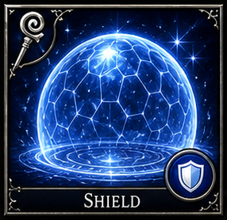</td>
<td style="border: none;">
<table border="0" cellspacing="0" cellpadding="0" style="border: none; border-collapse: collapse;">
<tr><th style="border: none;">School</th><th style="border: none;">Level</th><th style="border: none;">Mana</th><th style="border: none;">Damage</th><th style="border: none;">Class</th><th style="border: none;">Tags</th></tr>
<tr><td style="border: none;">Aegis</td><td style="border: none;">1</td><td style="border: none;">5</td><td style="border: none;">—</td><td style="border: none;">Mage</td><td style="border: none;">Defensive</td></tr>
</table>
</td>
</tr>
</table>

Magical shield against attacks and missiles. Armor Class increase and projectile defense.

*Minimum Level: Mage 1*

### Burning Hands

<table border="0" cellspacing="0" cellpadding="0" style="border: none; border-collapse: collapse;">
<tr>
<td style="border: none; padding-right: 12px;"></td>
<td style="border: none;">
<table border="0" cellspacing="0" cellpadding="0" style="border: none; border-collapse: collapse;">
<tr><th style="border: none;">School</th><th style="border: none;">Level</th><th style="border: none;">Mana</th><th style="border: none;">Damage</th><th style="border: none;">Class</th><th style="border: none;">Tags</th></tr>
<tr><td style="border: none;">Stormcraft</td><td style="border: none;">1</td><td style="border: none;">5</td><td style="border: none;">Fire</td><td style="border: none;">Mage</td><td style="border: none;">Offensive, AoE</td></tr>
</table>
</td>
</tr>
</table>

*A fan of roaring flame erupts from the caster's fingertips. A cone-shaped burst hits all targets in short range for 1d4 fire damage per caster level (max 5d4). No save for half. Base 1d4 at level 1, scaling +1d4 per level up to 5d4.*

*Minimum Level: Mage 1*

### Grease

<table border="0" cellspacing="0" cellpadding="0" style="border: none; border-collapse: collapse;">
<tr>
<td style="border: none; padding-right: 12px;">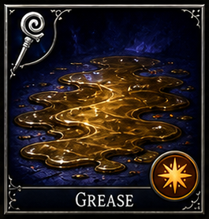</td>
<td style="border: none;">
<table border="0" cellspacing="0" cellpadding="0" style="border: none; border-collapse: collapse;">
<tr><th style="border: none;">School</th><th style="border: none;">Level</th><th style="border: none;">Mana</th><th style="border: none;">Damage</th><th style="border: none;">Class</th><th style="border: none;">Tags</th></tr>
<tr><td style="border: none;">Mirage</td><td style="border: none;">1</td><td style="border: none;">5</td><td style="border: none;">—</td><td style="border: none;">Mage</td><td style="border: none;">CC, Slip, AoE</td></tr>
</table>
</td>
</tr>
</table>

*- Mage Damage type: None/Control. Yes, persistent slippery zone.*

*Minimum Level: Mage 1*

### Sleep

<table border="0" cellspacing="0" cellpadding="0" style="border: none; border-collapse: collapse;">
<tr>
<td style="border: none; padding-right: 12px;"></td>
<td style="border: none;">
<table border="0" cellspacing="0" cellpadding="0" style="border: none; border-collapse: collapse;">
<tr><th style="border: none;">School</th><th style="border: none;">Level</th><th style="border: none;">Mana</th><th style="border: none;">Damage</th><th style="border: none;">Class</th><th style="border: none;">Tags</th></tr>
<tr><td style="border: none;">Mirage</td><td style="border: none;">1</td><td style="border: none;">5</td><td style="border: none;">—</td><td style="border: none;">Mage</td><td style="border: none;">CC, AoE</td></tr>
</table>
</td>
</tr>
</table>

*A cloud of shimmering blue motes drifts across the battlefield. Puts low-HP targets into magical slumber, affecting up to 4 HD of creatures total. Slumber breaks on damage or when the duration expires. Non-lethal crowd control that freezes TM.*

*Minimum Level: Mage 1*

### Color Spray

<table border="0" cellspacing="0" cellpadding="0" style="border: none; border-collapse: collapse;">
<tr>
<td style="border: none; padding-right: 12px;">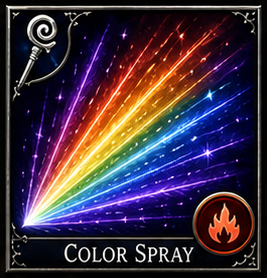</td>
<td style="border: none;">
<table border="0" cellspacing="0" cellpadding="0" style="border: none; border-collapse: collapse;">
<tr><th style="border: none;">School</th><th style="border: none;">Level</th><th style="border: none;">Mana</th><th style="border: none;">Damage</th><th style="border: none;">Class</th><th style="border: none;">Tags</th></tr>
<tr><td style="border: none;">Mirage</td><td style="border: none;">1</td><td style="border: none;">5</td><td style="border: none;">Light/Control</td><td style="border: none;">Mage</td><td style="border: none;">CC, AoE</td></tr>
</table>
</td>
</tr>
</table>

*- Mage Damage type: Light/Control.*

*Minimum Level: Mage 1*

### Detect Magic

<table border="0" cellspacing="0" cellpadding="0" style="border: none; border-collapse: collapse;">
<tr>
<td style="border: none; padding-right: 12px;">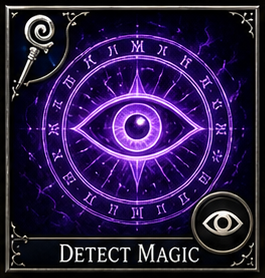</td>
<td style="border: none;">
<table border="0" cellspacing="0" cellpadding="0" style="border: none; border-collapse: collapse;">
<tr><th style="border: none;">School</th><th style="border: none;">Level</th><th style="border: none;">Mana</th><th style="border: none;">Damage</th><th style="border: none;">Class</th><th style="border: none;">Tags</th></tr>
<tr><td style="border: none;">Aegis / Mirage</td><td style="border: none;">1</td><td style="border: none;">5</td><td style="border: none;">—</td><td style="border: none;">Mage</td><td style="border: none;">Utility</td></tr>
</table>
</td>
</tr>
</table>

Reveals magical auras and enchantments. Utility and magical threat awareness.

*Minimum Level: Mage 1*

### Invisibility

<table border="0" cellspacing="0" cellpadding="0" style="border: none; border-collapse: collapse;">
<tr>
<td style="border: none; padding-right: 12px;"></td>
<td style="border: none;">
<table border="0" cellspacing="0" cellpadding="0" style="border: none; border-collapse: collapse;">
<tr><th style="border: none;">School</th><th style="border: none;">Level</th><th style="border: none;">Mana</th><th style="border: none;">Damage</th><th style="border: none;">Class</th><th style="border: none;">Tags</th></tr>
<tr><td style="border: none;">Mirage</td><td style="border: none;">2</td><td style="border: none;">8</td><td style="border: none;">—</td><td style="border: none;">Mage</td><td style="border: none;">Invisibility</td></tr>
</table>
</td>
</tr>
</table>

*The caster or a touched ally fades from sight, becoming a whisper of refracted light. Renders the target completely invisible — attacks against them suffer a severe miss chance. The spell ends when the target attacks or casts an offensive spell.*

*Minimum Level: Mage 2*

### Mirror Image

<table border="0" cellspacing="0" cellpadding="0" style="border: none; border-collapse: collapse;">
<tr>
<td style="border: none; padding-right: 12px;">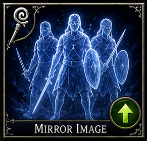</td>
<td style="border: none;">
<table border="0" cellspacing="0" cellpadding="0" style="border: none; border-collapse: collapse;">
<tr><th style="border: none;">School</th><th style="border: none;">Level</th><th style="border: none;">Mana</th><th style="border: none;">Damage</th><th style="border: none;">Class</th><th style="border: none;">Tags</th></tr>
<tr><td style="border: none;">Mirage</td><td style="border: none;">2</td><td style="border: none;">8</td><td style="border: none;">—</td><td style="border: none;">Mage</td><td style="border: none;">Defensive, Image</td></tr>
</table>
</td>
</tr>
</table>

*- Mage Yes, images persist until removed.*

*Minimum Level: Mage 2*

### Web

<table border="0" cellspacing="0" cellpadding="0" style="border: none; border-collapse: collapse;">
<tr>
<td style="border: none; padding-right: 12px;">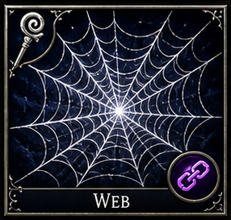</td>
<td style="border: none;">
<table border="0" cellspacing="0" cellpadding="0" style="border: none; border-collapse: collapse;">
<tr><th style="border: none;">School</th><th style="border: none;">Level</th><th style="border: none;">Mana</th><th style="border: none;">Damage</th><th style="border: none;">Class</th><th style="border: none;">Tags</th></tr>
<tr><td style="border: none;">Mirage / Dominion</td><td style="border: none;">2</td><td style="border: none;">8</td><td style="border: none;">—</td><td style="border: none;">Mage</td><td style="border: none;">CC, Root, AoE</td></tr>
</table>
</td>
</tr>
</table>

*- Mage Damage type: None/Control. Yes, persistent sticky field while active.*

*Minimum Level: Mage 2*

### Stinking Cloud

<table border="0" cellspacing="0" cellpadding="0" style="border: none; border-collapse: collapse;">
<tr>
<td style="border: none; padding-right: 12px;">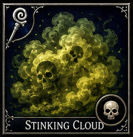</td>
<td style="border: none;">
<table border="0" cellspacing="0" cellpadding="0" style="border: none; border-collapse: collapse;">
<tr><th style="border: none;">School</th><th style="border: none;">Level</th><th style="border: none;">Mana</th><th style="border: none;">Damage</th><th style="border: none;">Class</th><th style="border: none;">Tags</th></tr>
<tr><td style="border: none;">Umbramancy / Mirage</td><td style="border: none;">2</td><td style="border: none;">8</td><td style="border: none;">Poison/Control</td><td style="border: none;">Mage</td><td style="border: none;">CC, AoE</td></tr>
</table>
</td>
</tr>
</table>

*- Mage Damage type: Poison/Control. Yes, persistent cloud zone.*

*Minimum Level: Mage 2*

### Ice Bolt

<table border="0" cellspacing="0" cellpadding="0" style="border: none; border-collapse: collapse;">
<tr>
<td style="border: none; padding-right: 12px;">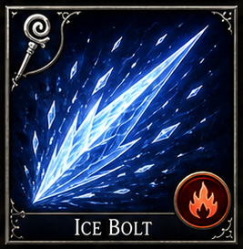</td>
<td style="border: none;">
<table border="0" cellspacing="0" cellpadding="0" style="border: none; border-collapse: collapse;">
<tr><th style="border: none;">School</th><th style="border: none;">Level</th><th style="border: none;">Mana</th><th style="border: none;">Damage</th><th style="border: none;">Class</th><th style="border: none;">Tags</th></tr>
<tr><td style="border: none;">Stormcraft</td><td style="border: none;">2</td><td style="border: none;">35</td><td style="border: none;">Ice</td><td style="border: none;">Mage</td><td style="border: none;">Single-Target Damage</td></tr>
</table>
</td>
</tr>
</table>

*A bolt of ice that freezes the target. Deals 2d8 ice damage at base, scaling +2d8 per level. Ice afterburn can slow the target or chill on critical.*

*Minimum Level: Mage 2*

### Shock

<table border="0" cellspacing="0" cellpadding="0" style="border: none; border-collapse: collapse;">
<tr>
<td style="border: none; padding-right: 12px;">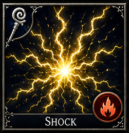</td>
<td style="border: none;">
<table border="0" cellspacing="0" cellpadding="0" style="border: none; border-collapse: collapse;">
<tr><th style="border: none;">School</th><th style="border: none;">Level</th><th style="border: none;">Mana</th><th style="border: none;">Damage</th><th style="border: none;">Class</th><th style="border: none;">Tags</th></tr>
<tr><td style="border: none;">Stormcraft</td><td style="border: none;">2</td><td style="border: none;">20</td><td style="border: none;">Lightning</td><td style="border: none;">Mage</td><td style="border: none;">Single-Target Damage</td></tr>
</table>
</td>
</tr>
</table>

*A jolt of electrical energy. Deals 2d6 lightning damage at base, scaling +2d6 per level. Shocked afterburn reduces turn meter gain for the target.*

*Minimum Level: Mage 2*

### Static Shock

<table border="0" cellspacing="0" cellpadding="0" style="border: none; border-collapse: collapse;">
<tr>
<td style="border: none; padding-right: 12px;">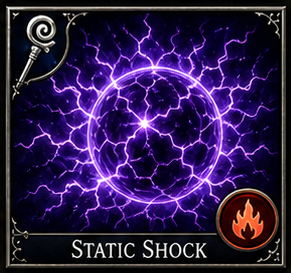</td>
<td style="border: none;">
<table border="0" cellspacing="0" cellpadding="0" style="border: none; border-collapse: collapse;">
<tr><th style="border: none;">School</th><th style="border: none;">Level</th><th style="border: none;">Mana</th><th style="border: none;">Damage</th><th style="border: none;">Class</th><th style="border: none;">Tags</th></tr>
<tr><td style="border: none;">Stormcraft</td><td style="border: none;">2</td><td style="border: none;">30</td><td style="border: none;">Lightning</td><td style="border: none;">Mage</td><td style="border: none;">Single-Target Damage, Debuff</td></tr>
</table>
</td>
</tr>
</table>

*A charged static shock that leaves lasting effects. Deals 1d6 lightning damage at base, scaling +1d6 per level. Inflicts Electrified (100% chance) which reduces turn meter gain and can chain to nearby targets.*

*Minimum Level: Mage 2*

## Mage specialization

From the mid game onward, mage identity shifts toward school-defined picks, stronger battlefield roles, and rarer variants. These are still organized with the same access-rule framework.

| Spell | School | Spell Level | Access Layer | Access Tier | Minimum Level | Effect | Impact | Class | Damage Type | Tags |
|---|---|---|---|---|---|---|---|---|---|---|
| [Lightning Bolt](#lightning-bolt) | Stormcraft | 3 | School Specialization | Mid | Mage 4 | Straight-line lightning blast through enemies. | HP damage; Electrocute variants can add TM loss or brief stun pressure. | Mage | Lightning | Offensive, AoE, Nuke |
| [Fireball](#fireball) | Stormcraft | 3 | School Specialization | Mid | Mage 4 | Explosive ranged fire burst for clustered targets. | HP damage to all victims in blast radius. | Mage | Fire | Offensive, AoE, Nuke |
| [Blink](#blink) | Mirage | 3 | School Specialization | Mid | Mage 4 | Phasing displacement defense. | Strong hit avoidance and mobility defense. | Mage | None | Blink, Defensive |
| [Slow](#slow) | Dominion / Mirage | 3 | School Specialization | Mid | Mage 4 | Reduces enemy tempo and action efficiency. | TM reduction and Movement reduction. | Mage | None/Control | CC, Debuff, Turn-Meter Control |
| [Haste](#haste) | Dominion | 3 | School Specialization | Mid | Mage 5 | Accelerates a target, massively increasing turn meter gain. | TM acceleration and action frequency increase. | Mage, Paladin, Knight, Bard | None/Buff | Buff, TM Uplift |
| [Mass Haste](#mass-haste) | Dominion | 5 | School Specialization | Late | Mage 7 | Accelerates all party members, boosting turn meter gain. Inflicts Haste Fatigue (DefensePower -2) on the caster. | Party-wide TM acceleration with a caster defense penalty. | Mage, Priest, Druid | None/Buff | Buff, TM Uplift, Group |
| [Vampiric Touch](#vampiric-touch) | Umbramancy | 3 | School Specialization | Mid | Mage 4 | Melee life-drain spell that steals vitality. | Victim loses HP; caster gains HP or sustain value in adaptation. | Mage | Necrotic/Drain-theme | Single-Target Damage, Leech |
| [Fear](#fear) | Umbramancy / Dominion | 4 | School Specialization | Mid | Mage 5 | Sends enemies fleeing in panic. | TM disorder and forced Movement away from threat source. | Mage | None/Control | CC, Debuff |
| [Ice Storm](#ice-storm) | Stormcraft | 4 | School Specialization | Mid | Mage 5 | Area storm of cold and impact force. | HP damage and possible Movement reduction in variant implementations. | Mage | Cold/Physical | Offensive, AoE |
| [Confusion](#confusion) | Mirage / Dominion | 4/7 | School Specialization | Late | Mage 6 | Scrambles enemy behavior and target selection. | TM unreliability, wasted turns, and positional chaos. | Mage | None/Control | CC, AoE |
| [Cloudkill](#cloudkill) | Umbramancy | 5 | School Specialization | Late | Mage 7 | Expanding poisonous cloud that fills space and kills or weakens creatures. | HP damage over time and Movement denial through zone pressure. | Mage | Poison | Offensive, AoE |
| [Cone of Cold](#cone-of-cold) | Stormcraft | 5 | School Specialization | Late | Mage 7 | Heavy cone-shaped cold burst. | HP damage; can support Movement slow in variant forms. | Mage | Cold | Offensive, AoE, Nuke |
| [Feeblemind](#feeblemind) | Umbramancy | 5 | School Specialization | Late | Mage 7 | Cripples caster or intellectual function. | MP pressure, anti-caster shutdown, and reduced magical threat output. | Mage | None/Anti-Mage | CC, Anti-Mage |
| [Delayed Blast Fireball](#delayed-blast-fireball) | Stormcraft | 7 | School Specialization | Late | Mage 9 | Timed explosive fire spell for setup nuking. | Massive HP damage with delayed detonation pressure. | Mage | Fire | Offensive, AoE, Nuke |
| [Maze](#maze) | Mirage | 8 | School Specialization | Late | Mage 10 | Temporarily removes a target from the battlefield. | TM removal through temporary battlefield exile. | Mage | None/Control | CC |
| [Mind Siphon Variant](#mind-siphon-variant) | Umbramancy | 4 | School Specialization | Mid | Mage 5 | Dark anti-mage variant that drains magical reserves. | MP damage or MP leech against spellcasters; can also reduce Magic Resistance in elite versions. | Mage, Dark Priest | Shadow/Drain | MP Leech, Variant |
| [Arc Lash Variant](#arc-lash-variant) | Stormcraft | 3 | School Specialization | Mid | Mage 4 | Focused lightning lash that shocks one target intensely. | HP damage plus Electrocute for TM loss or brief action delay. | Mage | Lightning | Single-Target Damage, TM Control, Variant |
| [Mirror Guard Variant](#mirror-guard-variant) | Mirage / Aegis | 3 | School Specialization | Mid | Mage 4 | Advanced mirror-image ward with partial retaliation or reflect chance. | Defense through miss chance and possible Magic Resistance flavor in elite versions. | Mage | Illusory/None | Defensive, Variant |
| [Greasefire Variant](#greasefire-variant) | Stormcraft / Mirage | 2 | School Specialization | Mid | Mage 3 | Custom variant that ignites a grease field into a burning slick. | HP damage plus Movement denial on the slicked area. | Mage | Fire | Offensive, AoE, Variant |
| [Mind Game](#mind-game) | Umbramancy | 2 | School Specialization | Mid | Mage 3 | Confuses the target, causing erratic behavior. | Random target selection, may skip turn or hit ally. | Mage | Shadow | CC, Debuff |
| [Charm Person](#charm-person) | Mirage | 2 | School Specialization | Mid | Mage 4 | Charms a humanoid to fight as an ally. | Target switches sides for the duration. | Mage | None | CC, Charm |
| [Dispel Magic](#dispel-magic) | Aegis | 3 | School Specialization | Mid | Mage 4 | Removes magical effects and buffs from a target. | Strips active buffs, debuffs, or ongoing spell effects. | Mage | None | Utility, Anti-Mage |
| [Stoneskin](#stoneskin) | Aegis | 3 | School Specialization | Mid | Mage 5 | Target gains strong resistance to physical damage for several turns. | Physical damage reduction; effective AC boost against normal attacks. | Mage | None | Defensive, Buff |
| [Counterspell](#counterspell) | Aegis | 4 | School Specialization | Mid | Mage 7 | Interrupts and negates an enemy spell as it is being cast. | Spell cancellation; denies enemy mana expenditure and turn investment. | Mage | None | Defensive, Anti-Mage |
| [Blight](#blight) | Umbramancy | 3 | School Specialization | Mid | Mage 4 | Withers living targets with spreading necrotic rot. | HP damage over time; strong against high-HP organic targets. | Mage | Shadow | Offensive, DoT |
| [Animate Dead](#animate-dead) | Umbramancy | 4 | School Specialization | Mid | Mage 6 | Raises a fallen enemy as an undead ally for several turns. | Adds a temporary undead combatant to the party. | Mage | None | Summoning, Necromancy |
| [Phantasmal Killer](#phantasmal-killer) | Mirage | 4 | School Specialization | Mid | Mage 7 | A terrifying vision deals psychic damage and inflicts Fear. | HP damage plus Fear status; double threat against non-resistant targets. | Mage | Psychic | Offensive, CC |
| [Polymorph](#polymorph) | Dominion | 4 | School Specialization | Mid | Mage 7 | Transforms a creature into a helpless animal form for a duration. | Removes enemy from combat effectively; strongest single-target CC. | Mage | None | CC |
| [Dominate Person](#dominate-person) | Dominion | 5 | School Specialization | Late | Mage 8 | Seizes full mental control of a humanoid for a duration. | Target fights for the caster; stronger and longer than Charm Person. | Mage | None | CC, Charm |
| [Globe of Invulnerability](#globe-of-invulnerability) | Aegis | 5 | School Specialization | Late | Mage 9 | Creates a zone of magic resistance protecting nearby allies. | Party-wide spell resistance bubble; negates most incoming spells. | Mage | None | Defensive, AoE |
| [Chain Lightning](#chain-lightning) | Stormcraft | 4 | School Specialization | Mid | Mage 7 | Lightning bolt that arcs between up to three targets in sequence. | HP damage to three targets; Electrocute can add TM loss to each. | Mage | Lightning | Offensive, AoE, Nuke |

### Lightning Bolt

<table border="0" cellspacing="0" cellpadding="0" style="border: none; border-collapse: collapse;">
<tr>
<td style="border: none; padding-right: 12px;">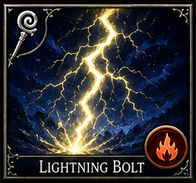</td>
<td style="border: none;">
<table border="0" cellspacing="0" cellpadding="0" style="border: none; border-collapse: collapse;">
<tr><th style="border: none;">School</th><th style="border: none;">Level</th><th style="border: none;">Mana</th><th style="border: none;">Damage</th><th style="border: none;">Class</th><th style="border: none;">Tags</th></tr>
<tr><td style="border: none;">Stormcraft</td><td style="border: none;">3</td><td style="border: none;">12</td><td style="border: none;">Lightning</td><td style="border: none;">Mage</td><td style="border: none;">Offensive, AoE, Nuke</td></tr>
</table>
</td>
</tr>
</table>

*- Mage Damage type: Lightning. Optional electric aftershock in variants.*

*Minimum Level: Mage 4*

### Fireball

<table border="0" cellspacing="0" cellpadding="0" style="border: none; border-collapse: collapse;">
<tr>
<td style="border: none; padding-right: 12px;"></td>
<td style="border: none;">
<table border="0" cellspacing="0" cellpadding="0" style="border: none; border-collapse: collapse;">
<tr><th style="border: none;">School</th><th style="border: none;">Level</th><th style="border: none;">Mana</th><th style="border: none;">Damage</th><th style="border: none;">Class</th><th style="border: none;">Tags</th></tr>
<tr><td style="border: none;">Stormcraft</td><td style="border: none;">3</td><td style="border: none;">12</td><td style="border: none;">Fire</td><td style="border: none;">Mage</td><td style="border: none;">Offensive, AoE, Nuke</td></tr>
</table>
</td>
</tr>
</table>

*A pea-sized bead of orange light streaks to the target point and erupts into a roaring sphere of flame. A wide-area explosion dealing 1d6 fire damage per caster level (cap 10d6) to all targets in a 20-foot radius. Cannot be shaped. Base 5d6 at level 5, scaling +1d6 per level to 10d6.*

*Minimum Level: Mage 4*

### Blink

<table border="0" cellspacing="0" cellpadding="0" style="border: none; border-collapse: collapse;">
<tr>
<td style="border: none; padding-right: 12px;">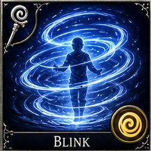</td>
<td style="border: none;">
<table border="0" cellspacing="0" cellpadding="0" style="border: none; border-collapse: collapse;">
<tr><th style="border: none;">School</th><th style="border: none;">Level</th><th style="border: none;">Mana</th><th style="border: none;">Damage</th><th style="border: none;">Class</th><th style="border: none;">Tags</th></tr>
<tr><td style="border: none;">Mirage</td><td style="border: none;">3</td><td style="border: none;">12</td><td style="border: none;">—</td><td style="border: none;">Mage</td><td style="border: none;">Blink, Defensive</td></tr>
</table>
</td>
</tr>
</table>

*- Mage Yes, duration displacement effect.*

*Minimum Level: Mage 4*

### Slow

<table border="0" cellspacing="0" cellpadding="0" style="border: none; border-collapse: collapse;">
<tr>
<td style="border: none; padding-right: 12px;"></td>
<td style="border: none;">
<table border="0" cellspacing="0" cellpadding="0" style="border: none; border-collapse: collapse;">
<tr><th style="border: none;">School</th><th style="border: none;">Level</th><th style="border: none;">Mana</th><th style="border: none;">Damage</th><th style="border: none;">Class</th><th style="border: none;">Tags</th></tr>
<tr><td style="border: none;">Dominion / Mirage</td><td style="border: none;">3</td><td style="border: none;">12</td><td style="border: none;">—</td><td style="border: none;">Mage</td><td style="border: none;">CC, Debuff, Turn-Meter Control</td></tr>
</table>
</td>
</tr>
</table>

*A cloying purple haze settles over the target, weighing down their limbs. Reduces turn meter gain by 50%, halves movement speed, and applies -2 DefensePower. Duration 1 round per caster level. Deity Bonus: (Chronara) +1 round duration.*

*Minimum Level: Mage 4*

### Haste

<table border="0" cellspacing="0" cellpadding="0" style="border: none; border-collapse: collapse;">
<tr>
<td style="border: none; padding-right: 12px;"></td>
<td style="border: none;">
<table border="0" cellspacing="0" cellpadding="0" style="border: none; border-collapse: collapse;">
<tr><th style="border: none;">School</th><th style="border: none;">Level</th><th style="border: none;">Mana</th><th style="border: none;">Damage</th><th style="border: none;">Class</th><th style="border: none;">Tags</th></tr>
<tr><td style="border: none;">Dominion</td><td style="border: none;">3</td><td style="border: none;">12</td><td style="border: none;">—</td><td style="border: none;">Mage, Paladin, Knight, Bard</td><td style="border: none;">Buff, TM Uplift</td></tr>
</table>
</td>
</tr>
</table>

*Time warps around the target as golden energy suffuses their limbs. Massively accelerates turn meter gain by 50% and grants +2 AttackPower and +2 DefensePower. Lasts 1 round per caster level (max 10 rounds). Deity Bonus: (Celestara) +1 round duration.*

*Minimum Level: Mage 5*

### Mass Haste

<table border="0" cellspacing="0" cellpadding="0" style="border: none; border-collapse: collapse;">
<tr>
<td style="border: none; padding-right: 12px;">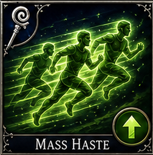</td>
<td style="border: none;">
<table border="0" cellspacing="0" cellpadding="0" style="border: none; border-collapse: collapse;">
<tr><th style="border: none;">School</th><th style="border: none;">Level</th><th style="border: none;">Mana</th><th style="border: none;">Damage</th><th style="border: none;">Class</th><th style="border: none;">Tags</th></tr>
<tr><td style="border: none;">Dominion</td><td style="border: none;">5</td><td style="border: none;">20</td><td style="border: none;">—</td><td style="border: none;">Mage, Priest, Druid</td><td style="border: none;">Buff, TM Uplift, Group</td></tr>
</table>
</td>
</tr>
</table>

*- Mage, Priest, Druid Damage type: None/Buff. Yes, duration-based speed buff. Caster suffers DefensePower debuff.*

*Minimum Level: Mage 7*

### Vampiric Touch

<table border="0" cellspacing="0" cellpadding="0" style="border: none; border-collapse: collapse;">
<tr>
<td style="border: none; padding-right: 12px;">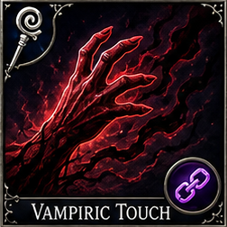</td>
<td style="border: none;">
<table border="0" cellspacing="0" cellpadding="0" style="border: none; border-collapse: collapse;">
<tr><th style="border: none;">School</th><th style="border: none;">Level</th><th style="border: none;">Mana</th><th style="border: none;">Damage</th><th style="border: none;">Class</th><th style="border: none;">Tags</th></tr>
<tr><td style="border: none;">Umbramancy</td><td style="border: none;">3</td><td style="border: none;">12</td><td style="border: none;">Necrotic/Drain-theme</td><td style="border: none;">Mage</td><td style="border: none;">Single-Target Damage, Leech</td></tr>
</table>
</td>
</tr>
</table>

*- Mage Damage type: Necrotic/Drain-theme. Leech effect instead of burn.*

*Minimum Level: Mage 4*

### Fear

<table border="0" cellspacing="0" cellpadding="0" style="border: none; border-collapse: collapse;">
<tr>
<td style="border: none; padding-right: 12px;">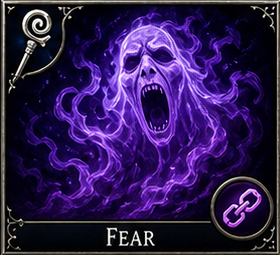</td>
<td style="border: none;">
<table border="0" cellspacing="0" cellpadding="0" style="border: none; border-collapse: collapse;">
<tr><th style="border: none;">School</th><th style="border: none;">Level</th><th style="border: none;">Mana</th><th style="border: none;">Damage</th><th style="border: none;">Class</th><th style="border: none;">Tags</th></tr>
<tr><td style="border: none;">Umbramancy / Dominion</td><td style="border: none;">4</td><td style="border: none;">15</td><td style="border: none;">—</td><td style="border: none;">Mage</td><td style="border: none;">CC, Debuff</td></tr>
</table>
</td>
</tr>
</table>

*- Mage Damage type: None/Control.*

*Minimum Level: Mage 5*

### Ice Storm

<table border="0" cellspacing="0" cellpadding="0" style="border: none; border-collapse: collapse;">
<tr>
<td style="border: none; padding-right: 12px;">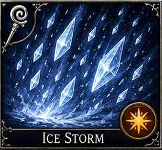</td>
<td style="border: none;">
<table border="0" cellspacing="0" cellpadding="0" style="border: none; border-collapse: collapse;">
<tr><th style="border: none;">School</th><th style="border: none;">Level</th><th style="border: none;">Mana</th><th style="border: none;">Damage</th><th style="border: none;">Class</th><th style="border: none;">Tags</th></tr>
<tr><td style="border: none;">Stormcraft</td><td style="border: none;">4</td><td style="border: none;">15</td><td style="border: none;">Cold/Physical</td><td style="border: none;">Mage</td><td style="border: none;">Offensive, AoE</td></tr>
</table>
</td>
</tr>
</table>

*- Mage Damage type: Cold/Physical.*

*Minimum Level: Mage 5*

### Confusion

<table border="0" cellspacing="0" cellpadding="0" style="border: none; border-collapse: collapse;">
<tr>
<td style="border: none; padding-right: 12px;"></td>
<td style="border: none;">
<table border="0" cellspacing="0" cellpadding="0" style="border: none; border-collapse: collapse;">
<tr><th style="border: none;">School</th><th style="border: none;">Level</th><th style="border: none;">Mana</th><th style="border: none;">Damage</th><th style="border: none;">Class</th><th style="border: none;">Tags</th></tr>
<tr><td style="border: none;">Mirage / Dominion</td><td style="border: none;">4/7</td><td style="border: none;">15</td><td style="border: none;">—</td><td style="border: none;">Mage</td><td style="border: none;">CC, AoE</td></tr>
</table>
</td>
</tr>
</table>

*Swirling ribbons of clashing colour erupt around the target. The target acts erratically — may attack allies, skip turns, or wander randomly each round. Lasts 1 round per caster level (max 6).*

*Minimum Level: Mage 6*

### Cloudkill

<table border="0" cellspacing="0" cellpadding="0" style="border: none; border-collapse: collapse;">
<tr>
<td style="border: none; padding-right: 12px;">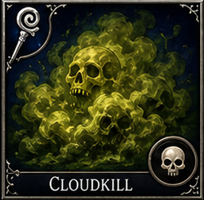</td>
<td style="border: none;">
<table border="0" cellspacing="0" cellpadding="0" style="border: none; border-collapse: collapse;">
<tr><th style="border: none;">School</th><th style="border: none;">Level</th><th style="border: none;">Mana</th><th style="border: none;">Damage</th><th style="border: none;">Class</th><th style="border: none;">Tags</th></tr>
<tr><td style="border: none;">Umbramancy</td><td style="border: none;">5</td><td style="border: none;">20</td><td style="border: none;">Poison</td><td style="border: none;">Mage</td><td style="border: none;">Offensive, AoE</td></tr>
</table>
</td>
</tr>
</table>

*- Mage Damage type: Poison. Yes, persistent cloud hazard.*

*Minimum Level: Mage 7*

### Cone of Cold

<table border="0" cellspacing="0" cellpadding="0" style="border: none; border-collapse: collapse;">
<tr>
<td style="border: none; padding-right: 12px;">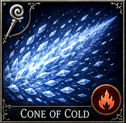</td>
<td style="border: none;">
<table border="0" cellspacing="0" cellpadding="0" style="border: none; border-collapse: collapse;">
<tr><th style="border: none;">School</th><th style="border: none;">Level</th><th style="border: none;">Mana</th><th style="border: none;">Damage</th><th style="border: none;">Class</th><th style="border: none;">Tags</th></tr>
<tr><td style="border: none;">Stormcraft</td><td style="border: none;">5</td><td style="border: none;">20</td><td style="border: none;">Cold</td><td style="border: none;">Mage</td><td style="border: none;">Offensive, AoE, Nuke</td></tr>
</table>
</td>
</tr>
</table>

*- Mage Damage type: Cold.*

*Minimum Level: Mage 7*

### Feeblemind

<table border="0" cellspacing="0" cellpadding="0" style="border: none; border-collapse: collapse;">
<tr>
<td style="border: none; padding-right: 12px;"></td>
<td style="border: none;">
<table border="0" cellspacing="0" cellpadding="0" style="border: none; border-collapse: collapse;">
<tr><th style="border: none;">School</th><th style="border: none;">Level</th><th style="border: none;">Mana</th><th style="border: none;">Damage</th><th style="border: none;">Class</th><th style="border: none;">Tags</th></tr>
<tr><td style="border: none;">Umbramancy</td><td style="border: none;">5</td><td style="border: none;">20</td><td style="border: none;">—</td><td style="border: none;">Mage</td><td style="border: none;">CC, Anti-Mage</td></tr>
</table>
</td>
</tr>
</table>

*A lance of pure psychic corruption pierces the target's consciousness. Devastating Intelligence and Wisdom drain drops mental stats to 1, making spellcasting impossible. Deals severe MP damage (2d6 x caster level).*

*Minimum Level: Mage 7*

### Delayed Blast Fireball

<table border="0" cellspacing="0" cellpadding="0" style="border: none; border-collapse: collapse;">
<tr>
<td style="border: none; padding-right: 12px;"></td>
<td style="border: none;">
<table border="0" cellspacing="0" cellpadding="0" style="border: none; border-collapse: collapse;">
<tr><th style="border: none;">School</th><th style="border: none;">Level</th><th style="border: none;">Mana</th><th style="border: none;">Damage</th><th style="border: none;">Class</th><th style="border: none;">Tags</th></tr>
<tr><td style="border: none;">Stormcraft</td><td style="border: none;">7</td><td style="border: none;">30</td><td style="border: none;">Fire</td><td style="border: none;">Mage</td><td style="border: none;">Offensive, AoE, Nuke</td></tr>
</table>
</td>
</tr>
</table>

*- Mage Damage type: Fire. No baseline burn rider.*

*Minimum Level: Mage 9*

### Maze

<table border="0" cellspacing="0" cellpadding="0" style="border: none; border-collapse: collapse;">
<tr>
<td style="border: none; padding-right: 12px;">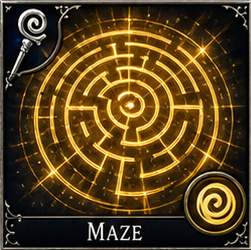</td>
<td style="border: none;">
<table border="0" cellspacing="0" cellpadding="0" style="border: none; border-collapse: collapse;">
<tr><th style="border: none;">School</th><th style="border: none;">Level</th><th style="border: none;">Mana</th><th style="border: none;">Damage</th><th style="border: none;">Class</th><th style="border: none;">Tags</th></tr>
<tr><td style="border: none;">Mirage</td><td style="border: none;">8</td><td style="border: none;">35</td><td style="border: none;">—</td><td style="border: none;">Mage</td><td style="border: none;">CC</td></tr>
</table>
</td>
</tr>
</table>

*- Mage Damage type: None/Control. Yes, exile duration.*

*Minimum Level: Mage 10*

### Mind Siphon Variant

<table border="0" cellspacing="0" cellpadding="0" style="border: none; border-collapse: collapse;">
<tr>
<td style="border: none; padding-right: 12px;">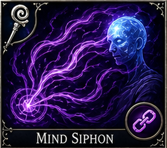</td>
<td style="border: none;">
<table border="0" cellspacing="0" cellpadding="0" style="border: none; border-collapse: collapse;">
<tr><th style="border: none;">School</th><th style="border: none;">Level</th><th style="border: none;">Mana</th><th style="border: none;">Damage</th><th style="border: none;">Class</th><th style="border: none;">Tags</th></tr>
<tr><td style="border: none;">Umbramancy</td><td style="border: none;">4</td><td style="border: none;">15</td><td style="border: none;">Shadow/Drain</td><td style="border: none;">Mage, Dark Priest</td><td style="border: none;">MP Leech, Variant</td></tr>
</table>
</td>
</tr>
</table>

*- Mage, Dark Priest Damage type: Shadow/Drain. Yes, lingering mana suppression in variant design.*

*Minimum Level: Mage 5*

### Arc Lash Variant

<table border="0" cellspacing="0" cellpadding="0" style="border: none; border-collapse: collapse;">
<tr>
<td style="border: none; padding-right: 12px;">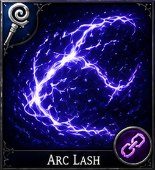</td>
<td style="border: none;">
<table border="0" cellspacing="0" cellpadding="0" style="border: none; border-collapse: collapse;">
<tr><th style="border: none;">School</th><th style="border: none;">Level</th><th style="border: none;">Mana</th><th style="border: none;">Damage</th><th style="border: none;">Class</th><th style="border: none;">Tags</th></tr>
<tr><td style="border: none;">Stormcraft</td><td style="border: none;">3</td><td style="border: none;">12</td><td style="border: none;">Lightning</td><td style="border: none;">Mage</td><td style="border: none;">Single-Target Damage, TM Control, Variant</td></tr>
</table>
</td>
</tr>
</table>

*- Mage Damage type: Lightning. Yes, electric aftershock in variant design.*

*Minimum Level: Mage 4*

### Mirror Guard Variant

<table border="0" cellspacing="0" cellpadding="0" style="border: none; border-collapse: collapse;">
<tr>
<td style="border: none; padding-right: 12px;">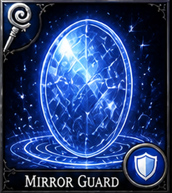</td>
<td style="border: none;">
<table border="0" cellspacing="0" cellpadding="0" style="border: none; border-collapse: collapse;">
<tr><th style="border: none;">School</th><th style="border: none;">Level</th><th style="border: none;">Mana</th><th style="border: none;">Damage</th><th style="border: none;">Class</th><th style="border: none;">Tags</th></tr>
<tr><td style="border: none;">Mirage / Aegis</td><td style="border: none;">3</td><td style="border: none;">12</td><td style="border: none;">Illusory/None</td><td style="border: none;">Mage</td><td style="border: none;">Defensive, Variant</td></tr>
</table>
</td>
</tr>
</table>

*- Mage Damage type: Illusory/None. Yes, images persist until broken.*

*Minimum Level: Mage 4*

### Greasefire Variant

<table border="0" cellspacing="0" cellpadding="0" style="border: none; border-collapse: collapse;">
<tr>
<td style="border: none; padding-right: 12px;">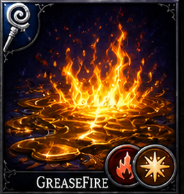</td>
<td style="border: none;">
<table border="0" cellspacing="0" cellpadding="0" style="border: none; border-collapse: collapse;">
<tr><th style="border: none;">School</th><th style="border: none;">Level</th><th style="border: none;">Mana</th><th style="border: none;">Damage</th><th style="border: none;">Class</th><th style="border: none;">Tags</th></tr>
<tr><td style="border: none;">Stormcraft / Mirage</td><td style="border: none;">2</td><td style="border: none;">8</td><td style="border: none;">Fire</td><td style="border: none;">Mage</td><td style="border: none;">Offensive, AoE, Variant</td></tr>
</table>
</td>
</tr>
</table>

*- Mage Damage type: Fire. Yes, brief burning ground effect in variant design.*

*Minimum Level: Mage 3*

### Mind Game

<table border="0" cellspacing="0" cellpadding="0" style="border: none; border-collapse: collapse;">
<tr>
<td style="border: none; padding-right: 12px;">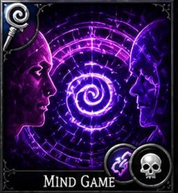</td>
<td style="border: none;">
<table border="0" cellspacing="0" cellpadding="0" style="border: none; border-collapse: collapse;">
<tr><th style="border: none;">School</th><th style="border: none;">Level</th><th style="border: none;">Mana</th><th style="border: none;">Damage</th><th style="border: none;">Class</th><th style="border: none;">Tags</th></tr>
<tr><td style="border: none;">Umbramancy</td><td style="border: none;">2</td><td style="border: none;">8</td><td style="border: none;">Shadow</td><td style="border: none;">Mage</td><td style="border: none;">CC, Debuff</td></tr>
</table>
</td>
</tr>
</table>

*- Mage Damage type: Shadow. Yes, Confused (gray).*

*Minimum Level: Mage 3*

### Charm Person

<table border="0" cellspacing="0" cellpadding="0" style="border: none; border-collapse: collapse;">
<tr>
<td style="border: none; padding-right: 12px;">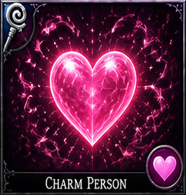</td>
<td style="border: none;">
<table border="0" cellspacing="0" cellpadding="0" style="border: none; border-collapse: collapse;">
<tr><th style="border: none;">School</th><th style="border: none;">Level</th><th style="border: none;">Mana</th><th style="border: none;">Damage</th><th style="border: none;">Class</th><th style="border: none;">Tags</th></tr>
<tr><td style="border: none;">Mirage</td><td style="border: none;">2</td><td style="border: none;">8</td><td style="border: none;">—</td><td style="border: none;">Mage</td><td style="border: none;">CC, Charm</td></tr>
</table>
</td>
</tr>
</table>

*- Mage Yes, Charmed (pink).*

*Minimum Level: Mage 4*

### Shadow Bolt

<table border="0" cellspacing="0" cellpadding="0" style="border: none; border-collapse: collapse;">
<tr>
<td style="border: none; padding-right: 12px;"></td>
<td style="border: none;">
<table border="0" cellspacing="0" cellpadding="0" style="border: none; border-collapse: collapse;">
<tr><th style="border: none;">School</th><th style="border: none;">Level</th><th style="border: none;">Mana</th><th style="border: none;">Damage</th><th style="border: none;">Class</th><th style="border: none;">Tags</th></tr>
<tr><td style="border: none;">Umbramancy</td><td style="border: none;">1</td><td style="border: none;">8</td><td style="border: none;">Shadow</td><td style="border: none;">Mage</td><td style="border: none;">Single-Target Damage</td></tr>
</table>
</td>
</tr>
</table>

*A sinuous bolt of shadow energy leaps from the casters palm, darkening the air as it streaks toward its target. Deals 1D6+2 Shadow damage. Shadow afterburn reduces the targets TM gain by 10% for one turn. Entry-level dark magic; cheaper than Vampiric Touch but lacks the leech component.*

*Minimum Level: Mage 2*

### Chill Touch

<table border="0" cellspacing="0" cellpadding="0" style="border: none; border-collapse: collapse;">
<tr>
<td style="border: none; padding-right: 12px;"></td>
<td style="border: none;">
<table border="0" cellspacing="0" cellpadding="0" style="border: none; border-collapse: collapse;">
<tr><th style="border: none;">School</th><th style="border: none;">Level</th><th style="border: none;">Mana</th><th style="border: none;">Damage</th><th style="border: none;">Class</th><th style="border: none;">Tags</th></tr>
<tr><td style="border: none;">Umbramancy</td><td style="border: none;">1</td><td style="border: none;">8</td><td style="border: none;">Shadow (Melee)</td><td style="border: none;">Mage</td><td style="border: none;">Single-Target Damage, Debuff</td></tr>
</table>
</td>
</tr>
</table>

*A ghostly pale hand reaches forward, leaving frost where it grips. The target cannot regain hit points on their next turn. Deals 1D4+1 Shadow damage and applies the Chilled status, suppressing any healing received for one round. Works only in melee range.*

*Minimum Level: Mage 2*

### Blur

<table border="0" cellspacing="0" cellpadding="0" style="border: none; border-collapse: collapse;">
<tr>
<td style="border: none; padding-right: 12px;"></td>
<td style="border: none;">
<table border="0" cellspacing="0" cellpadding="0" style="border: none; border-collapse: collapse;">
<tr><th style="border: none;">School</th><th style="border: none;">Level</th><th style="border: none;">Mana</th><th style="border: none;">Damage</th><th style="border: none;">Class</th><th style="border: none;">Tags</th></tr>
<tr><td style="border: none;">Mirage</td><td style="border: none;">2</td><td style="border: none;">15</td><td style="border: none;">—</td><td style="border: none;">Mage</td><td style="border: none;">Defensive, Buff</td></tr>
</table>
</td>
</tr>
</table>

*The casters or targets outline becomes unstable — edges smearing, position doubling. Attackers suffer a 20% miss chance on all physical attacks for 3 rounds. Does not affect spells or area effects. Stacks poorly with Mirror Image since both are illusion-based miss defenses.*

*Minimum Level: Mage 3*

### Enlarge

<table border="0" cellspacing="0" cellpadding="0" style="border: none; border-collapse: collapse;">
<tr>
<td style="border: none; padding-right: 12px;"></td>
<td style="border: none;">
<table border="0" cellspacing="0" cellpadding="0" style="border: none; border-collapse: collapse;">
<tr><th style="border: none;">School</th><th style="border: none;">Level</th><th style="border: none;">Mana</th><th style="border: none;">Damage</th><th style="border: none;">Class</th><th style="border: none;">Tags</th></tr>
<tr><td style="border: none;">Dominion</td><td style="border: none;">2</td><td style="border: none;">15</td><td style="border: none;">—</td><td style="border: none;">Mage</td><td style="border: none;">Buff</td></tr>
</table>
</td>
</tr>
</table>

*The subject swells to twice their normal height, armor splitting at seams as raw power floods through them. Target gains +2 AttackPower, +1 AC, and melee reach increases. Lasts 3 rounds. Counterpart Reduce (not yet implemented) would halve size and stats.*

*Minimum Level: Mage 3*

### Dispel Magic

<table border="0" cellspacing="0" cellpadding="0" style="border: none; border-collapse: collapse;">
<tr>
<td style="border: none; padding-right: 12px;"></td>
<td style="border: none;">
<table border="0" cellspacing="0" cellpadding="0" style="border: none; border-collapse: collapse;">
<tr><th style="border: none;">School</th><th style="border: none;">Level</th><th style="border: none;">Mana</th><th style="border: none;">Damage</th><th style="border: none;">Class</th><th style="border: none;">Tags</th></tr>
<tr><td style="border: none;">Aegis</td><td style="border: none;">3</td><td style="border: none;">20</td><td style="border: none;">—</td><td style="border: none;">Mage</td><td style="border: none;">Utility, Anti-Mage</td></tr>
</table>
</td>
</tr>
</table>

*A precise unraveling of magical weave — the mage gestures and active spells on the target simply cease. Removes up to one ongoing magical effect per casting. On contested dispel (enemy buffed higher than casters level), the effect persists. Invaluable against armored mages and warded enemies.*

*Minimum Level: Mage 4*

### Stoneskin

<table border="0" cellspacing="0" cellpadding="0" style="border: none; border-collapse: collapse;">
<tr>
<td style="border: none; padding-right: 12px;"></td>
<td style="border: none;">
<table border="0" cellspacing="0" cellpadding="0" style="border: none; border-collapse: collapse;">
<tr><th style="border: none;">School</th><th style="border: none;">Level</th><th style="border: none;">Mana</th><th style="border: none;">Damage</th><th style="border: none;">Class</th><th style="border: none;">Tags</th></tr>
<tr><td style="border: none;">Aegis</td><td style="border: none;">3</td><td style="border: none;">25</td><td style="border: none;">—</td><td style="border: none;">Mage</td><td style="border: none;">Defensive, Buff</td></tr>
</table>
</td>
</tr>
</table>

*The subjects skin hardens to the texture and density of granite, leaving grey-tinged patches across arms and face. Reduces all incoming physical damage by 3 for 4 rounds. Does not protect against elemental, magical, or psychic damage. Stacks with Armor and Shield.*

*Minimum Level: Mage 5*

### Counterspell

<table border="0" cellspacing="0" cellpadding="0" style="border: none; border-collapse: collapse;">
<tr>
<td style="border: none; padding-right: 12px;"></td>
<td style="border: none;">
<table border="0" cellspacing="0" cellpadding="0" style="border: none; border-collapse: collapse;">
<tr><th style="border: none;">School</th><th style="border: none;">Level</th><th style="border: none;">Mana</th><th style="border: none;">Damage</th><th style="border: none;">Class</th><th style="border: none;">Tags</th></tr>
<tr><td style="border: none;">Aegis</td><td style="border: none;">4</td><td style="border: none;">30</td><td style="border: none;">—</td><td style="border: none;">Mage</td><td style="border: none;">Defensive, Anti-Mage</td></tr>
</table>
</td>
</tr>
</table>

*The mage recognizes the pattern in the enemys incantation and speaks its counter-rune — the spell folds in on itself before it leaves the casters hands. When an enemy begins casting, this can be declared to negate it entirely. Requires knowing the tier of the incoming spell; higher-tier spells require more skill to counter.*

*Minimum Level: Mage 7*

### Blight

<table border="0" cellspacing="0" cellpadding="0" style="border: none; border-collapse: collapse;">
<tr>
<td style="border: none; padding-right: 12px;"></td>
<td style="border: none;">
<table border="0" cellspacing="0" cellpadding="0" style="border: none; border-collapse: collapse;">
<tr><th style="border: none;">School</th><th style="border: none;">Level</th><th style="border: none;">Mana</th><th style="border: none;">Damage</th><th style="border: none;">Class</th><th style="border: none;">Tags</th></tr>
<tr><td style="border: none;">Umbramancy</td><td style="border: none;">3</td><td style="border: none;">25</td><td style="border: none;">Shadow</td><td style="border: none;">Mage</td><td style="border: none;">Offensive, DoT</td></tr>
</table>
</td>
</tr>
</table>

*Dark energy seeps through skin and sinew, killing cells in spreading rings. Deals 3D6+2 Shadow damage over 2 rounds (applied at end of each of the targets turns). Biological creatures take full damage; undead and constructs are immune. Strong against high-HP tanks and regenerating enemies.*

*Minimum Level: Mage 4*

### Animate Dead

<table border="0" cellspacing="0" cellpadding="0" style="border: none; border-collapse: collapse;">
<tr>
<td style="border: none; padding-right: 12px;"></td>
<td style="border: none;">
<table border="0" cellspacing="0" cellpadding="0" style="border: none; border-collapse: collapse;">
<tr><th style="border: none;">School</th><th style="border: none;">Level</th><th style="border: none;">Mana</th><th style="border: none;">Damage</th><th style="border: none;">Class</th><th style="border: none;">Tags</th></tr>
<tr><td style="border: none;">Umbramancy</td><td style="border: none;">4</td><td style="border: none;">35</td><td style="border: none;">—</td><td style="border: none;">Mage</td><td style="border: none;">Summoning, Necromancy</td></tr>
</table>
</td>
</tr>
</table>

*The mage reaches out toward a fallen foe, dark threads knitting bone and sinew back into motion without restoring the spark of life. A creature that died this combat rises as a skeletal or zombie version of itself. The undead acts on the mages side but cannot use its original spells or special abilities. Lasts 4 rounds or until destroyed.*

*Minimum Level: Mage 6*

### Phantasmal Killer

<table border="0" cellspacing="0" cellpadding="0" style="border: none; border-collapse: collapse;">
<tr>
<td style="border: none; padding-right: 12px;"></td>
<td style="border: none;">
<table border="0" cellspacing="0" cellpadding="0" style="border: none; border-collapse: collapse;">
<tr><th style="border: none;">School</th><th style="border: none;">Level</th><th style="border: none;">Mana</th><th style="border: none;">Damage</th><th style="border: none;">Class</th><th style="border: none;">Tags</th></tr>
<tr><td style="border: none;">Mirage</td><td style="border: none;">4</td><td style="border: none;">30</td><td style="border: none;">Psychic</td><td style="border: none;">Mage</td><td style="border: none;">Offensive, CC</td></tr>
</table>
</td>
</tr>
</table>

*The caster reaches into the targets mind and sculpts their deepest dread — a thing of shadow and teeth visible only to the victim. Deals 2D8+2 Psychic damage. On a failed will save, the target also gains the Feared status (forced movement away from caster, -2 AttackPower). Immune to targets with the Fearless trait.*

*Minimum Level: Mage 7*

### Polymorph

<table border="0" cellspacing="0" cellpadding="0" style="border: none; border-collapse: collapse;">
<tr>
<td style="border: none; padding-right: 12px;"></td>
<td style="border: none;">
<table border="0" cellspacing="0" cellpadding="0" style="border: none; border-collapse: collapse;">
<tr><th style="border: none;">School</th><th style="border: none;">Level</th><th style="border: none;">Mana</th><th style="border: none;">Damage</th><th style="border: none;">Class</th><th style="border: none;">Tags</th></tr>
<tr><td style="border: none;">Dominion</td><td style="border: none;">4</td><td style="border: none;">30</td><td style="border: none;">—</td><td style="border: none;">Mage</td><td style="border: none;">CC</td></tr>
</table>
</td>
</tr>
</table>

*The arcane words distort reality around the target — limbs reshaping, voice silenced, mind reduced to animal instinct. Transforms target into a small harmless animal (sheep, toad, or similar) for up to 3 rounds. The target retains their HP total but cannot cast spells, use abilities, or make effective attacks. Dispel Magic or taking damage above a threshold ends the effect early.*

*Minimum Level: Mage 7*

### Dominate Person

<table border="0" cellspacing="0" cellpadding="0" style="border: none; border-collapse: collapse;">
<tr>
<td style="border: none; padding-right: 12px;"></td>
<td style="border: none;">
<table border="0" cellspacing="0" cellpadding="0" style="border: none; border-collapse: collapse;">
<tr><th style="border: none;">School</th><th style="border: none;">Level</th><th style="border: none;">Mana</th><th style="border: none;">Damage</th><th style="border: none;">Class</th><th style="border: none;">Tags</th></tr>
<tr><td style="border: none;">Dominion</td><td style="border: none;">5</td><td style="border: none;">40</td><td style="border: none;">—</td><td style="border: none;">Mage</td><td style="border: none;">CC, Charm</td></tr>
</table>
</td>
</tr>
</table>

*Not merely charmed — owned. The casters will replaces the targets own; they act as if they have always been the casters most loyal ally. Target fights for the caster for 3 rounds. Unlike Charm Person, the target will attack their former allies. A dominated target that takes severe damage may attempt to break free. Humanoids only.*

*Minimum Level: Mage 8*

### Globe of Invulnerability

<table border="0" cellspacing="0" cellpadding="0" style="border: none; border-collapse: collapse;">
<tr>
<td style="border: none; padding-right: 12px;"></td>
<td style="border: none;">
<table border="0" cellspacing="0" cellpadding="0" style="border: none; border-collapse: collapse;">
<tr><th style="border: none;">School</th><th style="border: none;">Level</th><th style="border: none;">Mana</th><th style="border: none;">Damage</th><th style="border: none;">Class</th><th style="border: none;">Tags</th></tr>
<tr><td style="border: none;">Aegis</td><td style="border: none;">5</td><td style="border: none;">45</td><td style="border: none;">—</td><td style="border: none;">Mage</td><td style="border: none;">Defensive, AoE</td></tr>
</table>
</td>
</tr>
</table>

*A shimmering sphere of force erupts around the mage, deflecting arcane energies into harmless light. All spells of level 4 or lower that target creatures within the globe fail automatically for 3 rounds. Affects allies inside the globe equally. Higher-level spells penetrate normally. The globe cannot be moved.*

*Minimum Level: Mage 9*

### Chain Lightning

<table border="0" cellspacing="0" cellpadding="0" style="border: none; border-collapse: collapse;">
<tr>
<td style="border: none; padding-right: 12px;"></td>
<td style="border: none;">
<table border="0" cellspacing="0" cellpadding="0" style="border: none; border-collapse: collapse;">
<tr><th style="border: none;">School</th><th style="border: none;">Level</th><th style="border: none;">Mana</th><th style="border: none;">Damage</th><th style="border: none;">Class</th><th style="border: none;">Tags</th></tr>
<tr><td style="border: none;">Stormcraft</td><td style="border: none;">4</td><td style="border: none;">35</td><td style="border: none;">Lightning</td><td style="border: none;">Mage</td><td style="border: none;">Offensive, AoE, Nuke</td></tr>
</table>
</td>
</tr>
</table>

*A bolt strikes the primary target, then leaps to the nearest enemy, then leaps again — each arc slightly weaker but no less lethal. Deals 3D6+2 Lightning damage to the primary target; 2D6 to the second and third targets in sequence. Electrocute afterburn on the primary; secondary targets may or may not inherit the status. Ideal for clustered enemies.*

*Minimum Level: Mage 7*

## Priest spellbook

Priests gain broad early identity through blessings, healing, commands, wards, and spiritual battlefield control. Their later spells expand into miracles, barriers, supreme restoration, and holy devastation rather than generic arcane offense.

| Spell | Deity | Spell Level | Access Layer | Access Tier | Minimum Level | Effect | Impact | Class | Damage Type | Tags |
|---|---|---|---|---|---|---|---|---|---|---|
| [Bless](#bless) | Aethelion | 1 | Class Core | Early | Priest 1 | Improves ally morale and combat performance. | TM uplift in custom pacing systems and general support. | Priest, Paladin | None | Buff, AoE |
| [Command](#command) | Umbraex | 1 | Class Core | Early | Priest 1 | One-word forced action disrupting the target briefly. | TM disruption and action loss for the victim. | Priest, Paladin | None/Control | CC |
| [Cure Light Wounds](#cure-light-wounds) | Aethelion | 1 | Class Core | Early | Priest 1 | Basic divine healing. | HP restoration. | Priest, Druid, Paladin | Healing | Healing |
| [Protection from Evil](#protection-from-evil) | Aethelion | 1 | Class Core | Early | Priest 1 | Defensive ward against evil influence and attacks. | Armor Class improvement and defensive resistance versus evil threats. | Priest, Paladin | None | Defensive, Buff |
| [Chasten](#chasten) | Umbraex | 1 | Core | Early | 1 | Weakens sinful/hostile targets | TM loss / debuff | Priest | Radiant | Debuff |
| [Sanctuary](#sanctuary) | Aethelion | 1 | Class Core | Early | Priest 1 | Makes hostile creatures less likely or unable to attack the protected subject directly. | Defensive targeting denial and effective survivability increase. | Priest, Paladin | None | Defensive |
| [Aid](#aid) | Aethelion | 2 | Class Core | Early | Priest 3 | Supportive blessing that improves staying power. | Effective HP increase and morale support. | Priest, Paladin | None | Buff |
| [Chant](#chant) | Astrara | 2 | Class Core | Early | Priest 3 | Battlefield prayer that aids allies and hinders enemies. | Ally TM support, enemy TM drag, and battle momentum shift. | Priest | None | Buff, Debuff |
| [Hold Person](#hold-person) | Umbraex | 2/3 | Class Core | Mid | Priest 4 | Paralyzes humanoid targets. | TM freeze and Movement set to zero while held. | Priest | None/Control | CC |
| [Prayer](#prayer) | Astrara | 3 | Class Core | Mid | Priest 5 | Broad ally buff plus enemy penalty effect. | Teamwide tempo advantage, including custom TM uplift for allies and drag for foes. | Priest | None | Buff, Debuff |
| [Remove Paralysis](#remove-paralysis) | Aethelion | 3 | Class Core | Mid | Priest 5 | Frees allies from paralysis. | Restores Movement and TM gain by ending paralysis. | Priest, Paladin | Cleanse | Healing, Cleanse |
| [Cure Serious Wounds](#cure-serious-wounds) | Aethelion | 4 | Class Core | Mid | Priest 6 | Stronger direct healing. | HP restoration. | Priest, Druid, Paladin | Healing | Healing |
| [Free Action](#free-action) | Astrara | 4 | Class Core | Mid | Priest 6 | Prevents many movement-impairing effects. | Movement immunity to many roots, holds, or slows. | Priest, Paladin | None | Defensive |
| [Cure Critical Wounds](#cure-critical-wounds) | Aethelion | 5 | School Specialization | Late | Priest 7 | Large heal for severe injuries. | HP restoration. | Priest, Druid, Paladin | Healing | Healing |
| [Flame Strike](#flame-strike) | Ignara | 5 | School Specialization | Late | Priest 7 | Vertical divine column of holy fire. | HP damage and holy offensive pressure. | Priest | Fire/Radiant | Offensive, Nuke |
| [Heal](#heal) | Aethelion | 6 | School Specialization | Late | Priest 8 | Major restorative miracle. | Major HP restoration and condition recovery. | Priest | Healing | Healing |
| [Mass Heal](#mass-heal) | Aethelion | 4 | School Specialization | Late | Priest 7 | Powerful group healing spell. | HP restoration for all allies. | Priest | Healing | Healing, AoE |
| [Blade Barrier](#blade-barrier) | Celestara | 6 | School Specialization | Late | Priest 8 | Immobile wall or ring of whirling blades around a point. | HP damage and Movement denial by forcing enemies to stop, reroute, or suffer repeated contact damage. | Priest | Physical/Magical | Offensive, Defensive, Barrier |
| [Heroes Feast](#heroes-feast) | Aethelion | 6 | School Specialization | Late | Priest 8 | Group pre-battle meal with strong support benefits. | Teamwide survivability, morale, and resilience increase. | Priest | Buff | Buff, AoE |
| [Restoration](#restoration) | Aethelion | 7 | School Specialization | Late | Priest 9 | Repairs severe spiritual or life-force harm. | Restores magical stability and cleanses severe debuffs. | Priest | Healing | Healing, Cleanse |
| [Spiritual Weapon](#spiritual-weapon) | Aethelion | 2 | Class Core | Early | Priest 3 | Summons a floating divine weapon that strikes each round. | Consistent HP damage each turn without spending an action. | Priest | Holy | Summoning, Offensive |
| [Raise Dead](#raise-dead) | Aethelion | 5 | School Specialization | Late | Priest 9 | Restores a fallen ally to life mid-battle at great mana cost. | Revives a KO or dead ally with partial HP. | Priest | None | Healing, Revive |

### Bless

<table border="0" cellspacing="0" cellpadding="0" style="border: none; border-collapse: collapse;">
<tr>
<td style="border: none; padding-right: 12px;"></td>
<td style="border: none;">
<table border="0" cellspacing="0" cellpadding="0" style="border: none; border-collapse: collapse;">
<tr><th style="border: none;">Deity</th><th style="border: none;">Level</th><th style="border: none;">Mana</th><th style="border: none;">Damage</th><th style="border: none;">Class</th><th style="border: none;">Tags</th></tr>
<tr><td style="border: none;">Aethelion</td><td style="border: none;">1</td><td style="border: none;">5</td><td style="border: none;">—</td><td style="border: none;">Priest, Paladin</td><td style="border: none;">Buff, AoE</td></tr>
</table>
</td>
</tr>
</table>

*The priest raises a holy symbol as golden light descends upon their allies. Allies in range gain +1 AttackPower, +10% turn meter rate, and +1 to all saving throws. Affects up to 6 allies. Deity Bonus: (Aethelion) +25% healing and +1 round duration.*

*Minimum Level: Priest 1*

### Command

<table border="0" cellspacing="0" cellpadding="0" style="border: none; border-collapse: collapse;">
<tr>
<td style="border: none; padding-right: 12px;">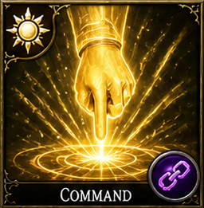</td>
<td style="border: none;">
<table border="0" cellspacing="0" cellpadding="0" style="border: none; border-collapse: collapse;">
<tr><th style="border: none;">Deity</th><th style="border: none;">Level</th><th style="border: none;">Mana</th><th style="border: none;">Damage</th><th style="border: none;">Class</th><th style="border: none;">Tags</th></tr>
<tr><td style="border: none;">Umbraex</td><td style="border: none;">1</td><td style="border: none;">5</td><td style="border: none;">—</td><td style="border: none;">Priest, Paladin</td><td style="border: none;">CC</td></tr>
</table>
</td>
</tr>
</table>

*- Priest, Paladin Damage type: None/Control. Deity Bonus: (Umbraex, Aethelion) Umbraex: -1 DefensePower; Aethelion: +1 round.*

*Minimum Level: Priest 1*

### Cure Light Wounds

<table border="0" cellspacing="0" cellpadding="0" style="border: none; border-collapse: collapse;">
<tr>
<td style="border: none; padding-right: 12px;"></td>
<td style="border: none;">
<table border="0" cellspacing="0" cellpadding="0" style="border: none; border-collapse: collapse;">
<tr><th style="border: none;">Deity</th><th style="border: none;">Level</th><th style="border: none;">Mana</th><th style="border: none;">Damage</th><th style="border: none;">Class</th><th style="border: none;">Tags</th></tr>
<tr><td style="border: none;">Aethelion</td><td style="border: none;">1</td><td style="border: none;">5</td><td style="border: none;">Healing</td><td style="border: none;">Priest, Druid, Paladin</td><td style="border: none;">Healing</td></tr>
</table>
</td>
</tr>
</table>

*A soft green glow radiates from the healer's palms as wounds knit and bruises fade. Restores 1d8+1 hit points to a single target, scaling +1d8+1 per caster level (cap 5d8+5 at level 5). Deity Bonus: (Aethelion, Lunara) Lunara: +1d4 healing on night cycle.*

*Minimum Level: Priest 1*

### Protection from Evil

<table border="0" cellspacing="0" cellpadding="0" style="border: none; border-collapse: collapse;">
<tr>
<td style="border: none; padding-right: 12px;"></td>
<td style="border: none;">
<table border="0" cellspacing="0" cellpadding="0" style="border: none; border-collapse: collapse;">
<tr><th style="border: none;">Deity</th><th style="border: none;">Level</th><th style="border: none;">Mana</th><th style="border: none;">Damage</th><th style="border: none;">Class</th><th style="border: none;">Tags</th></tr>
<tr><td style="border: none;">Aethelion</td><td style="border: none;">1</td><td style="border: none;">5</td><td style="border: none;">—</td><td style="border: none;">Priest, Paladin</td><td style="border: none;">Defensive, Buff</td></tr>
</table>
</td>
</tr>
</table>

*A shimmering golden ward encircles the target, deflecting the attentions of malevolent forces. Provides +2 AC and +2 saving throws against evil creatures. Grants immunity to mental control and possession. Deity Bonus: (Aethelion) +1 round duration and +2 AC.*

*Minimum Level: Priest 1*
### Chasten

<table border="0" cellspacing="0" cellpadding="0" style="border: none; border-collapse: collapse;">
<tr>
<td style="border: none; padding-right: 12px;">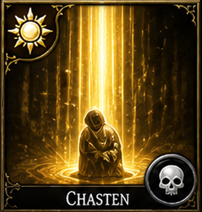</td>
<td style="border: none;">
<table border="0" cellspacing="0" cellpadding="0" style="border: none; border-collapse: collapse;">
<tr><th style="border: none;">Deity</th><th style="border: none;">Level</th><th style="border: none;">Mana</th><th style="border: none;">Damage</th><th style="border: none;">Class</th><th style="border: none;">Tags</th></tr>
<tr><td style="border: none;">Umbraex</td><td style="border: none;">1</td><td style="border: none;">5</td><td style="border: none;">Radiant</td><td style="border: none;">Priest</td><td style="border: none;">Debuff</td></tr>
</table>
</td>
</tr>
</table>

*- Priest Damage type: Radiant. Deity Bonus: (Umbraex) +1d4 shadow damage.*

*Minimum Level: 1*

### Sanctuary

<table border="0" cellspacing="0" cellpadding="0" style="border: none; border-collapse: collapse;">
<tr>
<td style="border: none; padding-right: 12px;">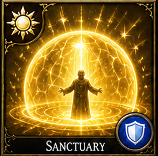</td>
<td style="border: none;">
<table border="0" cellspacing="0" cellpadding="0" style="border: none; border-collapse: collapse;">
<tr><th style="border: none;">Deity</th><th style="border: none;">Level</th><th style="border: none;">Mana</th><th style="border: none;">Damage</th><th style="border: none;">Class</th><th style="border: none;">Tags</th></tr>
<tr><td style="border: none;">Aethelion</td><td style="border: none;">1</td><td style="border: none;">5</td><td style="border: none;">—</td><td style="border: none;">Priest, Paladin</td><td style="border: none;">Defensive</td></tr>
</table>
</td>
</tr>
</table>

*- Priest, Paladin Yes, duration shield-state. Deity Bonus: (Aethelion) +1 round duration.*

*Minimum Level: Priest 1*

### Aid

<table border="0" cellspacing="0" cellpadding="0" style="border: none; border-collapse: collapse;">
<tr>
<td style="border: none; padding-right: 12px;">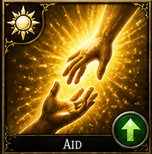</td>
<td style="border: none;">
<table border="0" cellspacing="0" cellpadding="0" style="border: none; border-collapse: collapse;">
<tr><th style="border: none;">Deity</th><th style="border: none;">Level</th><th style="border: none;">Mana</th><th style="border: none;">Damage</th><th style="border: none;">Class</th><th style="border: none;">Tags</th></tr>
<tr><td style="border: none;">Aethelion</td><td style="border: none;">2</td><td style="border: none;">8</td><td style="border: none;">—</td><td style="border: none;">Priest, Paladin</td><td style="border: none;">Buff</td></tr>
</table>
</td>
</tr>
</table>

*- Priest, Paladin Yes, duration support buff. Deity Bonus: (Aethelion) +5 temporary HP.*

*Minimum Level: Priest 3*

### Chant

<table border="0" cellspacing="0" cellpadding="0" style="border: none; border-collapse: collapse;">
<tr>
<td style="border: none; padding-right: 12px;">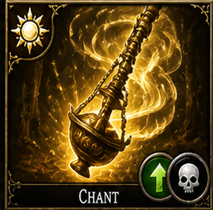</td>
<td style="border: none;">
<table border="0" cellspacing="0" cellpadding="0" style="border: none; border-collapse: collapse;">
<tr><th style="border: none;">Deity</th><th style="border: none;">Level</th><th style="border: none;">Mana</th><th style="border: none;">Damage</th><th style="border: none;">Class</th><th style="border: none;">Tags</th></tr>
<tr><td style="border: none;">Astrara</td><td style="border: none;">2</td><td style="border: none;">8</td><td style="border: none;">—</td><td style="border: none;">Priest</td><td style="border: none;">Buff, Debuff</td></tr>
</table>
</td>
</tr>
</table>

*- Priest Yes, duration aura. Deity Bonus: (Astrara) +1 round duration; +1 AttackPower for allies.*

*Minimum Level: Priest 3*

### Hold Person

<table border="0" cellspacing="0" cellpadding="0" style="border: none; border-collapse: collapse;">
<tr>
<td style="border: none; padding-right: 12px;"></td>
<td style="border: none;">
<table border="0" cellspacing="0" cellpadding="0" style="border: none; border-collapse: collapse;">
<tr><th style="border: none;">Deity</th><th style="border: none;">Level</th><th style="border: none;">Mana</th><th style="border: none;">Damage</th><th style="border: none;">Class</th><th style="border: none;">Tags</th></tr>
<tr><td style="border: none;">Umbraex</td><td style="border: none;">2/3</td><td style="border: none;">8</td><td style="border: none;">—</td><td style="border: none;">Priest</td><td style="border: none;">CC</td></tr>
</table>
</td>
</tr>
</table>

*Golden bands of divine light wrap around the target, locking their limbs in place. Paralyzes a humanoid target completely — no movement, no actions, no defense. Save each round to break free. Deity Bonus: (Umbraex, Veparix) Veparix: +5% hold chance.*

*Minimum Level: Priest 4*

### Prayer

<table border="0" cellspacing="0" cellpadding="0" style="border: none; border-collapse: collapse;">
<tr>
<td style="border: none; padding-right: 12px;">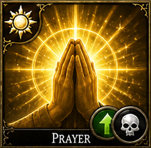</td>
<td style="border: none;">
<table border="0" cellspacing="0" cellpadding="0" style="border: none; border-collapse: collapse;">
<tr><th style="border: none;">Deity</th><th style="border: none;">Level</th><th style="border: none;">Mana</th><th style="border: none;">Damage</th><th style="border: none;">Class</th><th style="border: none;">Tags</th></tr>
<tr><td style="border: none;">Astrara</td><td style="border: none;">3</td><td style="border: none;">12</td><td style="border: none;">—</td><td style="border: none;">Priest</td><td style="border: none;">Buff, Debuff</td></tr>
</table>
</td>
</tr>
</table>

*- Priest Yes, duration field effect. Deity Bonus: (Chronara, Astrara) Astrara: +1 AttackPower for allies.*

*Minimum Level: Priest 5*

### Remove Paralysis

<table border="0" cellspacing="0" cellpadding="0" style="border: none; border-collapse: collapse;">
<tr>
<td style="border: none; padding-right: 12px;">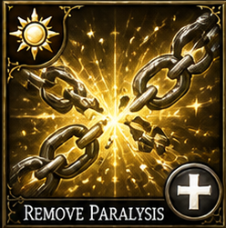</td>
<td style="border: none;">
<table border="0" cellspacing="0" cellpadding="0" style="border: none; border-collapse: collapse;">
<tr><th style="border: none;">Deity</th><th style="border: none;">Level</th><th style="border: none;">Mana</th><th style="border: none;">Damage</th><th style="border: none;">Class</th><th style="border: none;">Tags</th></tr>
<tr><td style="border: none;">Aethelion</td><td style="border: none;">3</td><td style="border: none;">12</td><td style="border: none;">Cleanse</td><td style="border: none;">Priest, Paladin</td><td style="border: none;">Healing, Cleanse</td></tr>
</table>
</td>
</tr>
</table>

*- Priest, Paladin Damage type: Cleanse. Deity Bonus: (Celestara) Also heals 1d4 HP.*

*Minimum Level: Priest 5*

### Cure Serious Wounds

<table border="0" cellspacing="0" cellpadding="0" style="border: none; border-collapse: collapse;">
<tr>
<td style="border: none; padding-right: 12px;">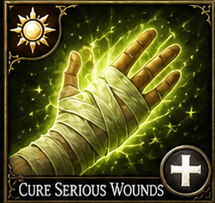</td>
<td style="border: none;">
<table border="0" cellspacing="0" cellpadding="0" style="border: none; border-collapse: collapse;">
<tr><th style="border: none;">Deity</th><th style="border: none;">Level</th><th style="border: none;">Mana</th><th style="border: none;">Damage</th><th style="border: none;">Class</th><th style="border: none;">Tags</th></tr>
<tr><td style="border: none;">Aethelion</td><td style="border: none;">4</td><td style="border: none;">15</td><td style="border: none;">Healing</td><td style="border: none;">Priest, Druid, Paladin</td><td style="border: none;">Healing</td></tr>
</table>
</td>
</tr>
</table>

*- Priest, Druid, Paladin Damage type: Healing. Deity Bonus: (Aethelion) +25% healing.*

*Minimum Level: Priest 6*

### Free Action

<table border="0" cellspacing="0" cellpadding="0" style="border: none; border-collapse: collapse;">
<tr>
<td style="border: none; padding-right: 12px;">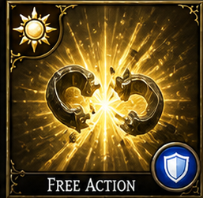</td>
<td style="border: none;">
<table border="0" cellspacing="0" cellpadding="0" style="border: none; border-collapse: collapse;">
<tr><th style="border: none;">Deity</th><th style="border: none;">Level</th><th style="border: none;">Mana</th><th style="border: none;">Damage</th><th style="border: none;">Class</th><th style="border: none;">Tags</th></tr>
<tr><td style="border: none;">Astrara</td><td style="border: none;">4</td><td style="border: none;">15</td><td style="border: none;">—</td><td style="border: none;">Priest, Paladin</td><td style="border: none;">Defensive</td></tr>
</table>
</td>
</tr>
</table>

*- Priest, Paladin Yes, duration buff. Deity Bonus: (Astrara) +1 round duration; +1 AttackPower for target.*

*Minimum Level: Priest 6*

### Cure Critical Wounds

<table border="0" cellspacing="0" cellpadding="0" style="border: none; border-collapse: collapse;">
<tr>
<td style="border: none; padding-right: 12px;">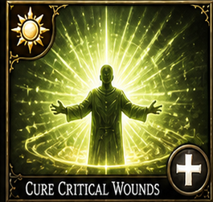</td>
<td style="border: none;">
<table border="0" cellspacing="0" cellpadding="0" style="border: none; border-collapse: collapse;">
<tr><th style="border: none;">Deity</th><th style="border: none;">Level</th><th style="border: none;">Mana</th><th style="border: none;">Damage</th><th style="border: none;">Class</th><th style="border: none;">Tags</th></tr>
<tr><td style="border: none;">Aethelion</td><td style="border: none;">5</td><td style="border: none;">20</td><td style="border: none;">Healing</td><td style="border: none;">Priest, Druid, Paladin</td><td style="border: none;">Healing</td></tr>
</table>
</td>
</tr>
</table>

*- Priest, Druid, Paladin Damage type: Healing. Deity Bonus: (Aethelion) +25% healing.*

*Minimum Level: Priest 7*

### Flame Strike

<table border="0" cellspacing="0" cellpadding="0" style="border: none; border-collapse: collapse;">
<tr>
<td style="border: none; padding-right: 12px;"></td>
<td style="border: none;">
<table border="0" cellspacing="0" cellpadding="0" style="border: none; border-collapse: collapse;">
<tr><th style="border: none;">Deity</th><th style="border: none;">Level</th><th style="border: none;">Mana</th><th style="border: none;">Damage</th><th style="border: none;">Class</th><th style="border: none;">Tags</th></tr>
<tr><td style="border: none;">Ignara</td><td style="border: none;">5</td><td style="border: none;">20</td><td style="border: none;">Fire/Radiant</td><td style="border: none;">Priest</td><td style="border: none;">Offensive, Nuke</td></tr>
</table>
</td>
</tr>
</table>

*A pillar of divine fire descends from the heavens. A vertical column dealing 1d6 fire + 1d6 radiant damage per caster level (cap 15d6+15d6). Undead take double damage. Base 6d6+6d6 at level 6, scaling +1d6/+1d6 per level. Deity Bonus: (Ignara) +1d6 fire damage; 10% chance to ignite.*

*Minimum Level: Priest 7*

### Heal

<table border="0" cellspacing="0" cellpadding="0" style="border: none; border-collapse: collapse;">
<tr>
<td style="border: none; padding-right: 12px;"></td>
<td style="border: none;">
<table border="0" cellspacing="0" cellpadding="0" style="border: none; border-collapse: collapse;">
<tr><th style="border: none;">Deity</th><th style="border: none;">Level</th><th style="border: none;">Mana</th><th style="border: none;">Damage</th><th style="border: none;">Class</th><th style="border: none;">Tags</th></tr>
<tr><td style="border: none;">Aethelion</td><td style="border: none;">6</td><td style="border: none;">25</td><td style="border: none;">Healing</td><td style="border: none;">Priest</td><td style="border: none;">Healing</td></tr>
</table>
</td>
</tr>
</table>

*The most powerful restorative miracle in the divine arsenal. Instantly restores the target to full health and cures blindness, deafness, paralysis, disease, and poison. Deity Bonus: (Aethelion, Lunara) Lunara adds mana restoration.*

*Minimum Level: Priest 8*

### Mass Heal

<table border="0" cellspacing="0" cellpadding="0" style="border: none; border-collapse: collapse;">
<tr>
<td style="border: none; padding-right: 12px;"></td>
<td style="border: none;">
<table border="0" cellspacing="0" cellpadding="0" style="border: none; border-collapse: collapse;">
<tr><th style="border: none;">Deity</th><th style="border: none;">Level</th><th style="border: none;">Mana</th><th style="border: none;">Damage</th><th style="border: none;">Class</th><th style="border: none;">Tags</th></tr>
<tr><td style="border: none;">Aethelion</td><td style="border: none;">4</td><td style="border: none;">50</td><td style="border: none;">3D6+6 Healing</td><td style="border: none;">Priest</td><td style="border: none;">Healing, AoE</td></tr>
</table>
</td>
</tr>
</table>

*Channels a wave of divine energy across the battlefield, restoring HP to all allies simultaneously. A cornerstone group heal for late-tier priests when the party needs wide recovery.*

*Minimum Level: Priest 7*

### Blade Barrier

<table border="0" cellspacing="0" cellpadding="0" style="border: none; border-collapse: collapse;">
<tr>
<td style="border: none; padding-right: 12px;"></td>
<td style="border: none;">
<table border="0" cellspacing="0" cellpadding="0" style="border: none; border-collapse: collapse;">
<tr><th style="border: none;">Deity</th><th style="border: none;">Level</th><th style="border: none;">Mana</th><th style="border: none;">Damage</th><th style="border: none;">Class</th><th style="border: none;">Tags</th></tr>
<tr><td style="border: none;">Celestara</td><td style="border: none;">6</td><td style="border: none;">25</td><td style="border: none;">Physical/Magical</td><td style="border: none;">Priest</td><td style="border: none;">Offensive, Defensive, Barrier</td></tr>
</table>
</td>
</tr>
</table>

*A ring of spinning silver blades materializes, orbiting in a deadly dance. An immobile 20-foot ring dealing 1d6 slashing per caster level (cap 15d6) to any creature passing through. Lasts 1 round per level. Deity Bonus: (Celestara) +1 round duration.*

*Minimum Level: Priest 8*

### Heroes Feast

<table border="0" cellspacing="0" cellpadding="0" style="border: none; border-collapse: collapse;">
<tr>
<td style="border: none; padding-right: 12px;">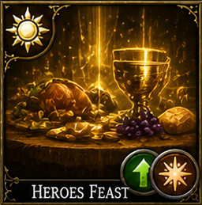</td>
<td style="border: none;">
<table border="0" cellspacing="0" cellpadding="0" style="border: none; border-collapse: collapse;">
<tr><th style="border: none;">Deity</th><th style="border: none;">Level</th><th style="border: none;">Mana</th><th style="border: none;">Damage</th><th style="border: none;">Class</th><th style="border: none;">Tags</th></tr>
<tr><td style="border: none;">Aethelion</td><td style="border: none;">6</td><td style="border: none;">25</td><td style="border: none;">Buff</td><td style="border: none;">Priest</td><td style="border: none;">Buff, AoE</td></tr>
</table>
</td>
</tr>
</table>

*- Priest Damage type: Buff. Yes, prebuff duration benefits. Deity Bonus: (Aethelion, Lunara) Lunara adds mana restoration on full moon.*

*Minimum Level: Priest 8*

### Restoration

<table border="0" cellspacing="0" cellpadding="0" style="border: none; border-collapse: collapse;">
<tr>
<td style="border: none; padding-right: 12px;">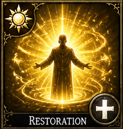</td>
<td style="border: none;">
<table border="0" cellspacing="0" cellpadding="0" style="border: none; border-collapse: collapse;">
<tr><th style="border: none;">Deity</th><th style="border: none;">Level</th><th style="border: none;">Mana</th><th style="border: none;">Damage</th><th style="border: none;">Class</th><th style="border: none;">Tags</th></tr>
<tr><td style="border: none;">Aethelion</td><td style="border: none;">7</td><td style="border: none;">30</td><td style="border: none;">Healing</td><td style="border: none;">Priest</td><td style="border: none;">Healing, Cleanse</td></tr>
</table>
</td>
</tr>
</table>

*- Priest Damage type: Healing. Deity Bonus: (Aethelion) Cures one additional random condition.*

*Minimum Level: Priest 9*

### Spiritual Weapon

<table border="0" cellspacing="0" cellpadding="0" style="border: none; border-collapse: collapse;">
<tr>
<td style="border: none; padding-right: 12px;"></td>
<td style="border: none;">
<table border="0" cellspacing="0" cellpadding="0" style="border: none; border-collapse: collapse;">
<tr><th style="border: none;">Deity</th><th style="border: none;">Level</th><th style="border: none;">Mana</th><th style="border: none;">Damage</th><th style="border: none;">Class</th><th style="border: none;">Tags</th></tr>
<tr><td style="border: none;">Aethelion</td><td style="border: none;">2</td><td style="border: none;">20</td><td style="border: none;">Holy</td><td style="border: none;">Priest</td><td style="border: none;">Summoning, Offensive</td></tr>
</table>
</td>
</tr>
</table>

*A glowing divine weapon — shaped like a longsword, hammer, or whatever form the deity favors — materializes beside the priest and begins attacking. Each round, the Spiritual Weapon attacks once independently, dealing 1D6+2 Holy damage. It lasts 3 rounds, occupies no action to maintain, and cannot be targeted by normal attacks but is dismissed by Dispel Magic.*

*Minimum Level: Priest 3*

### Raise Dead

<table border="0" cellspacing="0" cellpadding="0" style="border: none; border-collapse: collapse;">
<tr>
<td style="border: none; padding-right: 12px;"></td>
<td style="border: none;">
<table border="0" cellspacing="0" cellpadding="0" style="border: none; border-collapse: collapse;">
<tr><th style="border: none;">Deity</th><th style="border: none;">Level</th><th style="border: none;">Mana</th><th style="border: none;">Damage</th><th style="border: none;">Class</th><th style="border: none;">Tags</th></tr>
<tr><td style="border: none;">Aethelion</td><td style="border: none;">5</td><td style="border: none;">60</td><td style="border: none;">—</td><td style="border: none;">Priest</td><td style="border: none;">Healing, Revive</td></tr>
</table>
</td>
</tr>
</table>

*The priest calls the spirit back from wherever it has gone — a supreme act of faith that costs dearly in mana and focus. Restores a KnockedOut or Dead ally to 1D8+4 HP. The revived ally acts at the bottom of the turn order that round with one fewer action. Cannot revive a creature destroyed by disintegration or similar total-annihilation effects.*

*Minimum Level: Priest 9*

## Druid spellbook

Druids begin with natural control and utility, then scale into storms, swarms, primal damage, and guardian summoning. Their battlefield identity should feel environmental and living rather than doctrinal or purely holy.

| Spell | Deity | Spell Level | Access Layer | Access Tier | Minimum Level | Effect | Impact | Class | Damage Type | Tags |
|---|---|---|---|---|---|---|---|---|---|---|
| [Entangle](#entangle) | Chronara | 1 | Class Core | Early | Druid 1 | Plants twist around creatures in the area and restrain them. | Movement reduction or full root; TM loss in variant implementations. | Druid, Priest | None/Control | CC, Root |
| [Faerie Fire](#faerie-fire) | Veparix | 1 | Class Core | Early | Druid 1 | Outlines targets, countering stealth and concealment. | Reduced evasiveness and easier targeting; lowers effective defensive concealment. | Druid, Priest | None/Reveal | Debuff |
| [Shillelagh](#shillelagh) | Chronara | 1 | Class Core | Early | Druid 1 | Enchants a club or staff to hit harder. | Raises weapon HP damage output. | Druid | Physical/Magical | Buff |
| [Barkskin](#barkskin) | Celestara | 2 | Class Core | Early | Druid 3 | Skin becomes as tough as bark, improving base Armor Class. | Armor Class increase and slight defensive resilience increase. | Druid, Priest | None | Defensive |
| [Goodberry](#goodberry) | Lunara | 2 | Class Core | Early | Druid 3 | Creates restorative berries. | HP restoration and sustain support. | Druid, Priest | Healing | Healing |
| [Heat Metal](#heat-metal) | Ignara | 2 | Class Core | Early | Druid 3 | Punishes armored enemies through escalating heat. | HP damage over time, pain pressure, and possible Movement disruption. | Druid, Priest | Fire | Debuff |
| [Call Lightning](#call-lightning) | Chronara | 3 | Class Core | Mid | Druid 5 | Repeated lightning strikes called from a storm. | HP damage; ideal for variants with Electrocute, TM loss, or anti-metal bonus damage. | Druid, Priest | Lightning | Offensive |
| [Hold Animal](#hold-animal) | Chronara | 3 | Class Core | Mid | Druid 5 | Immobilizes beasts. | TM freeze and Movement set to zero. | Druid, Priest | None/Control | CC |
| [Call Woodland Beings](#call-woodland-beings) | Chronara | 4 | School Specialization | Mid | Druid 6 | Brings nature spirits or woodland allies. | HP pressure, support utility, or CC depending on ally type. | Druid | Variable | Summoning |
| [Giant Insect](#giant-insect) | Chronara | 4 | School Specialization | Mid | Druid 6 | Enlarges vermin into combat-capable forms. | HP pressure and Movement denial through large bodies. | Druid, Priest | Physical | Summoning-lite |
| [Insect Plague](#insect-plague) | Umbraex | 5 | School Specialization | Late | Druid 7 | Swarming insects disrupt and overwhelm groups. | HP chip damage, Movement hindrance, and TM pressure through disruption. | Druid, Priest | Physical/Poison-theme | Offensive, CC |
| [Anti-Plant Shell](#anti-plant-shell) | Chronara | 5 | School Specialization | Late | Druid 7 | Prevents plant creatures from closing in. | Personal safety zone and Movement denial against plant attackers. | Druid, Priest | None | Defensive |
| [Fire Seeds](#fire-seeds) | Ignara | 6 | School Specialization | Late | Druid 8 | Druid explosive seeds used as bombs or traps. | HP damage and trap-style zone denial. | Druid | Fire | Offensive |
| [Liveoak](#liveoak) | Chronara | 6 | School Specialization | Late | Druid 8 | Awakens or empowers a great tree guardian. | HP pressure, tank presence, and Movement blocking. | Druid | Physical | Summoning |
| [Creeping Doom](#creeping-doom) | Umbraex | 7 | School Specialization | Late | Druid 9 | Devastating moving swarm that overwhelms enemies. | HP damage over time plus Movement denial by panic and pursuit pressure. | Druid | Physical | Offensive, CC |
| [Earthquake](#earthquake) | Chronara | 7 | School Specialization | Late | Druid 9 | Wide-area terrain disruption and collapse threat. | HP damage, Movement disruption, and TM loss from knockdown or instability in variants. | Druid, Priest | Physical | Offensive, AoE |
| [Turn Undead](#turn-undead) | Aethelion | 2 | Class Core | Early | Priest 3, Paladin 4, Knight 6 | Drives undead enemies away in fear. | Undead must resist or flee; holy damage to undead. | Priest, Paladin, Knight | Holy | Offensive, CC |
| [Spike Growth](#spike-growth) | Chronara | 2 | Class Core | Early | Druid 3 | Covers ground in sharp spikes that punish anyone moving through. | HP damage-on-movement zone; terrain denial and kiting tool. | Druid, Priest | Physical | Terrain, DoT, AoE |
| [Wall of Thorns](#wall-of-thorns) | Chronara | 5 | School Specialization | Late | Druid 7 | Creates a barrier of thorns blocking movement and dealing damage on contact. | Movement denial and HP damage to any creature that attempts to cross. | Druid | Physical | Terrain, Barrier, AoE |

### Entangle

<table border="0" cellspacing="0" cellpadding="0" style="border: none; border-collapse: collapse;">
<tr>
<td style="border: none; padding-right: 12px;"></td>
<td style="border: none;">
<table border="0" cellspacing="0" cellpadding="0" style="border: none; border-collapse: collapse;">
<tr><th style="border: none;">Deity</th><th style="border: none;">Level</th><th style="border: none;">Mana</th><th style="border: none;">Damage</th><th style="border: none;">Class</th><th style="border: none;">Tags</th></tr>
<tr><td style="border: none;">Chronara</td><td style="border: none;">1</td><td style="border: none;">5</td><td style="border: none;">—</td><td style="border: none;">Druid, Priest</td><td style="border: none;">CC, Root</td></tr>
</table>
</td>
</tr>
</table>

*The ground erupts with grasping vines and thick roots that snake around the legs of the unwary. Plants and roots grapple all creatures in a 40-foot radius — movement reduced to 0. Deity Bonus: (Chronara, Veparix) Veparix: +5% entanglement chance.*

*Minimum Level: Druid 1*

### Faerie Fire

<table border="0" cellspacing="0" cellpadding="0" style="border: none; border-collapse: collapse;">
<tr>
<td style="border: none; padding-right: 12px;">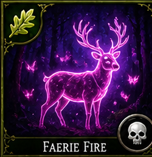</td>
<td style="border: none;">
<table border="0" cellspacing="0" cellpadding="0" style="border: none; border-collapse: collapse;">
<tr><th style="border: none;">Deity</th><th style="border: none;">Level</th><th style="border: none;">Mana</th><th style="border: none;">Damage</th><th style="border: none;">Class</th><th style="border: none;">Tags</th></tr>
<tr><td style="border: none;">Veparix</td><td style="border: none;">1</td><td style="border: none;">5</td><td style="border: none;">—</td><td style="border: none;">Druid, Priest</td><td style="border: none;">Debuff</td></tr>
</table>
</td>
</tr>
</table>

*- Druid, Priest Damage type: None/Reveal. Yes, duration reveal. Deity Bonus: (Veparix) +1 round reveal; -2 DefensePower on revealed target.*

*Minimum Level: Druid 1*

### Shillelagh

<table border="0" cellspacing="0" cellpadding="0" style="border: none; border-collapse: collapse;">
<tr>
<td style="border: none; padding-right: 12px;">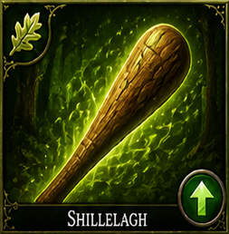</td>
<td style="border: none;">
<table border="0" cellspacing="0" cellpadding="0" style="border: none; border-collapse: collapse;">
<tr><th style="border: none;">Deity</th><th style="border: none;">Level</th><th style="border: none;">Mana</th><th style="border: none;">Damage</th><th style="border: none;">Class</th><th style="border: none;">Tags</th></tr>
<tr><td style="border: none;">Chronara</td><td style="border: none;">1</td><td style="border: none;">5</td><td style="border: none;">Physical/Magical</td><td style="border: none;">Druid</td><td style="border: none;">Buff</td></tr>
</table>
</td>
</tr>
</table>

*- Druid Damage type: Physical/Magical. Deity Bonus: (Chronara) +1d4 nature damage.*

*Minimum Level: Druid 1*

### Barkskin

<table border="0" cellspacing="0" cellpadding="0" style="border: none; border-collapse: collapse;">
<tr>
<td style="border: none; padding-right: 12px;">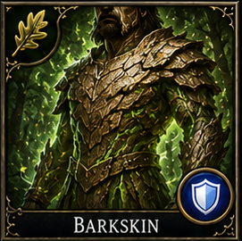</td>
<td style="border: none;">
<table border="0" cellspacing="0" cellpadding="0" style="border: none; border-collapse: collapse;">
<tr><th style="border: none;">Deity</th><th style="border: none;">Level</th><th style="border: none;">Mana</th><th style="border: none;">Damage</th><th style="border: none;">Class</th><th style="border: none;">Tags</th></tr>
<tr><td style="border: none;">Celestara</td><td style="border: none;">2</td><td style="border: none;">8</td><td style="border: none;">—</td><td style="border: none;">Druid, Priest</td><td style="border: none;">Defensive</td></tr>
</table>
</td>
</tr>
</table>

*- Druid, Priest Yes, duration-based defensive skin. Deity Bonus: (Celestara) +1 additional AC.*

*Minimum Level: Druid 3*

### Goodberry

<table border="0" cellspacing="0" cellpadding="0" style="border: none; border-collapse: collapse;">
<tr>
<td style="border: none; padding-right: 12px;">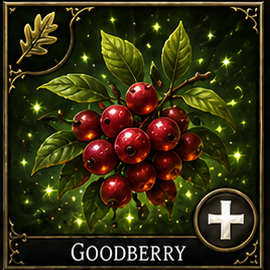</td>
<td style="border: none;">
<table border="0" cellspacing="0" cellpadding="0" style="border: none; border-collapse: collapse;">
<tr><th style="border: none;">Deity</th><th style="border: none;">Level</th><th style="border: none;">Mana</th><th style="border: none;">Damage</th><th style="border: none;">Class</th><th style="border: none;">Tags</th></tr>
<tr><td style="border: none;">Lunara</td><td style="border: none;">2</td><td style="border: none;">8</td><td style="border: none;">Healing</td><td style="border: none;">Druid, Priest</td><td style="border: none;">Healing</td></tr>
</table>
</td>
</tr>
</table>

*- Druid, Priest Damage type: Healing. Deity Bonus: (Lunara) +1 berry created; restores 1 mana per berry.*

*Minimum Level: Druid 3*

### Heat Metal

<table border="0" cellspacing="0" cellpadding="0" style="border: none; border-collapse: collapse;">
<tr>
<td style="border: none; padding-right: 12px;">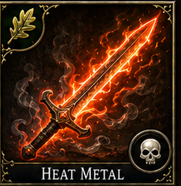</td>
<td style="border: none;">
<table border="0" cellspacing="0" cellpadding="0" style="border: none; border-collapse: collapse;">
<tr><th style="border: none;">Deity</th><th style="border: none;">Level</th><th style="border: none;">Mana</th><th style="border: none;">Damage</th><th style="border: none;">Class</th><th style="border: none;">Tags</th></tr>
<tr><td style="border: none;">Ignara</td><td style="border: none;">2</td><td style="border: none;">8</td><td style="border: none;">Fire</td><td style="border: none;">Druid, Priest</td><td style="border: none;">Debuff</td></tr>
</table>
</td>
</tr>
</table>

*- Druid, Priest Damage type: Fire. Yes, continuing heat damage or pressure. Deity Bonus: (Ignara) +1d6 fire damage; ignites target on critical.*

*Minimum Level: Druid 3*

### Call Lightning

<table border="0" cellspacing="0" cellpadding="0" style="border: none; border-collapse: collapse;">
<tr>
<td style="border: none; padding-right: 12px;"></td>
<td style="border: none;">
<table border="0" cellspacing="0" cellpadding="0" style="border: none; border-collapse: collapse;">
<tr><th style="border: none;">Deity</th><th style="border: none;">Level</th><th style="border: none;">Mana</th><th style="border: none;">Damage</th><th style="border: none;">Class</th><th style="border: none;">Tags</th></tr>
<tr><td style="border: none;">Chronara</td><td style="border: none;">3</td><td style="border: none;">12</td><td style="border: none;">Lightning</td><td style="border: none;">Druid, Priest</td><td style="border: none;">Offensive</td></tr>
</table>
</td>
</tr>
</table>

*The druid raises a hand to the sky, summoning a storm bolt from the heavens. A 5-foot wide lightning bolt strikes from above for 1d6 per caster level (cap 10d6). Can be called each round while the storm lasts. Deity Bonus: (Chronara) +1d6 lightning damage.*

*Minimum Level: Druid 5*

### Hold Animal

<table border="0" cellspacing="0" cellpadding="0" style="border: none; border-collapse: collapse;">
<tr>
<td style="border: none; padding-right: 12px;">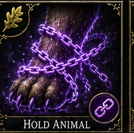</td>
<td style="border: none;">
<table border="0" cellspacing="0" cellpadding="0" style="border: none; border-collapse: collapse;">
<tr><th style="border: none;">Deity</th><th style="border: none;">Level</th><th style="border: none;">Mana</th><th style="border: none;">Damage</th><th style="border: none;">Class</th><th style="border: none;">Tags</th></tr>
<tr><td style="border: none;">Chronara</td><td style="border: none;">3</td><td style="border: none;">12</td><td style="border: none;">—</td><td style="border: none;">Druid, Priest</td><td style="border: none;">CC</td></tr>
</table>
</td>
</tr>
</table>

*- Druid, Priest Damage type: None/Control. Yes, duration root/paralysis. Deity Bonus: (Chronara) +5% hold chance.*

*Minimum Level: Druid 5*

### Call Woodland Beings

<table border="0" cellspacing="0" cellpadding="0" style="border: none; border-collapse: collapse;">
<tr>
<td style="border: none; padding-right: 12px;">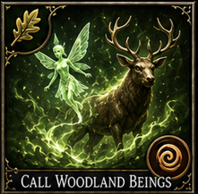</td>
<td style="border: none;">
<table border="0" cellspacing="0" cellpadding="0" style="border: none; border-collapse: collapse;">
<tr><th style="border: none;">Deity</th><th style="border: none;">Level</th><th style="border: none;">Mana</th><th style="border: none;">Damage</th><th style="border: none;">Class</th><th style="border: none;">Tags</th></tr>
<tr><td style="border: none;">Chronara</td><td style="border: none;">4</td><td style="border: none;">15</td><td style="border: none;">Variable</td><td style="border: none;">Druid</td><td style="border: none;">Summoning</td></tr>
</table>
</td>
</tr>
</table>

*- Druid Damage type: Variable. Yes, summoned allies persist for duration. Deity Bonus: (Chronara) Summoned ally has +10% HP.*

*Minimum Level: Druid 6*

### Giant Insect

<table border="0" cellspacing="0" cellpadding="0" style="border: none; border-collapse: collapse;">
<tr>
<td style="border: none; padding-right: 12px;">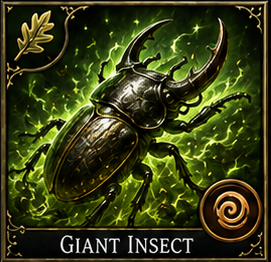</td>
<td style="border: none;">
<table border="0" cellspacing="0" cellpadding="0" style="border: none; border-collapse: collapse;">
<tr><th style="border: none;">Deity</th><th style="border: none;">Level</th><th style="border: none;">Mana</th><th style="border: none;">Damage</th><th style="border: none;">Class</th><th style="border: none;">Tags</th></tr>
<tr><td style="border: none;">Chronara</td><td style="border: none;">4</td><td style="border: none;">15</td><td style="border: none;">Physical</td><td style="border: none;">Druid, Priest</td><td style="border: none;">Summoning-lite</td></tr>
</table>
</td>
</tr>
</table>

*- Druid, Priest Damage type: Physical. Yes, transformed creatures persist for duration. Deity Bonus: (Chronara, Veparix) Veparix: +5% poison chance.*

*Minimum Level: Druid 6*

### Insect Plague

<table border="0" cellspacing="0" cellpadding="0" style="border: none; border-collapse: collapse;">
<tr>
<td style="border: none; padding-right: 12px;">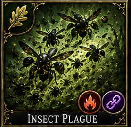</td>
<td style="border: none;">
<table border="0" cellspacing="0" cellpadding="0" style="border: none; border-collapse: collapse;">
<tr><th style="border: none;">Deity</th><th style="border: none;">Level</th><th style="border: none;">Mana</th><th style="border: none;">Damage</th><th style="border: none;">Class</th><th style="border: none;">Tags</th></tr>
<tr><td style="border: none;">Umbraex</td><td style="border: none;">5</td><td style="border: none;">20</td><td style="border: none;">Physical/Poison-theme</td><td style="border: none;">Druid, Priest</td><td style="border: none;">Offensive, CC</td></tr>
</table>
</td>
</tr>
</table>

*- Druid, Priest Damage type: Physical/Poison-theme. Yes, persistent swarm presence. Deity Bonus: (Umbraex) +1 round duration; +1d4 poison.*

*Minimum Level: Druid 7*

### Anti-Plant Shell

<table border="0" cellspacing="0" cellpadding="0" style="border: none; border-collapse: collapse;">
<tr>
<td style="border: none; padding-right: 12px;">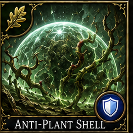</td>
<td style="border: none;">
<table border="0" cellspacing="0" cellpadding="0" style="border: none; border-collapse: collapse;">
<tr><th style="border: none;">Deity</th><th style="border: none;">Level</th><th style="border: none;">Mana</th><th style="border: none;">Damage</th><th style="border: none;">Class</th><th style="border: none;">Tags</th></tr>
<tr><td style="border: none;">Chronara</td><td style="border: none;">5</td><td style="border: none;">20</td><td style="border: none;">—</td><td style="border: none;">Druid, Priest</td><td style="border: none;">Defensive</td></tr>
</table>
</td>
</tr>
</table>

*- Druid, Priest Yes, persistent shell. Deity Bonus: (Chronara) +1 round duration.*

*Minimum Level: Druid 7*

### Fire Seeds

<table border="0" cellspacing="0" cellpadding="0" style="border: none; border-collapse: collapse;">
<tr>
<td style="border: none; padding-right: 12px;">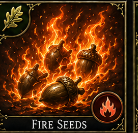</td>
<td style="border: none;">
<table border="0" cellspacing="0" cellpadding="0" style="border: none; border-collapse: collapse;">
<tr><th style="border: none;">Deity</th><th style="border: none;">Level</th><th style="border: none;">Mana</th><th style="border: none;">Damage</th><th style="border: none;">Class</th><th style="border: none;">Tags</th></tr>
<tr><td style="border: none;">Ignara</td><td style="border: none;">6</td><td style="border: none;">25</td><td style="border: none;">Fire</td><td style="border: none;">Druid</td><td style="border: none;">Offensive</td></tr>
</table>
</td>
</tr>
</table>

*- Druid Damage type: Fire. Sometimes, depending on trap-style implementation. Deity Bonus: (Ignara) +1d6 fire damage per seed.*

*Minimum Level: Druid 8*

### Liveoak

<table border="0" cellspacing="0" cellpadding="0" style="border: none; border-collapse: collapse;">
<tr>
<td style="border: none; padding-right: 12px;">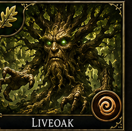</td>
<td style="border: none;">
<table border="0" cellspacing="0" cellpadding="0" style="border: none; border-collapse: collapse;">
<tr><th style="border: none;">Deity</th><th style="border: none;">Level</th><th style="border: none;">Mana</th><th style="border: none;">Damage</th><th style="border: none;">Class</th><th style="border: none;">Tags</th></tr>
<tr><td style="border: none;">Chronara</td><td style="border: none;">6</td><td style="border: none;">25</td><td style="border: none;">Physical</td><td style="border: none;">Druid</td><td style="border: none;">Summoning</td></tr>
</table>
</td>
</tr>
</table>

*- Druid Damage type: Physical. Yes, awakened guardian persists. Deity Bonus: (Chronara) Guardian has +10% HP and +1 AC.*

*Minimum Level: Druid 8*

### Creeping Doom

<table border="0" cellspacing="0" cellpadding="0" style="border: none; border-collapse: collapse;">
<tr>
<td style="border: none; padding-right: 12px;">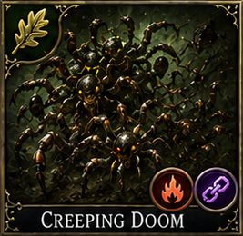</td>
<td style="border: none;">
<table border="0" cellspacing="0" cellpadding="0" style="border: none; border-collapse: collapse;">
<tr><th style="border: none;">Deity</th><th style="border: none;">Level</th><th style="border: none;">Mana</th><th style="border: none;">Damage</th><th style="border: none;">Class</th><th style="border: none;">Tags</th></tr>
<tr><td style="border: none;">Umbraex</td><td style="border: none;">7</td><td style="border: none;">30</td><td style="border: none;">Physical</td><td style="border: none;">Druid</td><td style="border: none;">Offensive, CC</td></tr>
</table>
</td>
</tr>
</table>

*- Druid Damage type: Physical. Yes, persistent swarm pressure. Deity Bonus: (Umbraex) +1 round duration; +1d4 poison.*

*Minimum Level: Druid 9*

### Earthquake

<table border="0" cellspacing="0" cellpadding="0" style="border: none; border-collapse: collapse;">
<tr>
<td style="border: none; padding-right: 12px;"></td>
<td style="border: none;">
<table border="0" cellspacing="0" cellpadding="0" style="border: none; border-collapse: collapse;">
<tr><th style="border: none;">Deity</th><th style="border: none;">Level</th><th style="border: none;">Mana</th><th style="border: none;">Damage</th><th style="border: none;">Class</th><th style="border: none;">Tags</th></tr>
<tr><td style="border: none;">Chronara</td><td style="border: none;">7</td><td style="border: none;">30</td><td style="border: none;">Physical</td><td style="border: none;">Druid, Priest</td><td style="border: none;">Offensive, AoE</td></tr>
</table>
</td>
</tr>
</table>

*- Druid, Priest Damage type: Physical. Yes, persistent terrain disruption during effect. Deity Bonus: (Chronara, Ignara) Ignara: +1d6 fire damage on cracked ground.*

*Minimum Level: Druid 9*

### Turn Undead

<table border="0" cellspacing="0" cellpadding="0" style="border: none; border-collapse: collapse;">
<tr>
<td style="border: none; padding-right: 12px;"></td>
<td style="border: none;">
<table border="0" cellspacing="0" cellpadding="0" style="border: none; border-collapse: collapse;">
<tr><th style="border: none;">Deity</th><th style="border: none;">Level</th><th style="border: none;">Mana</th><th style="border: none;">Damage</th><th style="border: none;">Class</th><th style="border: none;">Tags</th></tr>
<tr><td style="border: none;">Aethelion</td><td style="border: none;">2</td><td style="border: none;">8</td><td style="border: none;">Holy</td><td style="border: none;">Priest, Paladin, Knight</td><td style="border: none;">Offensive, CC</td></tr>
</table>
</td>
</tr>
</table>

*- Priest, Paladin, Knight Damage type: Holy. Yes, Fear (2 turns). Deity Bonus: (Aethelion) Turn Undead deals +1d4 radiant damage.*

*Minimum Level: Priest 3, Paladin 4, Knight 6*

### Spike Growth

<table border="0" cellspacing="0" cellpadding="0" style="border: none; border-collapse: collapse;">
<tr>
<td style="border: none; padding-right: 12px;"></td>
<td style="border: none;">
<table border="0" cellspacing="0" cellpadding="0" style="border: none; border-collapse: collapse;">
<tr><th style="border: none;">Deity</th><th style="border: none;">Level</th><th style="border: none;">Mana</th><th style="border: none;">Damage</th><th style="border: none;">Class</th><th style="border: none;">Tags</th></tr>
<tr><td style="border: none;">Chronara</td><td style="border: none;">2</td><td style="border: none;">15</td><td style="border: none;">Physical</td><td style="border: none;">Druid, Priest</td><td style="border: none;">Terrain, DoT, AoE</td></tr>
</table>
</td>
</tr>
</table>

*The druid plants their staff and sharp bone-white spikes erupt from the earth, carpeting an area in needle-like growth invisible in tall grass. Any creature moving through the zone takes 1D4 Physical damage per 5 feet of movement. The zone lasts 3 rounds. Excellent for forcing enemies to route around terrain or punishing rushdown.*

*Minimum Level: Druid 3*

### Wall of Thorns

<table border="0" cellspacing="0" cellpadding="0" style="border: none; border-collapse: collapse;">
<tr>
<td style="border: none; padding-right: 12px;"></td>
<td style="border: none;">
<table border="0" cellspacing="0" cellpadding="0" style="border: none; border-collapse: collapse;">
<tr><th style="border: none;">Deity</th><th style="border: none;">Level</th><th style="border: none;">Mana</th><th style="border: none;">Damage</th><th style="border: none;">Class</th><th style="border: none;">Tags</th></tr>
<tr><td style="border: none;">Chronara</td><td style="border: none;">5</td><td style="border: none;">40</td><td style="border: none;">Physical</td><td style="border: none;">Druid</td><td style="border: none;">Terrain, Barrier, AoE</td></tr>
</table>
</td>
</tr>
</table>

*Thick briars explode from the soil and twist into a wall of razor thorns up to 10 feet high and 60 feet long. The wall blocks movement entirely; a creature forcing through takes 3D6 Physical damage and moves at quarter speed for one round. Lasts until the end of combat or until Dispel Magic removes it. Ideal for splitting enemy formations.*

*Minimum Level: Druid 7*

## Paladin spellbook

Paladins begin magical access around level 6 in Dark Orb and remain a narrow support caster with holy defenses, buffs, and companion protection. Their spell list intentionally avoids broad offensive identity and instead reinforces survivability, courage, and team stability.

| Spell | Deity | Spell Level | Access Layer | Access Tier | Minimum Level | Effect | Impact | Class | Damage Type | Tags |
|---|---|---|---|---|---|---|---|---|---|---|
| [Bless](#bless-2) | Aethelion | 1 | Class Core | Early | Paladin 6 | Improves ally morale and combat readiness. | TM uplift and combat support. | Paladin | None | Buff, AoE |
| [Smite](#smite) | Aethelion | 1 | Class Core | Early | Paladin 6 | Divine strike vs enemies | HP dmg | Paladin | Radiant | Offensive |
| [Cure Light Wounds](#cure-light-wounds-2) | Aethelion | 1 | Class Core | Early | Paladin 6 | Basic holy healing. | HP restoration. | Paladin | Healing | Healing |
| [Remove Fear](#remove-fear) | Astrara | 1 | Class Core | Early | Paladin 6 | Clears fear and bolsters courage. | TM stabilization and panic protection. | Paladin | None | Buff, Cleanse |
| [Protection from Evil](#protection-from-evil-2) | Aethelion | 1 | Class Core | Early | Paladin 6 | Defensive ward against evil influence and attacks. | Armor Class support and defensive resistance. | Paladin | None | Defensive |
| [Aid](#aid-2) | Aethelion | 2 | Class Core | Early | Paladin 7 | Supportive blessing with extra staying power. | Effective HP increase and morale support. | Paladin | None | Buff |
| [Barkskin](#barkskin-2) | Celestara | 2 | Class Core | Early | Paladin 7 | Toughens skin like bark in Dark Orb's holy-nature support blend. | Armor Class increase and resilience increase. | Paladin | None | Defensive, Variant |
| [Resist Fire/Resist Cold](#resist-fire-resist-cold) | Lunara | 2 | Class Core | Mid | Paladin 7 | Grants elemental resistance. | Effective HP increase versus selected damage type. | Paladin | None | Defensive |
| [Chant](#chant-2) | Astrara | 2 | Class Core | Mid | Paladin 8 | Holy chant that steadies allies and pressures foes. | Ally TM support and enemy tempo drag. | Paladin | None | Buff, Debuff, Variant |
| [Remove Paralysis](#remove-paralysis-2) | Celestara | 3 | Class Core | Mid | Paladin 8 | Frees allies from paralysis. | Restores Movement and TM gain by ending paralysis. | Paladin | Cleanse | Cleanse |
| [Haste](#haste-2) | Celestara | 3 | School Specialization | Mid | Paladin 9 | Accelerates a target, massively increasing turn meter gain. | TM acceleration. | Paladin | None/Buff | Buff, TM Uplift |
| [Magical Vestment](#magical-vestment) | Celestara | 3 | Class Core | Mid | Paladin 8 | Enhances armor or shield quality with divine power. | Armor Class increase. | Paladin | None | Buff, Defensive |
| [Free Action](#free-action-2) | Astrara | 4 | School Specialization | Late | Paladin 9 | Prevents roots, holds, and slows. | Movement immunity to control effects. | Paladin | None | Defensive |
| [Protection from Evil 10ft](#protection-from-evil-10-radius) | Celestara | 4 | School Specialization | Late | Paladin 9 | Group protection aura against evil. | Group defense, Armor Class support, and anti-control protection. | Paladin | None | Defensive, AoE |
| [Holy Bulwark Variant](#holy-bulwark-variant) | Celestara | 4 | School Specialization | Late | Paladin 10 | Elite paladin ward for nearby allies. | Armor Class increase, Magic Resistance support, and brief TM stabilization. | Paladin | Radiant/None | Defensive, Variant |
| [Paladin Warcry Variant](#paladins-warcry-variant) | Astrara | 3 | School Specialization | Late | Paladin 9 | Inspiring holy battle-cry that rallies nearby allies. | Ally TM increase, fear resistance, and minor attack uplift in custom design. | Paladin | Sonic/Morale | Buff, AoE, Variant |

### Bless

<table border="0" cellspacing="0" cellpadding="0" style="border: none; border-collapse: collapse;">
<tr>
<td style="border: none; padding-right: 12px;"></td>
<td style="border: none;">
<table border="0" cellspacing="0" cellpadding="0" style="border: none; border-collapse: collapse;">
<tr><th style="border: none;">Deity</th><th style="border: none;">Level</th><th style="border: none;">Mana</th><th style="border: none;">Damage</th><th style="border: none;">Class</th><th style="border: none;">Tags</th></tr>
<tr><td style="border: none;">Aethelion</td><td style="border: none;">1</td><td style="border: none;">5</td><td style="border: none;">—</td><td style="border: none;">Paladin</td><td style="border: none;">Buff, AoE</td></tr>
</table>
</td>
</tr>
</table>

*The priest raises a holy symbol as golden light descends upon their allies. Allies in range gain +1 AttackPower, +10% turn meter rate, and +1 to all saving throws. Affects up to 6 allies. Deity Bonus: (Aethelion) +25% healing and +1 round duration.*

*Minimum Level: Paladin 6*

### Smite

<table border="0" cellspacing="0" cellpadding="0" style="border: none; border-collapse: collapse;">
<tr>
<td style="border: none; padding-right: 12px;"></td>
<td style="border: none;">
<table border="0" cellspacing="0" cellpadding="0" style="border: none; border-collapse: collapse;">
<tr><th style="border: none;">Deity</th><th style="border: none;">Level</th><th style="border: none;">Mana</th><th style="border: none;">Damage</th><th style="border: none;">Class</th><th style="border: none;">Tags</th></tr>
<tr><td style="border: none;">Aethelion</td><td style="border: none;">1</td><td style="border: none;">5</td><td style="border: none;">Radiant</td><td style="border: none;">Paladin</td><td style="border: none;">Offensive</td></tr>
</table>
</td>
</tr>
</table>

*The paladin's weapon blazes with holy radiance as they strike — a single, decisive blow empowered by divine will. Empowers the next melee attack with +1d8 radiant damage (+1 per level). Double damage to undead and demons. Deity Bonus: (Aethelion) +1d4 radiant damage; double vs undead.*

*Minimum Level: Paladin 6*

### Cure Light Wounds

<table border="0" cellspacing="0" cellpadding="0" style="border: none; border-collapse: collapse;">
<tr>
<td style="border: none; padding-right: 12px;"></td>
<td style="border: none;">
<table border="0" cellspacing="0" cellpadding="0" style="border: none; border-collapse: collapse;">
<tr><th style="border: none;">Deity</th><th style="border: none;">Level</th><th style="border: none;">Mana</th><th style="border: none;">Damage</th><th style="border: none;">Class</th><th style="border: none;">Tags</th></tr>
<tr><td style="border: none;">Aethelion</td><td style="border: none;">1</td><td style="border: none;">5</td><td style="border: none;">Healing</td><td style="border: none;">Paladin</td><td style="border: none;">Healing</td></tr>
</table>
</td>
</tr>
</table>

*A soft green glow radiates from the healer's palms as wounds knit and bruises fade. Restores 1d8+1 hit points to a single target, scaling +1d8+1 per caster level (cap 5d8+5 at level 5). Deity Bonus: (Aethelion, Lunara) Lunara: +1d4 healing on night cycle.*

*Minimum Level: Paladin 6*

### Remove Fear

<table border="0" cellspacing="0" cellpadding="0" style="border: none; border-collapse: collapse;">
<tr>
<td style="border: none; padding-right: 12px;"></td>
<td style="border: none;">
<table border="0" cellspacing="0" cellpadding="0" style="border: none; border-collapse: collapse;">
<tr><th style="border: none;">Deity</th><th style="border: none;">Level</th><th style="border: none;">Mana</th><th style="border: none;">Damage</th><th style="border: none;">Class</th><th style="border: none;">Tags</th></tr>
<tr><td style="border: none;">Astrara</td><td style="border: none;">1</td><td style="border: none;">5</td><td style="border: none;">—</td><td style="border: none;">Paladin</td><td style="border: none;">Buff, Cleanse</td></tr>
</table>
</td>
</tr>
</table>

Clears fear and bolsters courage. TM stabilization and panic protection. Deity Bonus (Astrara): Buff spells grant +1 AttackPower.

*Minimum Level: Paladin 6*

### Protection from Evil

<table border="0" cellspacing="0" cellpadding="0" style="border: none; border-collapse: collapse;">
<tr>
<td style="border: none; padding-right: 12px;"></td>
<td style="border: none;">
<table border="0" cellspacing="0" cellpadding="0" style="border: none; border-collapse: collapse;">
<tr><th style="border: none;">Deity</th><th style="border: none;">Level</th><th style="border: none;">Mana</th><th style="border: none;">Damage</th><th style="border: none;">Class</th><th style="border: none;">Tags</th></tr>
<tr><td style="border: none;">Aethelion</td><td style="border: none;">1</td><td style="border: none;">5</td><td style="border: none;">—</td><td style="border: none;">Paladin</td><td style="border: none;">Defensive</td></tr>
</table>
</td>
</tr>
</table>

*A shimmering golden ward encircles the target, deflecting the attentions of malevolent forces. Provides +2 AC and +2 saving throws against evil creatures. Grants immunity to mental control and possession. Deity Bonus: (Aethelion) +1 round duration and +2 AC.*

*Minimum Level: Paladin 6*

### Aid

<table border="0" cellspacing="0" cellpadding="0" style="border: none; border-collapse: collapse;">
<tr>
<td style="border: none; padding-right: 12px;"></td>
<td style="border: none;">
<table border="0" cellspacing="0" cellpadding="0" style="border: none; border-collapse: collapse;">
<tr><th style="border: none;">Deity</th><th style="border: none;">Level</th><th style="border: none;">Mana</th><th style="border: none;">Damage</th><th style="border: none;">Class</th><th style="border: none;">Tags</th></tr>
<tr><td style="border: none;">Aethelion</td><td style="border: none;">2</td><td style="border: none;">8</td><td style="border: none;">—</td><td style="border: none;">Paladin</td><td style="border: none;">Buff</td></tr>
</table>
</td>
</tr>
</table>

*- Priest, Paladin Yes, duration support buff. Deity Bonus: (Aethelion) +5 temporary HP.*

*Minimum Level: Paladin 7*

### Barkskin

<table border="0" cellspacing="0" cellpadding="0" style="border: none; border-collapse: collapse;">
<tr>
<td style="border: none; padding-right: 12px;"></td>
<td style="border: none;">
<table border="0" cellspacing="0" cellpadding="0" style="border: none; border-collapse: collapse;">
<tr><th style="border: none;">Deity</th><th style="border: none;">Level</th><th style="border: none;">Mana</th><th style="border: none;">Damage</th><th style="border: none;">Class</th><th style="border: none;">Tags</th></tr>
<tr><td style="border: none;">Celestara</td><td style="border: none;">2</td><td style="border: none;">8</td><td style="border: none;">—</td><td style="border: none;">Paladin</td><td style="border: none;">Defensive, Variant</td></tr>
</table>
</td>
</tr>
</table>

*- Druid, Priest Yes, duration-based defensive skin. Deity Bonus: (Celestara) +1 additional AC.*

*Minimum Level: Paladin 7*

### Resist Fire/Resist Cold

<table border="0" cellspacing="0" cellpadding="0" style="border: none; border-collapse: collapse;">
<tr>
<td style="border: none; padding-right: 12px;"></td>
<td style="border: none;">
<table border="0" cellspacing="0" cellpadding="0" style="border: none; border-collapse: collapse;">
<tr><th style="border: none;">Deity</th><th style="border: none;">Level</th><th style="border: none;">Mana</th><th style="border: none;">Damage</th><th style="border: none;">Class</th><th style="border: none;">Tags</th></tr>
<tr><td style="border: none;">Lunara</td><td style="border: none;">2</td><td style="border: none;">8</td><td style="border: none;">—</td><td style="border: none;">Paladin</td><td style="border: none;">Defensive</td></tr>
</table>
</td>
</tr>
</table>

Grants elemental resistance. Effective HP increase versus selected damage type. Yes, duration buff. Deity Bonus (Lunara): Mana cost reduced by -2 on aligned spells. Healing +1d4 during night cycle.

*Minimum Level: Paladin 7*

### Chant

<table border="0" cellspacing="0" cellpadding="0" style="border: none; border-collapse: collapse;">
<tr>
<td style="border: none; padding-right: 12px;"></td>
<td style="border: none;">
<table border="0" cellspacing="0" cellpadding="0" style="border: none; border-collapse: collapse;">
<tr><th style="border: none;">Deity</th><th style="border: none;">Level</th><th style="border: none;">Mana</th><th style="border: none;">Damage</th><th style="border: none;">Class</th><th style="border: none;">Tags</th></tr>
<tr><td style="border: none;">Astrara</td><td style="border: none;">2</td><td style="border: none;">8</td><td style="border: none;">—</td><td style="border: none;">Paladin</td><td style="border: none;">Buff, Debuff, Variant</td></tr>
</table>
</td>
</tr>
</table>

*- Priest Yes, duration aura. Deity Bonus: (Astrara) +1 round duration; +1 AttackPower for allies.*

*Minimum Level: Paladin 8*

### Remove Paralysis

<table border="0" cellspacing="0" cellpadding="0" style="border: none; border-collapse: collapse;">
<tr>
<td style="border: none; padding-right: 12px;"></td>
<td style="border: none;">
<table border="0" cellspacing="0" cellpadding="0" style="border: none; border-collapse: collapse;">
<tr><th style="border: none;">Deity</th><th style="border: none;">Level</th><th style="border: none;">Mana</th><th style="border: none;">Damage</th><th style="border: none;">Class</th><th style="border: none;">Tags</th></tr>
<tr><td style="border: none;">Celestara</td><td style="border: none;">3</td><td style="border: none;">12</td><td style="border: none;">Cleanse</td><td style="border: none;">Paladin</td><td style="border: none;">Cleanse</td></tr>
</table>
</td>
</tr>
</table>

*- Priest, Paladin Damage type: Cleanse. Deity Bonus: (Celestara) Also heals 1d4 HP.*

*Minimum Level: Paladin 8*

### Haste

<table border="0" cellspacing="0" cellpadding="0" style="border: none; border-collapse: collapse;">
<tr>
<td style="border: none; padding-right: 12px;"></td>
<td style="border: none;">
<table border="0" cellspacing="0" cellpadding="0" style="border: none; border-collapse: collapse;">
<tr><th style="border: none;">Deity</th><th style="border: none;">Level</th><th style="border: none;">Mana</th><th style="border: none;">Damage</th><th style="border: none;">Class</th><th style="border: none;">Tags</th></tr>
<tr><td style="border: none;">Celestara</td><td style="border: none;">3</td><td style="border: none;">12</td><td style="border: none;">—</td><td style="border: none;">Paladin</td><td style="border: none;">Buff, TM Uplift</td></tr>
</table>
</td>
</tr>
</table>

*Time warps around the target as golden energy suffuses their limbs. Massively accelerates turn meter gain by 50% and grants +2 AttackPower and +2 DefensePower. Lasts 1 round per caster level (max 10 rounds). Deity Bonus: (Celestara) +1 round duration.*

*Minimum Level: Paladin 9*

### Magical Vestment

<table border="0" cellspacing="0" cellpadding="0" style="border: none; border-collapse: collapse;">
<tr>
<td style="border: none; padding-right: 12px;"></td>
<td style="border: none;">
<table border="0" cellspacing="0" cellpadding="0" style="border: none; border-collapse: collapse;">
<tr><th style="border: none;">Deity</th><th style="border: none;">Level</th><th style="border: none;">Mana</th><th style="border: none;">Damage</th><th style="border: none;">Class</th><th style="border: none;">Tags</th></tr>
<tr><td style="border: none;">Celestara</td><td style="border: none;">3</td><td style="border: none;">12</td><td style="border: none;">—</td><td style="border: none;">Paladin</td><td style="border: none;">Buff, Defensive</td></tr>
</table>
</td>
</tr>
</table>

Enhances armor or shield quality with divine power. Armor Class increase. Yes, duration buff. Deity Bonus (Celestara): Barrier and time-aligned spells last +1 round. AC buffs gain +1 additional AC.

*Minimum Level: Paladin 8*

### Free Action

<table border="0" cellspacing="0" cellpadding="0" style="border: none; border-collapse: collapse;">
<tr>
<td style="border: none; padding-right: 12px;"></td>
<td style="border: none;">
<table border="0" cellspacing="0" cellpadding="0" style="border: none; border-collapse: collapse;">
<tr><th style="border: none;">Deity</th><th style="border: none;">Level</th><th style="border: none;">Mana</th><th style="border: none;">Damage</th><th style="border: none;">Class</th><th style="border: none;">Tags</th></tr>
<tr><td style="border: none;">Astrara</td><td style="border: none;">4</td><td style="border: none;">15</td><td style="border: none;">—</td><td style="border: none;">Paladin</td><td style="border: none;">Defensive</td></tr>
</table>
</td>
</tr>
</table>

*- Priest, Paladin Yes, duration buff. Deity Bonus: (Astrara) +1 round duration; +1 AttackPower for target.*

*Minimum Level: Paladin 9*

### Protection from Evil 10ft

<table border="0" cellspacing="0" cellpadding="0" style="border: none; border-collapse: collapse;">
<tr>
<td style="border: none; padding-right: 12px;"></td>
<td style="border: none;">
<table border="0" cellspacing="0" cellpadding="0" style="border: none; border-collapse: collapse;">
<tr><th style="border: none;">Deity</th><th style="border: none;">Level</th><th style="border: none;">Mana</th><th style="border: none;">Damage</th><th style="border: none;">Class</th><th style="border: none;">Tags</th></tr>
<tr><td style="border: none;">Celestara</td><td style="border: none;">4</td><td style="border: none;">15</td><td style="border: none;">—</td><td style="border: none;">Paladin</td><td style="border: none;">Defensive, AoE</td></tr>
</table>
</td>
</tr>
</table>

Group protection aura against evil. Group defense, Armor Class support, and anti-control protection. Yes, persistent aura duration. Deity Bonus (Celestara): Barrier and time-aligned spells last +1 round. AC buffs gain +1 additional AC.

*Minimum Level: Paladin 9*

### Holy Bulwark Variant

<table border="0" cellspacing="0" cellpadding="0" style="border: none; border-collapse: collapse;">
<tr>
<td style="border: none; padding-right: 12px;"></td>
<td style="border: none;">
<table border="0" cellspacing="0" cellpadding="0" style="border: none; border-collapse: collapse;">
<tr><th style="border: none;">Deity</th><th style="border: none;">Level</th><th style="border: none;">Mana</th><th style="border: none;">Damage</th><th style="border: none;">Class</th><th style="border: none;">Tags</th></tr>
<tr><td style="border: none;">Celestara</td><td style="border: none;">4</td><td style="border: none;">15</td><td style="border: none;">Radiant/None</td><td style="border: none;">Paladin</td><td style="border: none;">Defensive, Variant</td></tr>
</table>
</td>
</tr>
</table>

Elite paladin ward for nearby allies. Armor Class increase, Magic Resistance support, and brief TM stabilization. Damage type: Radiant/None. Yes, aura duration. Deity Bonus (Celestara): Barrier and time-aligned spells last +1 round. AC buffs gain +1 additional AC.

*Minimum Level: Paladin 10*

### Paladin Warcry Variant

<table border="0" cellspacing="0" cellpadding="0" style="border: none; border-collapse: collapse;">
<tr>
<td style="border: none; padding-right: 12px;"></td>
<td style="border: none;">
<table border="0" cellspacing="0" cellpadding="0" style="border: none; border-collapse: collapse;">
<tr><th style="border: none;">Deity</th><th style="border: none;">Level</th><th style="border: none;">Mana</th><th style="border: none;">Damage</th><th style="border: none;">Class</th><th style="border: none;">Tags</th></tr>
<tr><td style="border: none;">Astrara</td><td style="border: none;">3</td><td style="border: none;">12</td><td style="border: none;">Sonic/Morale</td><td style="border: none;">Paladin</td><td style="border: none;">Buff, AoE, Variant</td></tr>
</table>
</td>
</tr>
</table>

Inspiring holy battle-cry that rallies nearby allies. Ally TM increase, fear resistance, and minor attack uplift in custom design. Damage type: Sonic/Morale. Short-duration momentum buff. Deity Bonus: (Astrara) Buff grants +1 AttackPower for allies.

*Minimum Level: Paladin 9*

## Knight spellbook

Knights begin spell-like command magic around level 9 and should feel like tactical leaders using morale, discipline, banner magic, and resistance support. Their list is deliberately distinct from paladins even when both support allies.

| Spell | Deity | Spell Level | Access Layer | Access Tier | Minimum Level | Effect | Impact | Class | Damage Type | Tags |
|---|---|---|---|---|---|---|---|---|---|---|
| [War Cry](#war-cry) | Aethelion | 1 | Class Core | Early | Knight 9 | Battle shout that shocks enemies or steels allies. | Offensive version causes TM disruption and panic in enemies; support version grants TM gain and fear resistance to allies. | Knight, Paladin | Sonic/Morale | CC or Buff, Variant |
| [Smite](#smite-2) | Aethelion | 1 | Class Core | Early | Knight 6 | Divine strike vs enemies | HP dmg | Knight | Radiant | Offensive |
| [Rallying Cry](#rallying-cry) | Aethelion | 1 | Class Core | Early | Knight 9 | Calls allies back into formation. | TM increase and morale restoration for companions. | Knight | Sonic/Morale | Buff, Variant |
| [Steadfast Line](#steadfast-line) | Celestara | 2 | Class Core | Early | Knight 10 | Reinforces discipline and formation stability. | Movement resistance to forced displacement and TM stabilization. | Knight | None | Buff, Variant |
| [Banner of Resolve](#banner-of-resolve) | Celestara | 2 | Class Core | Early | Knight 10 | Banner magic that hardens allied will. | Fear resistance, TM uplift, and morale support. | Knight | None | Buff, Variant |
| [Iron Will Litany](#iron-will-litany) | Celestara | 3 | Class Core | Mid | Knight 11 | Litany of discipline against hostile magic. | Magic Resistance increase and anti-panic support. | Knight | None | Defensive, Variant |
| [Advance Signal](#advance-signal) | Chronara | 3 | Class Core | Mid | Knight 11 | Tactical call to press the attack. | Ally TM increase and Movement boost for an advance. | Knight | None | Buff, Variant |
| [Haste](#haste-3) | Celestara | 3 | School Specialization | Mid | Knight 12 | Accelerates a target, massively increasing turn meter gain. | TM acceleration. | Knight | None/Buff | Buff, TM Uplift |
| [Shielding Cadence](#shielding-cadence) | Celestara | 3 | Class Core | Mid | Knight 12 | Rhythmic command that improves survival in formation. | Armor Class increase and partial Magic Resistance support. | Knight | None | Defensive, Variant |
| [Battle Hymn of Defiance](#battle-hymn-of-defiance) | Chronara | 4 | School Specialization | Late | Knight 12 | Powerful morale chant for large engagements. | Teamwide TM uplift, panic immunity, and combat resilience. | Knight | Sonic/Morale | Buff, AoE, Variant |
| [Arcane Defiance Banner](#arcane-defiance-banner) | Lunara | 4 | School Specialization | Late | Knight 13 | Elite banner ward against sorcery. | Group Magic Resistance increase and magical pressure reduction. | Knight | None | Defensive, Variant |
| [Lionheart Command](#lionheart-command) | Aethelion | 4 | School Specialization | Late | Knight 13 | Supreme command that hardens allied resolve. | Large TM uplift, fear immunity, and offense confidence boost. | Knight | Sonic/Morale | Buff, Variant |

### War Cry

<table border="0" cellspacing="0" cellpadding="0" style="border: none; border-collapse: collapse;">
<tr>
<td style="border: none; padding-right: 12px;"></td>
<td style="border: none;">
<table border="0" cellspacing="0" cellpadding="0" style="border: none; border-collapse: collapse;">
<tr><th style="border: none;">Deity</th><th style="border: none;">Level</th><th style="border: none;">Mana</th><th style="border: none;">Damage</th><th style="border: none;">Class</th><th style="border: none;">Tags</th></tr>
<tr><td style="border: none;">Aethelion</td><td style="border: none;">1</td><td style="border: none;">5</td><td style="border: none;">Sonic/Morale</td><td style="border: none;">Knight, Paladin</td><td style="border: none;">CC or Buff, Variant</td></tr>
</table>
</td>
</tr>
</table>

*- Knight, Paladin Damage type: Sonic/Morale. Short-duration momentum effect. Deity Bonus: (Aethelion) Protection spells last +1 round.*

*Minimum Level: Knight 9*

### Smite

<table border="0" cellspacing="0" cellpadding="0" style="border: none; border-collapse: collapse;">
<tr>
<td style="border: none; padding-right: 12px;"></td>
<td style="border: none;">
<table border="0" cellspacing="0" cellpadding="0" style="border: none; border-collapse: collapse;">
<tr><th style="border: none;">Deity</th><th style="border: none;">Level</th><th style="border: none;">Mana</th><th style="border: none;">Damage</th><th style="border: none;">Class</th><th style="border: none;">Tags</th></tr>
<tr><td style="border: none;">Aethelion</td><td style="border: none;">1</td><td style="border: none;">5</td><td style="border: none;">Radiant</td><td style="border: none;">Knight</td><td style="border: none;">Offensive</td></tr>
</table>
</td>
</tr>
</table>

*The paladin's weapon blazes with holy radiance as they strike — a single, decisive blow empowered by divine will. Empowers the next melee attack with +1d8 radiant damage (+1 per level). Double damage to undead and demons. Deity Bonus: (Aethelion) +1d4 radiant damage; double vs undead.*

*Minimum Level: Knight 6*

### Rallying Cry

<table border="0" cellspacing="0" cellpadding="0" style="border: none; border-collapse: collapse;">
<tr>
<td style="border: none; padding-right: 12px;"></td>
<td style="border: none;">
<table border="0" cellspacing="0" cellpadding="0" style="border: none; border-collapse: collapse;">
<tr><th style="border: none;">Deity</th><th style="border: none;">Level</th><th style="border: none;">Mana</th><th style="border: none;">Damage</th><th style="border: none;">Class</th><th style="border: none;">Tags</th></tr>
<tr><td style="border: none;">Aethelion</td><td style="border: none;">1</td><td style="border: none;">5</td><td style="border: none;">Sonic/Morale</td><td style="border: none;">Knight</td><td style="border: none;">Buff, Variant</td></tr>
</table>
</td>
</tr>
</table>

*- Knight Damage type: Sonic/Morale. Short aura duration.*

*Minimum Level: Knight 9*

### Steadfast Line

<table border="0" cellspacing="0" cellpadding="0" style="border: none; border-collapse: collapse;">
<tr>
<td style="border: none; padding-right: 12px;"></td>
<td style="border: none;">
<table border="0" cellspacing="0" cellpadding="0" style="border: none; border-collapse: collapse;">
<tr><th style="border: none;">Deity</th><th style="border: none;">Level</th><th style="border: none;">Mana</th><th style="border: none;">Damage</th><th style="border: none;">Class</th><th style="border: none;">Tags</th></tr>
<tr><td style="border: none;">Celestara</td><td style="border: none;">2</td><td style="border: none;">8</td><td style="border: none;">—</td><td style="border: none;">Knight</td><td style="border: none;">Buff, Variant</td></tr>
</table>
</td>
</tr>
</table>

*- Knight Yes, short formation aura. Deity Bonus: (Celestara) +1 round formation aura.*

*Minimum Level: Knight 10*

### Banner of Resolve

<table border="0" cellspacing="0" cellpadding="0" style="border: none; border-collapse: collapse;">
<tr>
<td style="border: none; padding-right: 12px;"></td>
<td style="border: none;">
<table border="0" cellspacing="0" cellpadding="0" style="border: none; border-collapse: collapse;">
<tr><th style="border: none;">Deity</th><th style="border: none;">Level</th><th style="border: none;">Mana</th><th style="border: none;">Damage</th><th style="border: none;">Class</th><th style="border: none;">Tags</th></tr>
<tr><td style="border: none;">Celestara</td><td style="border: none;">2</td><td style="border: none;">8</td><td style="border: none;">—</td><td style="border: none;">Knight</td><td style="border: none;">Buff, Variant</td></tr>
</table>
</td>
</tr>
</table>

*- Knight Yes, aura duration. Deity Bonus: (Celestara) +1 round duration.*

*Minimum Level: Knight 10*

### Iron Will Litany

<table border="0" cellspacing="0" cellpadding="0" style="border: none; border-collapse: collapse;">
<tr>
<td style="border: none; padding-right: 12px;"></td>
<td style="border: none;">
<table border="0" cellspacing="0" cellpadding="0" style="border: none; border-collapse: collapse;">
<tr><th style="border: none;">Deity</th><th style="border: none;">Level</th><th style="border: none;">Mana</th><th style="border: none;">Damage</th><th style="border: none;">Class</th><th style="border: none;">Tags</th></tr>
<tr><td style="border: none;">Celestara</td><td style="border: none;">3</td><td style="border: none;">12</td><td style="border: none;">—</td><td style="border: none;">Knight</td><td style="border: none;">Defensive, Variant</td></tr>
</table>
</td>
</tr>
</table>

*- Knight Yes, chant duration. Deity Bonus: (Celestara) +5 Magic Resistance.*

*Minimum Level: Knight 11*

### Advance Signal

<table border="0" cellspacing="0" cellpadding="0" style="border: none; border-collapse: collapse;">
<tr>
<td style="border: none; padding-right: 12px;"></td>
<td style="border: none;">
<table border="0" cellspacing="0" cellpadding="0" style="border: none; border-collapse: collapse;">
<tr><th style="border: none;">Deity</th><th style="border: none;">Level</th><th style="border: none;">Mana</th><th style="border: none;">Damage</th><th style="border: none;">Class</th><th style="border: none;">Tags</th></tr>
<tr><td style="border: none;">Chronara</td><td style="border: none;">3</td><td style="border: none;">12</td><td style="border: none;">—</td><td style="border: none;">Knight</td><td style="border: none;">Buff, Variant</td></tr>
</table>
</td>
</tr>
</table>

*- Knight Short-duration surge. Deity Bonus: (Chronara, Astrara) Astrara: +1 AttackPower on surge.*

*Minimum Level: Knight 11*

### Haste

<table border="0" cellspacing="0" cellpadding="0" style="border: none; border-collapse: collapse;">
<tr>
<td style="border: none; padding-right: 12px;"></td>
<td style="border: none;">
<table border="0" cellspacing="0" cellpadding="0" style="border: none; border-collapse: collapse;">
<tr><th style="border: none;">Deity</th><th style="border: none;">Level</th><th style="border: none;">Mana</th><th style="border: none;">Damage</th><th style="border: none;">Class</th><th style="border: none;">Tags</th></tr>
<tr><td style="border: none;">Celestara</td><td style="border: none;">3</td><td style="border: none;">12</td><td style="border: none;">—</td><td style="border: none;">Knight</td><td style="border: none;">Buff, TM Uplift</td></tr>
</table>
</td>
</tr>
</table>

*Time warps around the target as golden energy suffuses their limbs. Massively accelerates turn meter gain by 50% and grants +2 AttackPower and +2 DefensePower. Lasts 1 round per caster level (max 10 rounds). Deity Bonus: (Celestara) +1 round duration.*

*Minimum Level: Knight 12*

### Shielding Cadence

<table border="0" cellspacing="0" cellpadding="0" style="border: none; border-collapse: collapse;">
<tr>
<td style="border: none; padding-right: 12px;"></td>
<td style="border: none;">
<table border="0" cellspacing="0" cellpadding="0" style="border: none; border-collapse: collapse;">
<tr><th style="border: none;">Deity</th><th style="border: none;">Level</th><th style="border: none;">Mana</th><th style="border: none;">Damage</th><th style="border: none;">Class</th><th style="border: none;">Tags</th></tr>
<tr><td style="border: none;">Celestara</td><td style="border: none;">3</td><td style="border: none;">12</td><td style="border: none;">—</td><td style="border: none;">Knight</td><td style="border: none;">Defensive, Variant</td></tr>
</table>
</td>
</tr>
</table>

*- Knight Yes, cadence duration. Deity Bonus: (Celestara) +1 AC; +1 round.*

*Minimum Level: Knight 12*

### Battle Hymn of Defiance

<table border="0" cellspacing="0" cellpadding="0" style="border: none; border-collapse: collapse;">
<tr>
<td style="border: none; padding-right: 12px;"></td>
<td style="border: none;">
<table border="0" cellspacing="0" cellpadding="0" style="border: none; border-collapse: collapse;">
<tr><th style="border: none;">Deity</th><th style="border: none;">Level</th><th style="border: none;">Mana</th><th style="border: none;">Damage</th><th style="border: none;">Class</th><th style="border: none;">Tags</th></tr>
<tr><td style="border: none;">Chronara</td><td style="border: none;">4</td><td style="border: none;">15</td><td style="border: none;">Sonic/Morale</td><td style="border: none;">Knight</td><td style="border: none;">Buff, AoE, Variant</td></tr>
</table>
</td>
</tr>
</table>

*- Knight Damage type: Sonic/Morale. Yes, anthem duration. Deity Bonus: (Chronara, Astrara) Astrara: +1 AttackPower for party.*

*Minimum Level: Knight 12*

### Arcane Defiance Banner

<table border="0" cellspacing="0" cellpadding="0" style="border: none; border-collapse: collapse;">
<tr>
<td style="border: none; padding-right: 12px;"></td>
<td style="border: none;">
<table border="0" cellspacing="0" cellpadding="0" style="border: none; border-collapse: collapse;">
<tr><th style="border: none;">Deity</th><th style="border: none;">Level</th><th style="border: none;">Mana</th><th style="border: none;">Damage</th><th style="border: none;">Class</th><th style="border: none;">Tags</th></tr>
<tr><td style="border: none;">Lunara</td><td style="border: none;">4</td><td style="border: none;">15</td><td style="border: none;">—</td><td style="border: none;">Knight</td><td style="border: none;">Defensive, Variant</td></tr>
</table>
</td>
</tr>
</table>

*- Knight Yes, banner aura. Deity Bonus: (Lunara) -2 mana cost; +5 Magic Resistance.*

*Minimum Level: Knight 13*

### Lionheart Command

<table border="0" cellspacing="0" cellpadding="0" style="border: none; border-collapse: collapse;">
<tr>
<td style="border: none; padding-right: 12px;"></td>
<td style="border: none;">
<table border="0" cellspacing="0" cellpadding="0" style="border: none; border-collapse: collapse;">
<tr><th style="border: none;">Deity</th><th style="border: none;">Level</th><th style="border: none;">Mana</th><th style="border: none;">Damage</th><th style="border: none;">Class</th><th style="border: none;">Tags</th></tr>
<tr><td style="border: none;">Aethelion</td><td style="border: none;">4</td><td style="border: none;">15</td><td style="border: none;">Sonic/Morale</td><td style="border: none;">Knight</td><td style="border: none;">Buff, Variant</td></tr>
</table>
</td>
</tr>
</table>

*- Knight Damage type: Sonic/Morale. Yes, command duration. Deity Bonus: (Chronara) +1 round command duration.*

*Minimum Level: Knight 13*

## Additional Common Spells

These spells are migrated from the quick-reference index. School, class, and progression metadata are preliminary — review during the next progression pass.

| Spell | School | Description | Damage | Mana | Impact | Class | Tags |
|-------|--------|-------------|:------:|:----:|--------|-------|------|
| [Haste](#haste-4) | Dominion | Accelerates a target, doubling turn meter gain for a short duration. | — | 20 | TM acceleration | Mage, Paladin, Knight | Buff, TM Uplift |
| [Fire Storm](#fire-storm) | Stormcraft | A conflagration engulfs the area. | 1D10 Fire | 12 | HP damage | Mage | Offensive, AoE, Nuke |
| [Acid Rain](#acid-rain) | Stormcraft | Corrosive rain burns all in the area. | 1D6 Acid | 9 | HP damage | Mage | Offensive, AoE |
| [Lava Hail](#lava-hail) | Stormcraft | Molten rock rains from the sky. | 1D12 Fire | 15 | HP damage | Mage | Offensive, AoE, Nuke |
| [Lightning Strike](#lightning-strike) | Stormcraft | A bolt of lightning strikes from above. | 1D10 Lightning | 10 | HP damage | Mage | Offensive, AoE |
| [Sand Storm](#sand-storm) | Verdancy | Blinding sand scours the battlefield. | 1D6 Bludgeoning | 7 | HP damage | Druid | Offensive, AoE |
| [Blinding Flash](#blinding-flash) | Mirage | A brilliant flash blinds all who see it. | — | 6 | TM disruption | Mage, Priest | CC, AoE |
| [Insect Swarm](#insect-swarm) | Verdancy | A cloud of biting insects descends. | 1D4 Piercing | 7 | HP damage, DoT | Druid | Offensive, DoT |
| [Fog of Despair](#fog-of-despair) | Umbramancy | A choking fog that saps morale. | — | 8 | TM disruption | Priest | CC, AoE |
| [Stun](#stun) | Stormcraft | A concussive force that stuns the target. | — | 5 | TM freeze | Mage | CC |
| [Charm Enemy](#charm-enemy) | Mirage | Bends an enemy to your will. | — | 8 | TM control | Mage | CC |
| [Taunt](#taunt) | Dominion | Forces an enemy to attack you. | — | 4 | TM disruption | Knight | CC |
| [Freeze](#freeze) | Stormcraft | Encases the target in ice. | — | 7 | TM freeze | Mage | CC |
| [Confuse](#confuse) | Mirage | Makes the target act erratically. | — | 6 | TM disruption | Mage | CC |
| [Provoke](#provoke) | Dominion | Enrages the target, reducing its defenses. | — | 5 | Debuff | Knight | CC, Debuff |
| [Sacrifice](#sacrifice) | Deity | Sacrifice own HP to empower an ally. | — | 0 | HP transfer | Priest | Support |
| [Blind](#blind) | Mirage | Robs the target of sight. | — | 5 | Debuff | Mage | CC |
| [Root](#root) | Verdancy | Anchors the target to the ground. | — | 5 | Movement denial | Druid | CC |
| [Summon Creature](#summon-creature) | Verdancy | Calls a creature to fight for you. | — | 12 | Summoning | Mage, Druid | Summon |

### Haste

<table border="0" cellspacing="0" cellpadding="0" style="border: none; border-collapse: collapse;">
<tr>
<td style="border: none; padding-right: 12px;"></td>
<td style="border: none;">
<table border="0" cellspacing="0" cellpadding="0" style="border: none; border-collapse: collapse;">
<tr><th style="border: none;">School</th><th style="border: none;">Level</th><th style="border: none;">Mana</th><th style="border: none;">Damage</th><th style="border: none;">Class</th><th style="border: none;">Tags</th></tr>
<tr><td style="border: none;">Dominion</td><td style="border: none;">?</td><td style="border: none;">20</td><td style="border: none;">—</td><td style="border: none;">Mage, Paladin, Knight</td><td style="border: none;">Buff, TM Uplift</td></tr>
</table>
</td>
</tr>
</table>

Accelerates a target, doubling turn meter gain for a short duration. TM acceleration

### Fire Storm

<table border="0" cellspacing="0" cellpadding="0" style="border: none; border-collapse: collapse;">
<tr>
<td style="border: none; padding-right: 12px;"></td>
<td style="border: none;">
<table border="0" cellspacing="0" cellpadding="0" style="border: none; border-collapse: collapse;">
<tr><th style="border: none;">School</th><th style="border: none;">Level</th><th style="border: none;">Mana</th><th style="border: none;">Damage</th><th style="border: none;">Class</th><th style="border: none;">Tags</th></tr>
<tr><td style="border: none;">Stormcraft</td><td style="border: none;">?</td><td style="border: none;">12</td><td style="border: none;">1D10 Fire</td><td style="border: none;">Mage</td><td style="border: none;">Offensive, AoE, Nuke</td></tr>
</table>
</td>
</tr>
</table>

A conflagration engulfs the area. HP damage

### Acid Rain

<table border="0" cellspacing="0" cellpadding="0" style="border: none; border-collapse: collapse;">
<tr>
<td style="border: none; padding-right: 12px;"></td>
<td style="border: none;">
<table border="0" cellspacing="0" cellpadding="0" style="border: none; border-collapse: collapse;">
<tr><th style="border: none;">School</th><th style="border: none;">Level</th><th style="border: none;">Mana</th><th style="border: none;">Damage</th><th style="border: none;">Class</th><th style="border: none;">Tags</th></tr>
<tr><td style="border: none;">Stormcraft</td><td style="border: none;">?</td><td style="border: none;">9</td><td style="border: none;">1D6 Acid</td><td style="border: none;">Mage</td><td style="border: none;">Offensive, AoE</td></tr>
</table>
</td>
</tr>
</table>

Corrosive rain burns all in the area. HP damage

### Lava Hail

<table border="0" cellspacing="0" cellpadding="0" style="border: none; border-collapse: collapse;">
<tr>
<td style="border: none; padding-right: 12px;"></td>
<td style="border: none;">
<table border="0" cellspacing="0" cellpadding="0" style="border: none; border-collapse: collapse;">
<tr><th style="border: none;">School</th><th style="border: none;">Level</th><th style="border: none;">Mana</th><th style="border: none;">Damage</th><th style="border: none;">Class</th><th style="border: none;">Tags</th></tr>
<tr><td style="border: none;">Stormcraft</td><td style="border: none;">?</td><td style="border: none;">15</td><td style="border: none;">1D12 Fire</td><td style="border: none;">Mage</td><td style="border: none;">Offensive, AoE, Nuke</td></tr>
</table>
</td>
</tr>
</table>

Molten rock rains from the sky. HP damage

### Lightning Strike

<table border="0" cellspacing="0" cellpadding="0" style="border: none; border-collapse: collapse;">
<tr>
<td style="border: none; padding-right: 12px;"></td>
<td style="border: none;">
<table border="0" cellspacing="0" cellpadding="0" style="border: none; border-collapse: collapse;">
<tr><th style="border: none;">School</th><th style="border: none;">Level</th><th style="border: none;">Mana</th><th style="border: none;">Damage</th><th style="border: none;">Class</th><th style="border: none;">Tags</th></tr>
<tr><td style="border: none;">Stormcraft</td><td style="border: none;">?</td><td style="border: none;">10</td><td style="border: none;">1D10 Lightning</td><td style="border: none;">Mage</td><td style="border: none;">Offensive, AoE</td></tr>
</table>
</td>
</tr>
</table>

A bolt of lightning strikes from above. HP damage

### Sand Storm

<table border="0" cellspacing="0" cellpadding="0" style="border: none; border-collapse: collapse;">
<tr>
<td style="border: none; padding-right: 12px;"></td>
<td style="border: none;">
<table border="0" cellspacing="0" cellpadding="0" style="border: none; border-collapse: collapse;">
<tr><th style="border: none;">School</th><th style="border: none;">Level</th><th style="border: none;">Mana</th><th style="border: none;">Damage</th><th style="border: none;">Class</th><th style="border: none;">Tags</th></tr>
<tr><td style="border: none;">Verdancy</td><td style="border: none;">?</td><td style="border: none;">7</td><td style="border: none;">1D6 Bludgeoning</td><td style="border: none;">Druid</td><td style="border: none;">Offensive, AoE</td></tr>
</table>
</td>
</tr>
</table>

Blinding sand scours the battlefield. HP damage

### Blinding Flash

<table border="0" cellspacing="0" cellpadding="0" style="border: none; border-collapse: collapse;">
<tr>
<td style="border: none; padding-right: 12px;"></td>
<td style="border: none;">
<table border="0" cellspacing="0" cellpadding="0" style="border: none; border-collapse: collapse;">
<tr><th style="border: none;">School</th><th style="border: none;">Level</th><th style="border: none;">Mana</th><th style="border: none;">Damage</th><th style="border: none;">Class</th><th style="border: none;">Tags</th></tr>
<tr><td style="border: none;">Mirage</td><td style="border: none;">?</td><td style="border: none;">6</td><td style="border: none;">—</td><td style="border: none;">Mage, Priest</td><td style="border: none;">CC, AoE</td></tr>
</table>
</td>
</tr>
</table>

A brilliant flash blinds all who see it. TM disruption

### Insect Swarm

<table border="0" cellspacing="0" cellpadding="0" style="border: none; border-collapse: collapse;">
<tr>
<td style="border: none; padding-right: 12px;"></td>
<td style="border: none;">
<table border="0" cellspacing="0" cellpadding="0" style="border: none; border-collapse: collapse;">
<tr><th style="border: none;">School</th><th style="border: none;">Level</th><th style="border: none;">Mana</th><th style="border: none;">Damage</th><th style="border: none;">Class</th><th style="border: none;">Tags</th></tr>
<tr><td style="border: none;">Verdancy</td><td style="border: none;">?</td><td style="border: none;">7</td><td style="border: none;">1D4 Piercing</td><td style="border: none;">Druid</td><td style="border: none;">Offensive, DoT</td></tr>
</table>
</td>
</tr>
</table>

A cloud of biting insects descends. HP damage, DoT

### Fog of Despair

<table border="0" cellspacing="0" cellpadding="0" style="border: none; border-collapse: collapse;">
<tr>
<td style="border: none; padding-right: 12px;"></td>
<td style="border: none;">
<table border="0" cellspacing="0" cellpadding="0" style="border: none; border-collapse: collapse;">
<tr><th style="border: none;">School</th><th style="border: none;">Level</th><th style="border: none;">Mana</th><th style="border: none;">Damage</th><th style="border: none;">Class</th><th style="border: none;">Tags</th></tr>
<tr><td style="border: none;">Umbramancy</td><td style="border: none;">?</td><td style="border: none;">8</td><td style="border: none;">—</td><td style="border: none;">Priest</td><td style="border: none;">CC, AoE</td></tr>
</table>
</td>
</tr>
</table>

A choking fog that saps morale. TM disruption

### Stun

<table border="0" cellspacing="0" cellpadding="0" style="border: none; border-collapse: collapse;">
<tr>
<td style="border: none; padding-right: 12px;"></td>
<td style="border: none;">
<table border="0" cellspacing="0" cellpadding="0" style="border: none; border-collapse: collapse;">
<tr><th style="border: none;">School</th><th style="border: none;">Level</th><th style="border: none;">Mana</th><th style="border: none;">Damage</th><th style="border: none;">Class</th><th style="border: none;">Tags</th></tr>
<tr><td style="border: none;">Stormcraft</td><td style="border: none;">?</td><td style="border: none;">5</td><td style="border: none;">—</td><td style="border: none;">Mage</td><td style="border: none;">CC</td></tr>
</table>
</td>
</tr>
</table>

A concussive force that stuns the target. TM freeze

### Charm Enemy

<table border="0" cellspacing="0" cellpadding="0" style="border: none; border-collapse: collapse;">
<tr>
<td style="border: none; padding-right: 12px;"></td>
<td style="border: none;">
<table border="0" cellspacing="0" cellpadding="0" style="border: none; border-collapse: collapse;">
<tr><th style="border: none;">School</th><th style="border: none;">Level</th><th style="border: none;">Mana</th><th style="border: none;">Damage</th><th style="border: none;">Class</th><th style="border: none;">Tags</th></tr>
<tr><td style="border: none;">Mirage</td><td style="border: none;">?</td><td style="border: none;">8</td><td style="border: none;">—</td><td style="border: none;">Mage</td><td style="border: none;">CC</td></tr>
</table>
</td>
</tr>
</table>

Bends an enemy to your will. TM control

### Taunt

<table border="0" cellspacing="0" cellpadding="0" style="border: none; border-collapse: collapse;">
<tr>
<td style="border: none; padding-right: 12px;"></td>
<td style="border: none;">
<table border="0" cellspacing="0" cellpadding="0" style="border: none; border-collapse: collapse;">
<tr><th style="border: none;">School</th><th style="border: none;">Level</th><th style="border: none;">Mana</th><th style="border: none;">Damage</th><th style="border: none;">Class</th><th style="border: none;">Tags</th></tr>
<tr><td style="border: none;">Dominion</td><td style="border: none;">?</td><td style="border: none;">4</td><td style="border: none;">—</td><td style="border: none;">Knight</td><td style="border: none;">CC</td></tr>
</table>
</td>
</tr>
</table>

Forces an enemy to attack you. TM disruption

### Freeze

<table border="0" cellspacing="0" cellpadding="0" style="border: none; border-collapse: collapse;">
<tr>
<td style="border: none; padding-right: 12px;"></td>
<td style="border: none;">
<table border="0" cellspacing="0" cellpadding="0" style="border: none; border-collapse: collapse;">
<tr><th style="border: none;">School</th><th style="border: none;">Level</th><th style="border: none;">Mana</th><th style="border: none;">Damage</th><th style="border: none;">Class</th><th style="border: none;">Tags</th></tr>
<tr><td style="border: none;">Stormcraft</td><td style="border: none;">?</td><td style="border: none;">7</td><td style="border: none;">—</td><td style="border: none;">Mage</td><td style="border: none;">CC</td></tr>
</table>
</td>
</tr>
</table>

Encases the target in ice. TM freeze

### Confuse

<table border="0" cellspacing="0" cellpadding="0" style="border: none; border-collapse: collapse;">
<tr>
<td style="border: none; padding-right: 12px;"></td>
<td style="border: none;">
<table border="0" cellspacing="0" cellpadding="0" style="border: none; border-collapse: collapse;">
<tr><th style="border: none;">School</th><th style="border: none;">Level</th><th style="border: none;">Mana</th><th style="border: none;">Damage</th><th style="border: none;">Class</th><th style="border: none;">Tags</th></tr>
<tr><td style="border: none;">Mirage</td><td style="border: none;">?</td><td style="border: none;">6</td><td style="border: none;">—</td><td style="border: none;">Mage</td><td style="border: none;">CC</td></tr>
</table>
</td>
</tr>
</table>

Makes the target act erratically. TM disruption

### Provoke

<table border="0" cellspacing="0" cellpadding="0" style="border: none; border-collapse: collapse;">
<tr>
<td style="border: none; padding-right: 12px;"></td>
<td style="border: none;">
<table border="0" cellspacing="0" cellpadding="0" style="border: none; border-collapse: collapse;">
<tr><th style="border: none;">School</th><th style="border: none;">Level</th><th style="border: none;">Mana</th><th style="border: none;">Damage</th><th style="border: none;">Class</th><th style="border: none;">Tags</th></tr>
<tr><td style="border: none;">Dominion</td><td style="border: none;">?</td><td style="border: none;">5</td><td style="border: none;">—</td><td style="border: none;">Knight</td><td style="border: none;">CC, Debuff</td></tr>
</table>
</td>
</tr>
</table>

Enrages the target, reducing its defenses. Debuff

### Sacrifice

<table border="0" cellspacing="0" cellpadding="0" style="border: none; border-collapse: collapse;">
<tr>
<td style="border: none; padding-right: 12px;"></td>
<td style="border: none;">
<table border="0" cellspacing="0" cellpadding="0" style="border: none; border-collapse: collapse;">
<tr><th style="border: none;">School</th><th style="border: none;">Level</th><th style="border: none;">Mana</th><th style="border: none;">Damage</th><th style="border: none;">Class</th><th style="border: none;">Tags</th></tr>
<tr><td style="border: none;">Deity</td><td style="border: none;">?</td><td style="border: none;">0</td><td style="border: none;">—</td><td style="border: none;">Priest</td><td style="border: none;">Support</td></tr>
</table>
</td>
</tr>
</table>

Sacrifice own HP to empower an ally. HP transfer

### Blind

<table border="0" cellspacing="0" cellpadding="0" style="border: none; border-collapse: collapse;">
<tr>
<td style="border: none; padding-right: 12px;"></td>
<td style="border: none;">
<table border="0" cellspacing="0" cellpadding="0" style="border: none; border-collapse: collapse;">
<tr><th style="border: none;">School</th><th style="border: none;">Level</th><th style="border: none;">Mana</th><th style="border: none;">Damage</th><th style="border: none;">Class</th><th style="border: none;">Tags</th></tr>
<tr><td style="border: none;">Mirage</td><td style="border: none;">?</td><td style="border: none;">5</td><td style="border: none;">—</td><td style="border: none;">Mage</td><td style="border: none;">CC</td></tr>
</table>
</td>
</tr>
</table>

Robs the target of sight. Debuff

### Root

<table border="0" cellspacing="0" cellpadding="0" style="border: none; border-collapse: collapse;">
<tr>
<td style="border: none; padding-right: 12px;"></td>
<td style="border: none;">
<table border="0" cellspacing="0" cellpadding="0" style="border: none; border-collapse: collapse;">
<tr><th style="border: none;">School</th><th style="border: none;">Level</th><th style="border: none;">Mana</th><th style="border: none;">Damage</th><th style="border: none;">Class</th><th style="border: none;">Tags</th></tr>
<tr><td style="border: none;">Verdancy</td><td style="border: none;">?</td><td style="border: none;">5</td><td style="border: none;">—</td><td style="border: none;">Druid</td><td style="border: none;">CC</td></tr>
</table>
</td>
</tr>
</table>

Anchors the target to the ground. Movement denial

### Summon Creature

<table border="0" cellspacing="0" cellpadding="0" style="border: none; border-collapse: collapse;">
<tr>
<td style="border: none; padding-right: 12px;"></td>
<td style="border: none;">
<table border="0" cellspacing="0" cellpadding="0" style="border: none; border-collapse: collapse;">
<tr><th style="border: none;">School</th><th style="border: none;">Level</th><th style="border: none;">Mana</th><th style="border: none;">Damage</th><th style="border: none;">Class</th><th style="border: none;">Tags</th></tr>
<tr><td style="border: none;">Verdancy</td><td style="border: none;">3</td><td style="border: none;">12</td><td style="border: none;">—</td><td style="border: none;">Mage, Druid</td><td style="border: none;">Summon</td></tr>
</table>
</td>
</tr>
</table>

Calls a creature to fight for you. Summoning

## Variant design rules

The spellbook is intentionally broad, so baseline spells can branch into variants while still respecting their school and access rules. Good examples are Lightning Bolt into Electrocute or Arc Lash variants, Barkskin into more elite defensive skins, Web into poisonous or shadow-infused webs, and Umbramancy lines such as Mind Siphon and Mana Leak for MP drain against hostile casters.

## Expansion checklist

When adding new spells, apply the following order so progression remains coherent:

1. Decide the **class identity** first.
2. Assign the **access layer**: Common Core, Class Core, or School Specialization.
3. Assign the **access tier**: Early, Mid, or Late.
4. Set the **minimum level** by class track.
5. Assign the **school** that best matches the spell's doctrine.
6. Define the **impact** in terms of HP, TM, MP, Magic Resistance, Armor Class, or Movement.
7. Add **damage type** and **afterburn** only after the access and identity rules are locked.

## Design summary

The merged structure now preserves the earlier spell identity work while applying the new progression model and access restrictions across the document. Low-tier mages stay broad before specializing, paladins start earlier but remain protective, knights come online later as morale casters, and every spell entry now follows one common design grammar.
